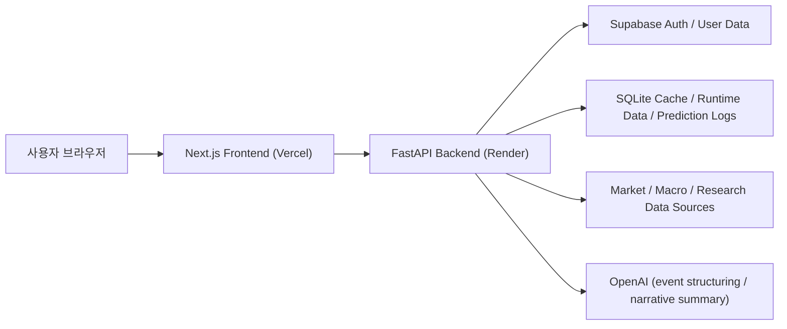
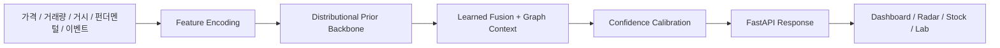
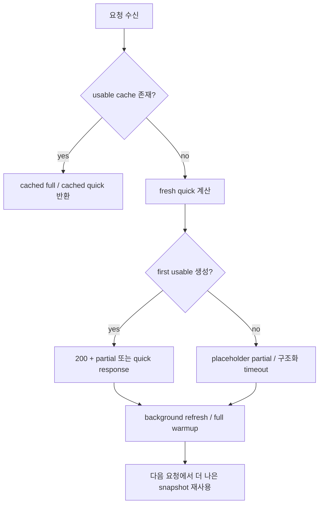

# Stock Predict

투자 판단, 종목 해석, 포트폴리오 운영, 예측 검증을 한 흐름으로 연결한 분석 워크스페이스입니다.
이 프로젝트는 단순 시세 조회나 목표가 제시에 머무르지 않고, `시장 탐색 -> 종목 해석 -> 포트폴리오 운영 -> 예측 검증`을 하나의 제품 안에서 이어 주는 것을 목표로 합니다.

핵심 원칙은 세 가지입니다.

- 숫자 예측은 확률모형이 담당합니다.
- `OpenAI`는 숫자 예측기가 아니라 `구조화 이벤트 추출기 + 서술형 요약기`로 사용합니다.
- 느린 외부 소스 하나 때문에 화면 전체가 죽지 않도록 `partial + fallback`을 먼저 설계합니다.

현재 릴리즈: `v2.60.56`
현재 운영 모델 버전: `dist-studentt-v3.3-lfgraph`

### 이번 릴리즈 하이라이트

- backend `/api/stock/{ticker}/detail`는 이제 Render `startup_memory_safe_mode`에서 quick partial 응답 뒤 `prediction_capture_service`를 전혀 건드리지 않습니다. 그래서 first hit이 이미 `stock_quick_detail`로 충분히 응답했는데도 distributional capture scheduling이 cold `stock_analyzer + db` import를 다시 깨우며 10초대 지연과 추가 메모리 압박을 만들던 경로를 더 보수적으로 끊었습니다.
- `backend/tests/test_stock_router.py`에는 safe mode quick partial이 distributional capture scheduling 자체를 건너뛰는 회귀를 추가했습니다. 앞으로는 stock detail quick 응답이 다시 숨은 side effect import 때문에 느려지는 회귀를 테스트에서 바로 잡을 수 있습니다.
- backend `/api/country/KR/heatmap`는 이제 Render `startup_memory_safe_mode`에서 `yfinance_client`가 아직 cold import 상태면 live heatmap build 자체를 시작하지 않고, 먼저 cache/last-success를 확인한 뒤 그것도 없으면 `heatmap_cold_import_guard` shell로 바로 닫습니다. 그래서 heatmap first hit 하나만으로 `yfinance` 스택을 새로 깨우며 워커 메모리를 다시 `470MB+` critical band로 밀어 올리던 경로를 더 보수적으로 막았습니다.
- heatmap timeout fallback도 이제 safe mode에서 `kr_market_quote_client`가 cold import 상태면 live 대표호가 fetch를 다시 시도하지 않고 placeholder heatmap으로 바로 닫습니다. 그래서 live build timeout 뒤 fallback에서 다시 KR quote client를 깨우며 memory pressure를 한 번 더 올리던 경로를 줄였습니다.
- `backend/tests/test_public_dashboard_timeouts.py`에는 safe mode cold import guard가 live heatmap build/shared cache fetch를 모두 건너뛰는 회귀와, heatmap fallback이 cold KR quote import를 다시 깨우지 않는 회귀를 추가했습니다. 앞으로는 히트맵 first hit이 다시 cold data client import 때문에 지연과 메모리 급등을 같이 만드는 회귀를 테스트에서 바로 잡을 수 있습니다.
- backend `/api/stock/{ticker}/detail`의 quick public 경로는 이제 Render `startup_memory_safe_mode`에서 background full refresh를 아예 시작하지 않습니다. 프론트 기본 흐름은 `preferFull=false`인데도 quick 응답 직후 숨은 full refresh가 다시 돌면서 RSS를 `450MB+` warning band까지 밀어 올리고, 이어지는 diagnostics/screener 지연을 다시 키우던 경로를 끊었습니다.
- `backend/tests/test_stock_router.py`에는 safe mode 저압 구간에서도 stock detail background refresh가 다시 살아나지 않는 회귀를 추가했습니다. 앞으로는 quick 종목 상세 뒤에서 full 분석이 몰래 붙어 메모리를 다시 잡아먹는 회귀를 테스트에서 바로 잡을 수 있습니다.
- backend `/api/stock/{ticker}/detail`은 이제 Render `startup_memory_safe_mode`에서 `stock_analyzer`가 아직 cold import 상태면 uncached quick/full 분석을 바로 시작하지 않고 `stock_memory_guard` shell로 먼저 내려갑니다. 로컬 기준 `stock_analyzer` 첫 import만으로도 RSS가 약 `+136MB` 커지는 구간을 확인했고, 운영에서는 이 cold import가 첫 종목 상세 요청 뒤 memory pressure를 critical까지 끌어올리며 diagnostics 지연을 다시 키우던 경로를 잘랐습니다.
- `backend/tests/test_stock_router.py`에는 safe mode 저압 구간에서도 cold stock analysis import를 피하고 memory guard shell/background refresh skip으로 끝나는 회귀를 추가했습니다. 앞으로는 Render 500MB 한도에서 종목 상세가 다시 uncached first hit만으로 무거운 분석 스택을 깨우는 회귀를 테스트에서 바로 잡을 수 있습니다.
- backend `/api/screener`는 이제 Render safe mode에서 `last_success` seed나 `safe shell` partial을 내려준 뒤 추가 cache warmup background job을 다시 만들지 않습니다. 그래서 partial 응답은 이미 끝났는데 뒤에서 KR bulk snapshot warmup이 계속 돌며 memory pressure와 다음 diagnostics 지연을 다시 키우던 경로를 잘랐습니다.
- `backend/tests/test_public_dashboard_timeouts.py`에는 safe mode shell fallback과 last-success seed가 모두 cache warmup background job 없이 끝나는 회귀를 추가했습니다. 앞으로는 Render 500MB 보호 구간에서 screener partial 응답 뒤에 후속 warmup이 다시 살아나 운영 smoke 직후 메모리와 지연을 밀어 올리는 회귀를 테스트에서 바로 잡을 수 있습니다.
- backend `memory_hygiene`는 이제 Render safe mode에서 `pressure_ratio 0.8` 이상의 elevated warning 구간이면 trim cooldown을 건너뛰고 바로 한 번 더 정리를 시도합니다. 그래서 public smoke 직후 cgroup 사용량이 500MB 한도 바로 아래 warning band에 머무를 때도 다음 요청이 쿨다운에 막혀 손을 놓고 있지 않도록 조정했습니다.
- backend `/api/diagnostics`는 이제 preflight trim 이후 pressure가 `0.8` 이상이면 critical 전이라도 archive/research heavy probe를 건너뛰고 구조화된 skip reason을 바로 반환합니다. 그래서 운영 smoke 직후 warning pressure만으로도 diagnostics가 다시 10초대까지 늘어지며 메모리 회복을 방해하던 구간을 더 짧게 끊습니다.
- `backend/tests/test_memory_hygiene.py`, `backend/tests/test_system_service.py`에는 elevated warning 구간에서 cooldown bypass와 heavy probe skip이 함께 유지되는 회귀를 추가했습니다. 앞으로는 Render 500MB 보호선 바로 아래에서 trim과 diagnostics 축약이 다시 critical 직전까지 늦어지는 회귀를 테스트에서 바로 잡을 수 있습니다.
- backend `/api/screener`는 이제 대표 스냅샷, cache lookup/write, main/fallback build timeout을 모두 `shield + explicit cancel` 기반 timebox로 감쌉니다. 그래서 timeout 자체는 났는데 cancellation cleanup이나 SQLite 정리 대기 때문에 첫 응답이 15초를 그대로 채워 버리던 cold-hit 회귀를 더 짧게 끊습니다.
- `backend/tests/test_public_dashboard_timeouts.py`에는 `screener` cache lookup과 representative snapshot이 cancellation cleanup sleep을 가져도 즉시 partial/shell로 복귀하는 회귀를 추가했습니다. 앞으로는 timeout 뒤 정리 단계 때문에 `/api/screener`가 다시 first-usable 응답을 놓치는 회귀를 테스트에서 바로 잡을 수 있습니다.
- backend `/api/diagnostics`는 이제 응답 시작 전에 현재 메모리 pressure를 먼저 읽고, warning 이상이면 즉시 trim을 한 번 시도한 뒤 probe 예산을 더 짧게 가져갑니다. 그래서 public smoke 직후 RSS가 400MB대 후반으로 치솟은 상태에서 archive/research probe까지 다시 오래 붙잡으며 진단 API 자체가 18초 가까이 늦어지던 구간을 먼저 줄이도록 정리했습니다.
- backend `/api/diagnostics`의 best-effort probe는 이제 timeout이 나면 cancellation cleanup까지 끝날 때까지 기다리지 않고 바로 복귀합니다. 그래서 느린 probe가 이미 timeout으로 판정된 뒤에도 `CancelledError` 정리 sleep 때문에 diagnostics 응답이 추가로 늘어지던 회귀를 더 짧게 끊습니다.
- `backend/tests/test_system_service.py`에는 critical memory pressure에서 heavy probe를 건너뛰는 회귀와, timeout된 probe가 cancellation cleanup에 다시 막히지 않는 회귀를 추가했습니다. 앞으로는 Render 500MB 보호 구간에서 diagnostics가 다시 archive/research probe를 무리하게 수행하거나 timeout 뒤 cleanup 대기까지 끌고 가는 회귀를 테스트에서 바로 잡을 수 있습니다.
- backend `/api/screener`는 이제 본문 10초 timeout 뒤 들어가는 snapshot fallback에도 별도 상한을 둡니다. 그래서 본 경로가 이미 timeout된 뒤 fallback까지 다시 `yfinance` 배치 다운로드를 오래 기다리며 운영 smoke에서 15초를 넘기던 회귀를 더 짧은 shell partial로 끊습니다.
- `backend/tests/test_public_dashboard_timeouts.py`에는 `screener`의 snapshot fallback도 stall될 때 `kr_timeout_shell`로 빠르게 복귀하는 회귀를 추가했습니다. 앞으로는 timeout 뒤 fallback까지 다시 느린 외부 fetch를 붙잡으며 `/api/screener` first-usable 응답이 늦어지는 회귀를 테스트에서 바로 잡을 수 있습니다.
- backend `memory_hygiene`는 이제 Render safe mode에서 trim 시작 기준을 `pressure_ratio 0.6`부터 적용합니다. 그래서 메모리가 이미 warning band에 들어왔는데도 0.7을 넘길 때까지 기다리며 public smoke 한 바퀴 뒤 cgroup 사용량이 500MB 한도 바로 아래에 오래 붙어 있던 구간을 더 일찍 눌러보도록 조정했습니다.
- `backend/tests/test_memory_hygiene.py`에는 warning pressure band에서도 trim이 실제로 시도되는 회귀를 추가했습니다. 앞으로는 trim 시작 기준이 다시 너무 늦어져 memory-safe 모드가 사실상 critical 직전에서만 작동하는 회귀를 테스트에서 바로 잡을 수 있습니다.
- backend `stock detail`은 이제 Render `startup_memory_safe_mode`에서 pressure가 중간 이상으로 올라가면 public quick 경로의 background refresh와 inline full upgrade를 더 일찍 건너뜁니다. 그래서 quick 호출 뒤 숨어서 돌던 full 분석이 RSS를 400MB대 후반까지 끌어올리고, 이어지는 `prefer_full` 호출이 10초대 후반까지 튀거나 `stock_memory_guard`로 늦게 떨어지던 회귀를 더 보수적으로 막습니다.
- `backend/tests/test_stock_router.py`에는 elevated pressure에서 background refresh와 inline full analyze를 건너뛰는 회귀를 추가했습니다. 앞으로는 Render 500MB 보호 구간에서 public stock detail이 다시 full 분석을 무리하게 시작하며 지연과 메모리 급등을 동시에 만드는 회귀를 테스트에서 바로 잡을 수 있습니다.
- backend `stock detail`은 이제 quick snapshot 대기 예산을 더 짧게 고정하고, memory guard shell/quick cache persist를 짧게 timebox합니다. 그래서 Render cold cache나 SQLite lock 구간에서도 `/api/stock/{ticker}/detail` first-usable 응답이 느린 cache write까지 같이 기다리며 6초 이상 끌리는 회귀를 더 줄였습니다.
- `backend/tests/test_stock_router.py`, `backend/tests/test_stock_analyzer.py`에는 memory guard shell과 quick cache persist가 느린 cache write에 막히지 않고 빠르게 복귀하는 회귀를 추가했습니다. 앞으로는 종목 상세 fallback이 다시 cache I/O에 동기 대기하며 first-usable 응답을 늦추는 회귀를 테스트에서 바로 잡을 수 있습니다.
- backend `/api/country/KR/heatmap`은 이제 startup/memory guard 구간에서 `cache` import나 live/universe fallback 전체를 다시 타지 않고, `COUNTRY_REGISTRY`만으로 만든 중립 섹터 shell을 즉시 반환합니다. 그래서 메모리 경고 구간에서도 히트맵 guard 응답이 다시 수초 이상 끌리는 회귀를 줄였고, 홈 대시보드도 완전히 빈 state card 대신 최소한의 섹터 레이아웃을 먼저 유지합니다.
- `backend/tests/test_public_dashboard_timeouts.py`는 heatmap startup guard가 live builder, fallback builder, cache fetch를 모두 건너뛰고 neutral shell만 반환하는 회귀를 고정합니다. 앞으로는 보호 구간에서 히트맵이 다시 cache/bootstrap이나 live fallback을 먼저 타며 느려지는 회귀를 테스트에서 바로 잡을 수 있습니다.
- backend `/api/screener`는 이제 KR quick partial 경로에서 cache lookup, seed write, `last_success` persist를 짧게 timebox합니다. 그래서 representative quote나 safe shell 자체는 이미 준비됐는데도 SQLite cache I/O가 같이 늘어지면서 첫 usable 응답이 10초 이상 밀리던 회귀를 줄였습니다.
- `backend/tests/test_public_dashboard_timeouts.py`에는 `screener`가 느린 cache lookup을 miss로 처리하고, cache persist가 막혀도 partial 응답을 먼저 반환하는 회귀를 추가했습니다. 앞으로는 Render cold cache/lock 구간에서 screener partial path가 다시 cache I/O까지 동기 대기하는 회귀를 테스트에서 바로 잡을 수 있습니다.
- backend `/api/briefing/daily`는 이제 timeout, startup guard, memory guard에 걸리면 `sessions/calendar/archive`를 다시 읽는 서비스 fallback까지 기다리지 않고 라우트 안에서 초경량 shell payload를 즉시 반환합니다. 그래서 브리핑이 partial 상태로 내려갈 때도 하위 의존 하나가 늦어지는 바람에 다시 15초 budget을 넘기는 경로를 더 확실히 잘랐습니다.
- `backend/tests/test_public_dashboard_timeouts.py`에는 `daily briefing`이 startup/memory guard 상태에서 full 브리핑 fetch를 건너뛰고 partial fallback으로 바로 내려가는 회귀를 추가했습니다. 새 프로세스 초반이나 보호 구간에서 브리핑 라우트가 다시 느린 full path를 먼저 붙잡는 회귀를 테스트에서 바로 잡을 수 있습니다.
- `.github/workflows/render-keepalive.yml`은 이제 `main` push에서도 즉시 한 번 실행됩니다. public GitHub Actions 페이지 기준으로 keepalive workflow run이 `0`건이던 상태를 bootstrapping하기 위해, 배포 직후 warm-up과 workflow 활성 확인을 같은 경로로 묶었습니다.
- `backend/tests/test_keepalive_workflow.py`는 keepalive workflow가 `main` push + 10분 cron + manual trigger를 함께 유지하는지 회귀로 고정합니다. 앞으로는 schedule만 남고 push bootstrap이 빠져 workflow가 다시 잠든 상태로 남는 회귀를 테스트에서 바로 잡을 수 있습니다.
- backend `/api/market/indicators`는 이제 Render memory-safe 모드에서 서비스가 막 깨어난 직후나 메모리 압박 구간이면 live 지표 fetch를 바로 건너뛰고 `last_success` 또는 초경량 fallback을 먼저 반환합니다. 운영 smoke에서 `market/indicators` 첫 호출이 15초 timeout에 걸리던 구간을 줄이기 위해, 공개 지표 라우트도 다른 startup guard 공개 경로와 같은 fast fallback 규칙으로 맞췄습니다.
- `backend/tests/test_public_dashboard_timeouts.py`에는 `market indicators`가 startup/memory guard 상태에서 shared cache fetch와 live yfinance fetch를 건너뛰는 회귀를 추가했습니다. 앞으로는 새 프로세스 초반이나 메모리 보호 구간에서 공개 지표 라우트가 다시 느린 외부 fetch를 먼저 붙잡는 회귀를 테스트에서 바로 잡을 수 있습니다.
- backend `countries`, `country report`, `heatmap`, `market/opportunities`는 이제 Render memory-safe 모드에서 서비스가 막 깨어난 직후 몇 분 동안 같은 `startup guard` fast fallback 규칙을 공유합니다. 새 프로세스는 메모리 비율이 낮아도 cold first-hit가 길어질 수 있었는데, 이번에는 국가 목록도 캐시 lookup보다 fallback shell을 먼저 내려 첫 usable 응답을 더 빨리 닫는 쪽으로 정리했습니다.
- `backend/tests/test_country_router.py`, `backend/tests/test_public_dashboard_timeouts.py`에는 최근 startup window 동안 countries cache lookup과 heavy heatmap/live quick path를 건너뛰고 startup guard fallback으로 바로 내려가는 회귀를 추가했습니다. 앞으로는 새 프로세스 초반에 다시 무거운 full path로 들어가는 회귀를 테스트에서 바로 잡을 수 있습니다.
- frontend `public-audit`에는 `heatmap_startup_guard`, `heatmap_memory_guard`, `opportunity_startup_guard`, `opportunity_memory_guard` 라벨/요약을 추가해, 히트맵과 기회 레이더 fallback 이유도 raw code 대신 자연스러운 한국어로 보이도록 맞췄습니다.
- `.github/workflows/render-keepalive.yml`을 추가해 GitHub Actions가 10분마다 `api/health`와 `api/country/KR/report`를 호출하도록 했습니다. Vercel Hobby cron으로는 분 단위 keepalive가 불가능해서, Render cold wake로 20~35초까지 튀던 첫 요청 지연을 완화하는 운영 keepalive를 저장소 안에서 관리하도록 옮겼습니다.
- `backend/tests/test_keepalive_workflow.py`를 추가해 keepalive workflow가 스케줄과 대상 URL을 유지하는지 회귀로 고정했습니다. 앞으로는 workflow가 빠지거나 warm 대상이 바뀌는 회귀를 테스트에서 바로 잡을 수 있습니다.
- backend `stock detail`은 이제 quick/full 계산이 모두 실패하거나 timeout이어도 500/504로 바로 끊지 않고, 최소 shell 상세를 `200 + partial + fallback_reason=stock_minimal_shell`로 먼저 반환합니다. 그래서 Render cold wake나 외부 시세 지연 구간에서도 상세 페이지가 완전히 깨지지 않고, 티커·기본 메타데이터 중심 first-usable 상태를 먼저 유지합니다.
- `backend/tests/test_stock_router.py`에는 stock detail이 no-cache error/timeout에서도 최소 shell fallback으로 내려가는 회귀를 추가했습니다. 앞으로는 quick/full builder가 모두 실패할 때 공개 종목 상세가 다시 500으로 깨지는 회귀를 테스트에서 바로 잡을 수 있습니다.
- backend `country report`는 memory guard가 켜진 순간 `last_success` cache lookup도 먼저 시도하지 않고, 바로 초경량 fallback으로 내려갑니다. `app.data.cache`/`app.database` cold import와 SQLite bootstrap이 보호 모드의 첫 응답 자체를 늦출 수 있는 경로를 잘라, 메모리 압박 구간에서는 “최근 캐시보다 first-usable 속도”를 우선하도록 순서를 고정했습니다.
- `backend/tests/test_country_router.py`에는 memory guard 진입 시 `cached report lookup`까지 건너뛰는 회귀를 추가했습니다. 앞으로는 보호 응답 앞에서 다시 cache import/bootstrap을 먼저 타는 회귀를 테스트에서 바로 잡을 수 있습니다.
- backend `country report` memory-guard fallback은 이제 `countries` cache 조회와 `fear_greed`/`country score` helper를 아예 건너뛰고, 초경량 중립 payload를 바로 반환합니다. 최근 배포에서 메모리는 `500MB` 한도 안으로 안정됐지만 `country_report_memory_guard` 자체가 10초 안팎으로 늦게 닫히던 구간을 더 짧게 줄이는 방향으로 정리했습니다.
- `backend/tests/test_country_router.py`에는 memory-guard fallback이 archived/quick candidate lookup뿐 아니라 `countries` cache lookup과 scoring helper까지 호출하지 않는 회귀를 추가했습니다. 앞으로는 보호 응답이 다시 무거운 import나 cache 경로를 밟는 회귀를 테스트에서 바로 잡을 수 있습니다.
- backend `country report`와 `stock detail`은 이제 응답 직전 동기 `gc/malloc_trim`을 수행하지 않고, 별도 `asyncio` background trim으로 넘깁니다. `Response.background` 경로에서 배포 런타임이 `No response returned` 500으로 깨지지 않도록 수정하면서도, Render `500MB` 보호 구간에서 fallback/cached 응답이 마지막 메모리 정리 때문에 더 늦게 닫히지 않도록 유지했습니다.
- `backend/tests/test_country_router.py`, `backend/tests/test_stock_router.py`에 응답 helper가 trim을 inline으로 호출하지 않고 비동기 trim 스케줄만 거는 회귀를 추가했습니다. 그래서 앞으로는 fast path가 다시 동기 trim에 막히거나, trim 전달 방식 때문에 공개 응답이 깨지는 회귀를 테스트에서 바로 잡을 수 있습니다.
- Render memory-safe startup에서는 `prediction_accuracy_refresh`도 이제 함께 건너뜁니다. cold wake 직후 `yfinance` 가격 이력 재평가가 공개 라우트와 같은 타이밍에 붙지 않도록 줄여, `500MB` 한도 근처에서 startup background job이 추가 메모리와 CPU를 먼저 잡아먹던 구간을 더 보수적으로 막았습니다.
- `/api/countries`는 memory-safe 모드에서 fallback 또는 `last_success`를 반환할 때 더 이상 즉시 background refresh를 시작하지 않습니다. 응답 직후 `asyncio.create_task`가 다시 index quote 수집을 붙잡으면서 cold route와 메모리 보호 응답을 흔들던 문제를 줄여, `countries` 첫 응답이 안전한 shell/fallback 그대로 끝나도록 맞췄습니다.
- 관련 safe mode 기대값을 startup/public dashboard 회귀 테스트에 함께 고정했습니다. 그래서 앞으로는 `prediction_accuracy_refresh`가 Render 보호 모드에서 다시 살아나거나, `countries` fallback이 응답 직후 무거운 background refresh를 다시 켜는 회귀를 테스트에서 바로 잡을 수 있습니다.
- backend `market_service`는 이제 `yfinance_client`, `stock_scorer`, `stock_analyzer`, `distributional_return_engine` 같은 무거운 공개 레이더 의존성을 실제 계산 시점까지 지연 로드합니다. 그래서 `opportunity radar` 첫 요청이 `pandas/yfinance/ta`를 무조건 함께 적재하지 않게 되어, quick route 진입 시 import footprint와 cold-path 메모리 급등을 줄이는 방향으로 정리했습니다.
- Render memory-safe 구간에서 quick `opportunity radar`는 `1일 포커스` 정밀 계산을 잠시 생략하고 1차 후보 목록을 먼저 반환합니다. `next_day_focus`가 없어도 프론트가 안전하게 렌더링되도록 유지한 채, `500MB` 한도 근처에서 메모리 압박 때문에 quick 응답 자체가 늦어지던 구간을 더 줄이는 쪽으로 맞췄습니다.
- backend `llm_client`는 이제 `openai` SDK를 import 시점이 아니라 실제 LLM 호출 시점에 지연 로드합니다. Render `500MB` 메모리 한도 근처에서 공개 route startup이 불필요한 SDK 메모리를 먼저 점유하지 않도록 줄여, cold start RSS를 낮추는 방향으로 정리했습니다.
- `verify.py --deployed-site-smoke`는 배포 브라우저 매트릭스를 돌리기 전에 동일 라우트를 한 번 더 워밍업하고, 전체 viewport matrix 예산도 늘렸습니다. 실제 사이트는 정상인데 cold path 때문에 검증만 `exit 1`로 깨지던 간헐 실패를 줄여 회귀 루프를 더 안정적으로 반복할 수 있습니다.
- 공개 `country report`의 memory-guard 경로를 더 가볍게 줄였습니다. 메모리 보호 응답이 필요한 순간에는 archived report 재조회와 후보 탐색을 먼저 붙잡지 않고, 대표 지수 스냅샷 중심 1차 응답을 바로 반환해 Render `500MB` 한도 근처에서 9~10초까지 늘어나던 보호 응답 지연을 더 낮추는 방향으로 정리했습니다.
- `verify.py`와 `start.py --check`는 이제 Windows에서 repo-local `venv`와 PATH만 보지 않고, 표준 `nodejs` 설치 경로와 로컬 `.cmd` shim까지 해석합니다. `node`가 PATH에 없어도 `next build`, `tsc --noEmit`, 런처 점검이 같은 규칙으로 계속 동작해 회귀 루프 자체가 끊기지 않도록 맞췄습니다.
- `/api/health`는 Render memory-safe 모드에서도 요청 전 `gc/malloc_trim`을 건너뜁니다. readiness 확인과 wake 확인 경로가 메모리 정리 작업 때문에 추가로 느려지지 않도록 분리했습니다.
- 공개 `stock detail`의 cached full/quick lookup은 이제 `stock_analyzer`를 import하지 않고 라우터에서 바로 cache key를 읽습니다. 그래서 `pandas`, `ta`, 분포 엔진 적재 전에 cached/shell 응답을 먼저 낼 수 있어, cold first-hit에서 20초대까지 밀리던 구간을 더 짧게 줄이는 쪽으로 맞췄습니다.
- 공개 `stock detail` memory-guard shell은 더 이상 `yfinance` 기본 정보 조회를 시도하지 않습니다. 500MB 압박 구간에서는 외부 가격 조회를 건너뛰고 티커·기본 메타데이터 중심 최소 응답을 먼저 주어 화면 계약을 유지합니다.

- backend startup import footprint를 다시 줄였습니다. `main`과 주요 공개/상세 라우터는 이제 `market_service`, `archive_service`, `prediction_capture_service`, `yfinance_client`, `sector_analyzer`, `stock_scorer` 같은 무거운 모듈을 import 시점이 아니라 실제 요청 시점에 로드합니다. Render cold start에서 `/api/health`가 불필요한 `pandas/yfinance/ta` 적재를 먼저 하지 않도록 바꿔, 500MB 메모리 한도와 첫 요청 지연을 함께 낮추는 방향으로 맞췄습니다.
- `app.utils` 패키지는 더 이상 import만으로 `market_calendar`와 `pandas_market_calendars`를 끌어오지 않습니다. `next_trading_day` 노출은 lazy wrapper로 바꿔, route trace나 async util만 쓰는 경로가 달력 계산 모듈까지 함께 적재하지 않도록 정리했습니다.
- `backend/tests/test_import_footprint.py`를 추가해 `app.main`과 `app.routers.country` import가 `market_service`, `yfinance_client`, `stock_analyzer`, `pandas_market_calendars`를 즉시 로드하지 않는다는 회귀를 고정했습니다.

- Render `500MB` memory-safe 모드에서 공개 `country report`, `opportunity radar`, `stock detail`은 고압박 구간이면 요청 안의 무거운 full/quick 계산을 더 과감히 건너뜁니다. 이제 `country report`는 캐시/대표 스냅샷 기반 1차 보고서를 먼저 주고, `opportunity radar`는 안전한 placeholder를, `stock detail`은 프론트 계약을 유지하는 최소 shell 상세를 먼저 반환해 10~20초대 first-hit 지연과 peak RSS를 줄이는 쪽으로 맞췄습니다.
- `country`와 `stock` 라우터의 무거운 분석 import는 lazy import로 옮겼습니다. Render cold start와 `/api/health` 초기 응답이 불필요한 분석 모듈 로딩 때문에 같이 무거워지지 않도록, 실제 계산이 필요한 시점까지 메모리 적재를 늦췄습니다.
- 공개 `country report`와 `stock detail`은 응답 직전에 예측 캡처/아카이브 저장을 동기식으로 기다리던 경로를 정리했습니다. 이제 사용자 응답은 먼저 반환하고, 비핵심 후처리는 별도 경로로 넘겨 `No response returned` 형태의 500과 응답 지연을 줄입니다.
- 공개 `country report`와 `stock detail`의 cached lookup도 짧은 timeout 안에서만 조회합니다. SQLite/cache 조회가 잠기면 오래 붙잡히지 않고 즉시 miss로 간주해 fallback/quick path로 내려가도록 맞췄습니다.
- `/api/diagnostics`는 `memory_diagnostics`를 함께 내려 현재 RSS/cgroup 사용량, 메모리 압박 상태, hot memory cache 엔트리 수와 추정 바이트, oversized cache write skip 횟수를 같이 보여줍니다. accuracy/research archive probe도 병렬로 돌려 진단 엔드포인트 자체가 느려지는 구간을 줄였습니다.
- 공개 지연 경로는 `quick` fallback 기준을 더 짧게 조정했습니다. `market/opportunities` quick timeout과 `stock detail` quick/full grace를 줄였고, 홈·레이더·스크리너·종목 상세 SSR은 클라이언트 hydration 재요청이 있는 화면부터 timebox를 더 낮춰 첫 HTML이 backend cold path를 오래 기다리지 않도록 정리했습니다.
- `scripts/latency_probe.py`를 운영/로컬 지연 재현용으로 정리해 프론트 HTML, 핵심 공개 API, `/api/diagnostics`의 route latency와 `memory_diagnostics`를 같은 형식으로 다시 측정할 수 있게 했습니다.

- `verify.py --deployed-site-smoke`가 하위 headless browser 프로세스에서 오래 멈추지 않도록 브라우저 스모크에 명시적 command timeout과 전체 deadline을 추가했습니다. 이제 배포 검증은 hang 대신 구조화된 실패로 빠르게 돌아와 다음 회귀를 이어서 잡을 수 있습니다.
- `country report` timeout 테스트는 `last_success`/archived cache 오염에 흔들리지 않도록 분리했고, SQLite schema bootstrap은 import 시점과 startup에서 두 번 돌지 않도록 1회 보장으로 정리했습니다. 그래서 배포 검증 루프는 더 안정적으로 반복되고, cold start 때 health 공개 전 불필요한 초기화 비용도 줄였습니다.
- 공용 레이아웃을 한 번 더 다듬어 좌측 레일 폭, 상단 검색/계정 스트립, `PageHeader` 높이를 다시 줄였습니다. 그래서 대시보드, 레이더, 캘린더처럼 상단 체감이 큰 화면에서도 제목과 첫 판단 카드가 더 빨리 같은 viewport 안에 들어옵니다.
- 실행 버튼과 선택 chip의 역할을 다시 분리했습니다. `watchlist`, `settings`, `stock`, `archive`, `calendar`에 남아 있던 기본 버튼 느낌 또는 chip-형 CTA를 `primary / secondary / text` 버튼 계층으로 다시 흡수해, 실제 액션과 필터 토글이 더 쉽게 구분됩니다.
- 인증 게이트, 조건 추천, 레이더 보드, 다음 거래일 포커스 카드처럼 여러 화면에 반복되던 CTA도 같은 button hierarchy로 다시 정리했습니다. 로그인/회원가입, 조건 추천 실행, 연구실 이동, 종목 상세 이동이 더 이상 토글 chip처럼 보이지 않고 실행 버튼으로 읽히도록 맞췄습니다.
- `/calendar`는 상단 빈 공간을 agenda preview와 이번 달 리듬 요약으로 다시 채우고, 단일 국가일 때 어색하게 떠 있던 헤더 버튼을 제거했습니다.
- `/watchlist`와 `/country/[code]/sector/[id]`는 모바일에서 표나 chip 액션을 바로 강요하지 않고, summary-first 카드와 명확한 실행 버튼을 먼저 보여주도록 보강했습니다.
- `/settings`는 로그인 전/후 액션 언어를 다시 맞추고, 보안/이메일/탈퇴 패널이 데스크톱에서는 더 이른 시점부터 2열로 읽히도록 정리해 세로 길이와 버튼 혼선을 줄였습니다.
- 공개 `screener`의 KR representative quote 캐시는 이제 짧은 `wait_timeout` 뒤에 최근 정상 `last_success`를 우선 다시 쓰고, 그것도 없으면 빈 placeholder로 바로 복귀한 뒤 background refresh를 이어 갑니다. 그래서 운영 cold request에서도 `partial` warming 응답이 대표 시세 fetch를 끝까지 기다리며 10초 넘게 늘어지는 구간을 더 줄였습니다.
- 공개 `country report`는 이제 최근 정상 캐시가 있으면 그 응답을 바로 내리고, 캐시가 없어도 최근 아카이브가 있으면 stale public fallback을 즉시 내려줍니다. 최신 정밀 계산은 백그라운드 refresh로 계속 갱신해서, 운영에서는 느린 국가 리포트 계산 때문에 첫 응답이 20초 이상 붙잡히는 구간을 더 줄였습니다.
- 공개 `country report`는 정밀 계산 timeout과 export timeout을 분리했습니다. 운영 공개 경로는 더 이른 시점에 archived report/시장 스냅샷 fallback으로 내려가고, PDF/CSV export는 기존 여유 시간을 유지해 배포 스모크의 15초 기준과 내보내기 안정성을 같이 맞춥니다.
- `country report` fallback은 최근 정상 아카이브에 이미 `top_stocks`가 있으면 quick 후보 조회를 다시 돌지 않도록 순서를 정리했습니다. 그래서 운영에서 느린 공개 요청이 fallback 단계에서 추가로 1초 이상 더 붙잡히는 경로를 줄였습니다.
- `market/opportunities` 응답은 `NaN`/`inf`가 섞인 포커스 예측값이나 20거래일 분포 값이 있어도 JSON 직렬화에서 터지지 않도록 다시 정리했습니다. 운영에서는 `next_day_focus`, `opportunities` 카드가 비정상 수치 때문에 500으로 떨어지지 않고 안전한 기본값으로 내려갑니다.
- 분포 인코더, 시장 국면, 과거 패턴 예측, 공포·탐욕 점수, `yfinance` 수익률 추출의 로그 수익률 계산을 다시 정리해 `0` 또는 음수 가격이 끼어도 `RuntimeWarning`이 연쇄적으로 쌓이지 않도록 보강했습니다. 이번 검증 루프에서는 `verify.py --skip-frontend --live-api-smoke` 로그 기준 `RuntimeWarning 0건`까지 다시 확인했습니다.
- 모바일 상단 chrome과 `PageHeader`, `AuthStatus`, `SearchBar` 간격을 다시 줄여 `네비게이션 -> 검색 -> 계정 -> 본문` 흐름이 first viewport에서 과점유되지 않도록 정리했습니다.
- `/auth`, `/settings`, `/portfolio`, `/watchlist`, `/stock/[ticker]`의 모바일 정렬을 다시 맞춰 입력 버튼 경쟁, 긴 이메일/상태 문구 줄바꿈, 고정 폭 보조 패널 문제를 줄였습니다.
- `/stock/[ticker]`는 차트 컨트롤이 두 줄까지 자연스럽게 감싸지도록 조정하고, 최근 재무 스냅샷은 모바일 카드 요약을 먼저 보여준 뒤 `md` 이상에서 표 상세를 유지하도록 바꿨습니다.
- `DESIGN_BIBLE.md`에 모바일 action wrap과 dense table의 모바일 대체 규칙을 추가해 공용 기준과 실제 화면이 같은 원칙을 따르도록 맞췄습니다.
- `PublicAuditStrip`, `MetricValueCard`, `/settings` 경로 표기, `/stock/[ticker]`의 가이드/점수 헤더를 추가로 다듬어 긴 audit chip, metric 값, API 경로가 모바일에서 잘리지 않고 읽기 흐름을 유지하도록 보강했습니다.
- `/calendar`, `/watchlist/[ticker]`, `OpportunityRadarBoard`도 한 번 더 다듬어 모바일 action row를 공용 규칙으로 묶고, 긴 운영 메모는 pill 대신 본문 메모로 내려 읽기 흐름을 덜 끊게 바꿨습니다.
- 종목 상세 내부 카드인 `NextDayForecastCard`, `TradePlanCard`, `HistoricalPatternCard`, `SetupBacktestCard`도 상단 요약과 5칸 metric strip을 모바일 우선 흐름으로 다시 맞춰 내부 카드까지 같은 리듬을 유지하도록 정리했습니다.
- `dev_runtime.py`, `start.py`, `verify.py`의 런처 해석 규칙을 다시 맞춰 `repo-local venv -> 현재 Python -> Windows py -3` 순서로 fallback하고, 프론트 실행기는 `frontend/node_modules/.bin -> PATH npm/npx` 순서로 찾도록 정리했습니다.
- `verify.py`는 이제 `--skip-frontend`, `--full-sweep`, responsive viewport matrix, backend requirements import probe를 같은 단계형 스윕에 묶어 로컬/배포 회귀를 더 짧은 실패 메시지로 다시 돌릴 수 있습니다.
- `/api/briefing/daily`는 내부 레이더 계산이 늦게 끝나거나 취소를 바로 받지 못해도 브리핑 전체가 오래 붙잡히지 않도록 soft-timeout 경로를 다시 정리했습니다. 그래서 운영에서는 요약 partial 응답이 더 빨리 내려가고, 느린 하위 작업은 뒤에서 정리되더라도 첫 응답은 덜 막힙니다.
- `verify.py`는 같은 워크스페이스에서 중복 실행되면 `.verify.lock`으로 먼저 막고, 정말 병렬 실행이 필요할 때만 `--allow-parallel`로 명시적으로 우회하도록 바꿨습니다. 그래서 regression sweep를 두 개 겹쳐 돌릴 때 생기던 캐시/프로브 테스트 간섭을 기본값에서 줄였습니다.
- backend data 경로에서 이미 사용 중이던 `requests`를 `backend/requirements.txt`에 반영해 새 Python 환경에서 unittest/import probe가 불완전한 requirements 때문에 먼저 깨지지 않도록 맞췄습니다.
- 전역 UI 디자인 시스템을 `glass/card-heavy` 톤에서 `brutal editorial + less is more` 기준으로 다시 정리했습니다. `IBM Plex Sans KR`와 `IBM Plex Mono`를 기준 글꼴로 두고, 라이트 모드를 canonical theme로 맞췄습니다.
- `Navigation`, `SearchBar`, `AuthStatus`, `WorkspaceStateCard`, `PageHeader`를 다시 설계해 상단 chrome, 상태 카드, slab/metric/data frame 규칙을 같은 시각 언어로 통일했습니다.
- `/compare`, `/country/[code]`, `/country/[code]/sector/[id]`, `/settings`, `/auth`, `/lab`와 홈/레이더/종목/포트폴리오 핵심 패널을 새 primitive 기준으로 정리해 pill 남발, 다중 보더, 긴 문장의 캡슐 배치를 줄였습니다.
- `/api/research/predictions`가 `pipeline_health`, `coverage_breakdown`, `pipeline_alerts`를 함께 반환해 연구실이 비어 보일 때도 어디서 표본이 끊겼는지 먼저 설명합니다.
- `stock` quick detail, `country` partial report, `market/opportunities` quick/cached 응답에서 prediction capture를 다시 연결해 1D뿐 아니라 5D/20D 표본도 누적되도록 복구했습니다.
- `/lab` 첫 화면을 `표본 수집 퍼널 -> horizon 커버리지 -> 지금 막히는 지점` 순서로 재구성해, 성과 카드보다 저장/평가 상태를 먼저 읽게 바꿨습니다.
- iPhone Safari 기준으로 상단 mobile shell을 `브랜드/컨트롤 + 검색/계정`의 compact 흐름으로 다시 정리했습니다.
- `/`, `/radar`, `/calendar`, `/stock/[ticker]`, `/portfolio`, `/watchlist`, `/lab`의 상태 카드를 `blocking / partial / empty / loading` 규칙으로 맞췄습니다.
- `/calendar` 모바일 보드는 날짜 셀 장식을 줄이고 `월간 보드 + 선택 날짜 agenda` 구조로 다시 정리했습니다.

- 프론트: [https://yoongeon.xyz](https://yoongeon.xyz)
- 백엔드 API: [https://api.yoongeon.xyz](https://api.yoongeon.xyz)
- health: [https://api.yoongeon.xyz/api/health](https://api.yoongeon.xyz/api/health)
- 운영 스택: `Vercel + Render + Supabase + Cloudflare`

## 목차

- [무엇을 해결하는 제품인가](#무엇을-해결하는-제품인가)
- [현재 운영 기준선](#현재-운영-기준선)
- [핵심 기능](#핵심-기능)
- [시스템 아키텍처](#시스템-아키텍처)
- [운영 철학과 실패 처리 철학](#운영-철학과-실패-처리-철학)
- [예측 엔진 상세](#예측-엔진-상세)
- [예측 로그와 연구실 표본 누적 구조](#예측-로그와-연구실-표본-누적-구조)
- [기술 스택 상세](#기술-스택-상세)
- [데이터 소스와 fallback 전략](#데이터-소스와-fallback-전략)
- [기능별 설명](#기능별-설명)
- [어려웠던 점과 해결 과정](#어려웠던-점과-해결-과정)
- [Known Limitations](#known-limitations)
- [디자인 방향성](#디자인-방향성)
- [운영 검증과 관련 문서](#운영-검증과-관련-문서)

## 무엇을 해결하는 제품인가

시장 데이터는 많지만, 실제 투자 워크플로우에서는 아래 문제가 반복됩니다.

- 시장 브리핑은 따로 보고, 종목 상세는 또 다른 화면에서 보고, 포트폴리오 판단은 스프레드시트로 따로 관리해야 합니다.
- 종목 하나의 “좋아 보이는 이유”는 볼 수 있어도, 그 판단이 시간이 지나 실제로 얼마나 맞았는지는 보기 어렵습니다.
- 무료 또는 제한된 데이터 소스를 사용하는 환경에서는, 공개 화면이 자주 `불러오는 중`, `빈 화면`, `에러 전용 화면`으로 무너지기 쉽습니다.

Stock Predict는 이 문제를 아래 방식으로 해결합니다.

- 대시보드에서 시장 전체 상태를 먼저 요약합니다.
- 기회 레이더와 스크리너로 후보 종목을 빠르게 좁힙니다.
- 종목 상세에서 확률 분포, 가격 분위수, 이벤트/기술 요약을 함께 봅니다.
- 포트폴리오에서 실제 보유 종목과 추천을 같은 기준으로 비교합니다.
- 예측 연구실에서 과거 예측이 실제로 얼마나 맞았는지 다시 검증합니다.

이 제품은 “AI가 종목을 찍어 주는 서비스”보다, **판단 과정과 운영 흐름을 구조화하는 분석 워크스페이스**에 가깝습니다.

## 현재 운영 기준선

문서와 구현은 `예전에 구상한 제품`이 아니라 **지금 운영 중인 사이트**를 기준으로 맞춥니다.

### 운영 환경

- Frontend: `Next.js App Router` on `Vercel`
- Backend: `FastAPI` on `Render`
- 인증/사용자 데이터: `Supabase`
- 런타임 캐시/연구 로그/보조 저장: `SQLite`
- DNS/도메인: `Cloudflare`

### 시장 범위

현재 서비스는 한국 시장 중심으로 운영됩니다.
다만 README에서는 이 제약을 headline처럼 반복하지 않고, 필요한 문맥에서만 분명하게 적습니다.

### 현재 주요 화면

| 화면 | 역할 | 비고 |
|---|---|---|
| `/` | 대시보드, 브리핑, 시장 스냅샷, 히트맵, 강한 셋업 | 공개 |
| `/radar` | Opportunity Radar | 공개, 대표 유니버스 기반 |
| `/screener` | 조건 기반 필터링 | 공개 |
| `/compare` | 종목 비교 | 공개 |
| `/stock/[ticker]` | 종목 상세 분석 | 공개 |
| `/portfolio` | 보유 종목, 추천, 이벤트 레이더 | 로그인 |
| `/watchlist` | 관심종목 및 심화 추적 | 로그인 |
| `/calendar` | 일정 캘린더 | 공개 |
| `/archive` | 리서치/예측 아카이브 | 공개 |
| `/lab` | 예측 연구실 | 공개 |
| `/settings` | 계정/시스템/진단/운영 상태 | 로그인 |

## 핵심 기능

### 1. 대시보드

- 선택 시장의 브리핑, 핵심 수치, 히트맵, 강한 셋업, 뉴스, 포커스를 한 화면에 요약합니다.
- 일부 데이터 소스가 늦어도 `마지막 정상 스냅샷 + 대표 표본 + partial 안내`를 우선 보여 줍니다.

### 2. Opportunity Radar

- `다음 거래일 포커스`는 보드 상위 몇 종목만 다시 고르는 방식이 아니라, 더 넓은 레이더 후보군을 1일 기준으로 다시 재평가해 1종목을 고릅니다.
- 이 추천은 `1일 예상 수익률`, `상승 확률`, `손익비`, `시장 국면`뿐 아니라 최근 급등 추격 위험도 함께 감점해 단기 추격 매수를 줄이도록 설계합니다.
- 여기에 `추세 정렬`, `MACD 모멘텀`, `RSI 위치`, `거래량 확인`, `볼린저 밴드/돌파 품질`, `ATR 기반 과열`을 묶은 `단타 차트 점수`를 크게 반영합니다.

- KR 기본 유니버스를 `코스피 상위 190개 + 코스닥 상위 10개` 대표 200종목으로 고정합니다.
- 먼저 1차 스코어링으로 후보를 좁히고, 상위 종목만 정밀 분석합니다.
- 상단에는 `다음 거래일 포커스`를 별도로 두어, 상위 후보 중 `예상 수익률 + 상승 확률 + 차트 점수 + 손익비`가 가장 유리한 종목 1개를 진입가/손절가/목표가와 함께 바로 읽을 수 있게 합니다.
- 같은 화면 안에서도 상단 포커스는 `다음 거래일`, 아래 후보 보드는 `20거래일 기대 수익 분포` 기준으로 분리해 보여줍니다.
- 전종목 전수 심층 분석 대신, **운영 가능한 범위 안에서 일관된 후보 보드**를 만드는 전략입니다.

### 3. Screener

- 조건 기반으로 종목을 필터링합니다.
- seed preview와 full scan을 분리해, 첫 화면이 오래 멈추지 않도록 설계했습니다.

### 4. 종목 상세

- 방향 확률, 분위수 기반 가격 범위, 기술 요약, 이벤트/공시 맥락을 함께 보여 줍니다.
- `quick snapshot -> prefer_full` 업그레이드 구조를 유지해 first usable을 먼저 확보합니다.

### 5. 포트폴리오

- 보유 종목, 자산 기준, 조건 추천, 최적 추천, 이벤트 레이더를 하나의 워크스페이스로 연결합니다.
- 모델 포트폴리오 계산이 늦어져도 자산 요약과 보유 종목 패널은 먼저 살립니다.

### 6. 관심종목 / 심화 추적

- 관심종목을 저장하고, 필요 시 `심화 추적`을 켤 수 있습니다.
- `/watchlist/[ticker]`에서 최근 예측 변화, 적중/오차, 현재 판단 근거를 더 깊게 볼 수 있습니다.

### 7. 예측 연구실

- 저장된 예측 로그와 실제 결과를 비교해, 방향 적중률/오차/보정 품질을 점검합니다.
- 단순 성과 표가 아니라 `표본 수집 퍼널`, `반복 실패 패턴`, `리뷰 큐`, `현재 표본 상태`까지 함께 보여 줍니다.
- `/api/research/predictions`는 `pipeline_health`, `coverage_breakdown`, `pipeline_alerts`를 additive로 포함해 저장만 되고 평가가 없는 상태나 5D/20D 누락 상태를 먼저 설명합니다.

## 시스템 아키텍처

### 시스템 구조도



### 예측 파이프라인



### 운영/실패 흐름도



### 저장소 구조 요약

| 경로 | 역할 |
|---|---|
| `frontend/src/app` | Next.js App Router 페이지 엔트리 |
| `frontend/src/components` | UI 패널, 차트, 인증, 상태 카드 |
| `frontend/src/lib/api.ts` | 프론트-백엔드 API 계약 중심 |
| `backend/app/main.py` | FastAPI 엔트리포인트, middleware, startup task |
| `backend/app/routers` | HTTP API 계층 |
| `backend/app/services` | 비즈니스 로직 계층 |
| `backend/app/analysis` | 예측/분석 엔진 |
| `backend/app/scoring` | confidence / selection / calibration 규칙 |
| `backend/app/data` | 외부 데이터 클라이언트 |
| `backend/app/errors.py` | 중앙 에러 코드 레지스트리 |
| `backend/tests` | 회귀 테스트 |

더 자세한 구조는 [ARCHITECTURE.md](./ARCHITECTURE.md)를 참고하세요.

## 운영 철학과 실패 처리 철학

이 프로젝트의 중요한 설계 원칙은 **모든 요청이 완전한 성공을 보장할 수 없다는 사실을 먼저 인정하는 것**입니다.

### 1. hard fail보다 `first usable`을 우선합니다

가능한 경우 공개 화면은 아래 순서를 따릅니다.

1. cached full
2. cached quick
3. fresh quick
4. placeholder partial
5. 그 다음에만 structured timeout / hard error

즉, “완벽한 결과를 늦게 보여주는 것”보다 “쓸 수 있는 첫 결과를 먼저 보여주는 것”을 우선합니다.

### 2. `200 + partial + fallback_reason`을 적극 사용합니다

공개 집계형 API는 가능한 한 아래 메타데이터를 포함합니다.

- `partial`
- `fallback_reason`
- `generated_at`
- `fallback_tier`
- `snapshot_id`

이 방식의 장점은 다음과 같습니다.

- 사용자는 에러 전용 화면 대신 현재 사용 가능한 결과를 먼저 볼 수 있습니다.
- 프론트는 숫자/패널/보드가 “완전 성공인지, 부분 성공인지”를 구분해서 렌더할 수 있습니다.
- diagnostics와 browser smoke에서 복합 장애를 더 명확히 분해할 수 있습니다.

### 3. 패널 단위 격리를 우선합니다

느린 외부 소스 하나 때문에 화면 전체가 무너지지 않도록, 패널별 상태를 분리합니다.

- 좋은 예: 포트폴리오 추천 패널이 늦어도 자산 요약과 보유 종목은 먼저 보여 줌
- 나쁜 예: 뉴스 패널 실패 때문에 전체 대시보드가 blank가 되는 구조

### 4. 보호 API는 인증 계약을 일관되게 유지합니다

보호된 API는 인증이 없을 때 `401 / SP-6014`를 반환합니다.
관심종목에 없는 종목으로 심화 추적을 요청하면 `404 / SP-6017`을 사용합니다.

이 프로젝트에서는 페이지별 ad-hoc 로그인 처리보다, **공통 인증 계약과 세션 복구 흐름**을 우선합니다.

## 예측 엔진 상세

현재 canonical backbone은 [`backend/app/analysis/distributional_return_engine.py`](./backend/app/analysis/distributional_return_engine.py) 입니다.
표시 confidence의 canonical calibration loop는 [`backend/app/scoring/confidence.py`](./backend/app/scoring/confidence.py) 와 [`backend/app/services/confidence_calibration_service.py`](./backend/app/services/confidence_calibration_service.py) 입니다.

### 엔진 개요

엔진은 점예측보다 **조건부 수익률 분포**를 우선합니다.

- 출력은 `q10 / q25 / q50 / q75 / q90`
- 방향은 `p_down / p_flat / p_up`
- 표시 confidence는 heuristic를 바로 노출하지 않고 calibration loop를 거쳐 재보정

입력은 대략 아래 축으로 구성됩니다.

- 가격 시계열과 변동성
- benchmark 대비 상대 흐름
- 거시 압축 요인
- 펀더멘털/애널리스트 요약
- 수급 신호
- 뉴스/공시에서 구조화한 이벤트 특징
- graph context와 learned fusion profile

### 1. regime 확률

엔진은 먼저 시장 체제를 `risk_on / neutral / risk_off`로 요약합니다.

개념 요약식:

```text
logit_risk_on  = 1.10*macro + 0.95*market_momentum + 0.65*fused_score
               + 0.75*breadth + 0.28*advance_decline
               - 0.35*dispersion - 0.80*stress - 0.25*event_uncertainty

logit_neutral  = 0.18 - 0.25*|fused_score| - 0.18*|macro| - 0.10*|breadth|

logit_risk_off = -0.95*macro - 0.85*market_momentum - 0.50*fused_score
               - 0.65*breadth + 0.52*dispersion + 1.00*stress
               + 0.55*event_uncertainty

regime_probs = softmax([logit_risk_on, logit_neutral, logit_risk_off])
```

직관:

- 거시/시장 모멘텀이 좋고 breadth가 넓으면 `risk_on` 확률이 올라갑니다.
- stress, dispersion, uncertainty가 커지면 `risk_off` 쪽 가중이 커집니다.

### 2. horizon별 분포 생성

각 horizon은 단일 정규분포가 아니라, **regime x component mixture 기반 Student-t 분포 샘플링**으로 구성합니다.

개념 요약식:

```text
X_h ~ Σ_r Σ_k π(r, k) * StudentT(df_rk, loc_rk, scale_rk)
```

여기서:

- `r`: `risk_on / neutral / risk_off`
- `k`: bearish / base / bullish component
- `π(r, k)`: regime 확률과 skew 기반 component weight의 곱
- `loc_rk`: historical mean + signal tilt + regime shift + component offset
- `scale_rk`: historical volatility와 regime scale로 조정된 분산

실제 구현에서는 horizon당 `4096`개 샘플을 뽑아 분포를 만듭니다.

이 분포에서 바로 아래를 계산합니다.

```text
q10, q25, q50, q75, q90 = quantile(X_h)

delta  = max(0.0032*sqrt(h), 0.18*std(X_h))
p_up   = P(X_h >  delta)
p_down = P(X_h < -delta)
p_flat = 1 - p_up - p_down
```

직관:

- median 하나만 보여주면 tail risk가 사라지므로 분위수를 함께 노출합니다.
- `flat` 구간은 미세한 흔들림을 방향 신호로 과대해석하지 않기 위한 완충 구간입니다.

### 3. confidence support 조합

confidence는 단일 숫자가 아니라 여러 support의 조합에서 출발합니다.

핵심 support는 아래와 같습니다.

- `distribution_support`
- `analog_support`
- `regime_support`
- `edge_support`
- `agreement_support`
- `data_quality_support`
- `uncertainty_support`
- `volatility_support`

raw support 개념 요약식:

```text
raw_support =
    normalized_weighted_sum(
        distribution,
        analog,
        regime,
        edge,
        agreement,
        quality,
        uncertainty,
        volatility
    )
```

실제 구현 가중은 현재 아래 비중을 사용합니다.

```text
distribution 0.35
analog       0.18
regime       0.08
edge         0.12
agreement    0.10
quality      0.07
uncertainty  0.05
volatility   0.05
```

#### analog support

유사 패턴 품질은 아래 조합으로 요약합니다.

```text
ESS = 1 / Σ (w_i_normalized^2)

analog_support =
    0.45*win_rate_component
  + 0.25*ESS_component
  + 0.15*profit_factor_component
  + 0.15*dispersion_component
```

직관:

- 단순 적중률만 높고 몇 개 샘플에 편중된 analog는 과신하지 않습니다.
- ESS와 dispersion을 같이 보아 “표본 다양성”과 “흩어짐”을 같이 평가합니다.

#### data quality support

```text
data_quality_support =
    0.50*history_component
  + 0.15*macro_available
  + 0.15*fundamental_available
  + 0.10*flow_available
  + 0.10*event_component
```

직관:

- history가 충분한지
- macro / fundamental / flow / event가 실제로 채워졌는지
- event는 수량뿐 아니라 uncertainty까지 반영하는지

### 4. bootstrap prior와 empirical calibration

raw support는 그대로 confidence로 쓰지 않습니다.
horizon마다 먼저 bootstrap prior를 두고, 실제 예측 로그가 쌓이면 empirical profile로 다시 보정합니다.

#### bootstrap sigmoid

```text
p_bootstrap = sigmoid(slope_h * (raw_support - center_h))
```

현재 기본 파라미터:

- `1D`: slope `8.0`, center `0.54`
- `5D`: slope `7.2`, center `0.57`
- `20D`: slope `6.4`, center `0.60`

#### empirical sigmoid

실측 로그가 충분하면:

```text
score = intercept + Σ(alpha_i * feature_i)
p_empirical = sigmoid(score)
```

그 위에 표본이 충분한 경우 isotonic curve를 한 번 더 얹습니다.

```text
p_final = isotonic(p_empirical)
```

즉 표시 confidence는:

1. raw support 계산
2. bootstrap 또는 empirical sigmoid
3. 필요 시 isotonic reliability correction

을 거친 뒤 최종적으로 사용자에게 노출됩니다.

### 5. learned fusion

이 프로젝트는 prior backbone 하나로 끝나지 않고, 표본이 충분한 horizon에서는 learned fusion을 얹습니다.

개념적으로는:

```text
fused_score = (1 - beta) * prior_score + beta * learned_score + graph_adjustment
```

여기서:

- `prior_score`: 가격/거시/펀더멘털/이벤트/수급을 합친 기본 backbone
- `learned_score`: prediction log 기반으로 학습된 fusion profile
- `beta`: horizon별 sample count에 따라 달라지는 blend weight
- `graph_adjustment`: peer/sector 관계와 coverage를 반영한 보정

표본이 부족하면 `prior_only`에 더 가깝고, 표본이 충분할수록 learned fusion 비중이 올라갑니다.

### 6. 포트폴리오 optimizer

canonical optimizer는 [`backend/app/services/portfolio_optimizer.py`](./backend/app/services/portfolio_optimizer.py) 입니다.

핵심 목적함수는 아래 형태입니다.

```text
J(w) = μ'w - λ * (w'Σw) - τ * ||w - w_current||_1
```

여기서:

- `μ`: 기대 초과수익과 기대 총수익을 혼합한 objective mean
- `Σ`: `EWMA + shrinkage covariance`
- `λ`: risk aversion
- `τ`: turnover penalty

공분산은 개념적으로 아래처럼 구성합니다.

```text
Σ_daily = (1 - shrinkage) * EWMA_cov + shrinkage * diag(EWMA_cov)
Σ_horizon = horizon_days * Σ_daily
```

여기에:

- single position cap
- country cap
- sector cap
- 최소 active weight

같은 현실 제약을 projection 단계에서 반복적으로 반영합니다.

## 예측 로그와 연구실 표본 누적 구조

예측 연구실은 별도 샘플 파일을 따로 관리하는 구조가 아니라, **실제 API 예측 흐름에서 발생한 prediction log를 다시 읽는 구조**입니다.

### 저장 흐름

1. 예측 생성
2. `prediction_records`에 저장
3. target date 도달 후 실제값(`actual_close`, `actual_low`, `actual_high`) 업데이트
4. calibration profile refresh
5. `/lab`과 diagnostics에 반영

추가 규칙:

- `stock` quick detail이 먼저 내려가더라도 필요하면 background distributional capture를 다시 걸어 5D/20D 표본을 복구합니다.
- `country` report는 `partial` 응답이어도 usable forecast가 있으면 표본 저장을 건너뛰지 않습니다.
- `market/opportunities` quick/cached 응답도 usable payload라면 stock canonical sample로 다시 저장해 표본 수집 경로를 넓힙니다.

### 핵심 저장 필드

`prediction_records`에는 대략 아래 정보가 저장됩니다.

- `scope`
- `symbol`
- `country_code`
- `prediction_type`
- `target_date`
- `model_version`
- `prediction_json`
- `calibration_json`
- `actual_close / actual_low / actual_high`

### pending prediction vs evaluated prediction

- `pending prediction`
  - 예측은 저장됐지만 아직 target date가 지나지 않았거나 actual 값이 비어 있음
- `evaluated prediction`
  - actual 값이 들어와 적중/오차/보정 평가가 가능한 상태

이 구분이 중요한 이유는, 연구실에서 표본이 “아예 안 쌓이는 것”과 “쌓였지만 아직 평가되지 않은 것”이 완전히 다른 상태이기 때문입니다.

### calibration_json의 역할

`calibration_json`은 단순 메모 필드가 아니라, 표시 confidence가 왜 그렇게 나왔는지를 나중에 다시 검증하기 위한 snapshot입니다.

여기에는 예를 들어 아래가 들어갑니다.

- raw support
- distribution support
- analog support
- regime support
- edge support
- data quality support
- volatility support
- fusion metadata
- graph context metadata

즉 연구실은 “결과만 보는 화면”이 아니라, **예측 당시의 입력 상태와 confidence 구성까지 다시 읽는 화면**입니다.

## 기술 스택 상세

### 기술 스택 요약 표

| 레이어 | 사용 기술 | 역할 |
|---|---|---|
| Frontend | Next.js App Router, React, TypeScript, Tailwind CSS | SSR, 공개/보호 페이지 UI, 상태 계약 |
| Backend | FastAPI, Pydantic, async Python | API, fallback, 분석 orchestration |
| Auth / User Data | Supabase | 인증, 계정 프로필, 사용자별 watchlist/portfolio |
| Runtime Storage | SQLite | 캐시, prediction log, runtime diagnostics |
| Infra | Vercel, Render, Cloudflare | 프론트/백엔드 배포, DNS, edge 보조 |
| External Data | ECOS, KOSIS, OpenDART, Naver, Yahoo Finance, FMP, 연구 리포트 | 시장/거시/공시/뉴스/시세 입력 |
| AI Layer | OpenAI | 이벤트 구조화, 내러티브 요약 |

### Frontend

#### 왜 Next.js App Router인가

- 공개 화면에서 SSR first usable 확보가 중요합니다.
- `/`, `/radar`, `/stock/[ticker]`처럼 첫 화면 자체가 제품 경험의 핵심입니다.
- 페이지 단위 server-first 구조와 client-side hydration 보강을 함께 쓰기 좋습니다.

#### 왜 TypeScript인가

- 백엔드 응답 shape가 additive로 자주 확장됩니다.
- `partial`, `fallback_reason`, `tracking_enabled`, `failure_class` 같은 필드가 UI에서 안전하게 따라와야 합니다.

#### 왜 Tailwind 기반 UI인가

- dense-data 화면에서 spacing, surface, panel hierarchy를 빠르게 통일하기 쉽습니다.
- 반응형 보정과 primitive 재정의가 빠릅니다.

### Backend

#### 왜 FastAPI인가

- typed response model과 route 계층이 빠르게 맞물립니다.
- 공개 route, 보호 route, diagnostics route를 같은 패턴으로 유지하기 쉽습니다.
- async I/O와 structured error response를 설계하기 좋습니다.

#### 운영상 장점

- route-level partial/fallback을 유연하게 넣기 쉽습니다.
- health/diagnostics와 business route를 같은 프레임에서 관리할 수 있습니다.

### Auth / User Data

#### 왜 Supabase인가

- 인증, session, metadata, user-specific rows를 빠르게 일관되게 처리할 수 있습니다.
- `/auth`, `/settings`, watchlist/portfolio 같은 사용자 데이터 흐름을 직접 auth 서버 없이 관리할 수 있습니다.

#### trade-off

- 세션 복구/reauth/metadata sync를 프론트와 백엔드가 같이 맞춰야 합니다.
- 그래서 이 저장소는 인증 UI 규칙과 보호 API 계약을 강하게 고정합니다.

### Runtime Storage

#### 왜 SQLite인가

- prediction log, cache, diagnostics summary, runtime snapshot을 빠르게 붙이기 좋습니다.
- 작은 운영 환경에서 별도 cache store 없이 시작하기 쉽습니다.

#### trade-off

- Render free 환경에서는 장기 영속성 한계가 있습니다.
- lock contention과 cold restart 후 state 손실 가능성을 항상 고려해야 합니다.
- 그래서 cache timeout, public-read timeout, fail-open을 함께 설계합니다.

### Infra

#### 왜 Vercel + Render + Cloudflare 조합인가

- Vercel: Next.js frontend에 적합
- Render: FastAPI backend를 단순하게 운영 가능
- Cloudflare: DNS/도메인/보조 edge 역할

#### 실제 운영 한계

- Render free는 cold start와 startup time budget 문제가 있습니다.
- background job, long warmup, always-on cache를 기대하기 어렵습니다.
- 그래서 이 프로젝트는 route-triggered refresh, representative sample, structured partial response를 적극 사용합니다.

### AI Usage

이 프로젝트에서 OpenAI의 역할은 분명히 제한합니다.

- 하는 일
  - 뉴스/공시 이벤트를 구조화
  - 서술형 요약 생성
- 하지 않는 일
  - 숫자 가격 예측 직접 생성
  - 비중 최적화 직접 생성

즉 숫자 backbone은 확률모형이고, LLM은 **보조 입력과 설명 계층**입니다.

## 데이터 소스와 fallback 전략

| 소스 | 주 역할 | 자주 생기는 문제 | 현재 fallback |
|---|---|---|---|
| `ECOS` | 거시 지표 | 발표 지연, 최신값 공백 | 이전 값 유지 + macro partial |
| `KOSIS` | 보조 통계 | 응답 지연 | ECOS/이전 snapshot 우선 |
| `OpenDART` | 공시 | 공시 비는 날 존재 | event count 0 허용 |
| `Naver` | KR 대표 quote, 뉴스, 시총 페이지 | HTML 구조 변경 가능성 | cached snapshot / representative quote |
| `Yahoo Finance` | 가격 이력, 일부 quote | 느림, 비일관성, rate limit 가능성 | 제한된 범위에서만 사용, representative scan 우선 |
| `FMP` | 보조 quote / news | free tier 변동성, 제한 | source disable / cached fallback |
| 공식 리서치 소스 | archive/research | source별 품질 편차 | archive sync partial 허용 |

### fallback 전략 핵심

1. 모든 소스를 같은 신뢰도로 취급하지 않습니다.
2. 빠른 공개 화면은 representative sample과 cache를 우선합니다.
3. 느린 소스는 background refresh로 미룹니다.
4. 소스 하나 실패가 전체 API 실패로 번지지 않게 `partial`을 우선합니다.

## 기능별 설명

### `/`

- 시장 브리핑
- 핵심 지표
- 히트맵
- 오늘의 포커스
- 강한 셋업
- 주요 뉴스

### `/radar`

- 대표 200종목 레이더
- 시장 국면
- 1차 스캔 수
- 실제 시세 확보 수
- 상위 후보 정밀 분석

### `/screener`

- 조건 기반 필터
- seed preview
- full scan
- quality filter와 fallback

### `/stock/[ticker]`

- 공개 판단 요약
- 분포 기반 forecast
- 기술 요약
- pivot/forecast delta
- watchlist / 심화 추적 진입

### `/portfolio`

- 자산 기준
- 보유 종목
- 조건 추천
- 최적 추천
- 이벤트 레이더

### `/watchlist`

- 저장 관심종목
- 심화 추적 on/off
- 최근 예측 preview
- tracking detail 이동

### `/lab`

- accuracy summary
- failure patterns
- review queue
- calibration 관련 메타데이터

## 어려웠던 점과 해결 과정

### 1. Render free cold start와 first usable

#### 문제

공개 화면이 cold start 직후 `timeout`, `blank`, `error-only`로 무너지는 경우가 잦았습니다.

#### 왜 어려웠나

- Render free는 startup budget이 빡빡합니다.
- 외부 데이터 fan-out이 큰 요청은 cold 상태에서 더 오래 걸립니다.
- 사용자는 “잠깐 기다리면 나아지는지”와 “실제로 실패한 것인지”를 구분하기 어렵습니다.

#### 버린 선택지

- 모든 startup task를 부팅 시점에 강제로 끝내기
- 공개 화면을 full 계산 완료 후에만 렌더하기

#### 최종 해결

- cached full -> cached quick -> fresh quick -> placeholder partial 순서를 고정
- `200 + partial + fallback_reason`을 우선 사용
- background refresh를 따로 돌려 다음 요청 품질을 올림

#### 남은 한계

- free-tier 특성상 cold request가 느려질 수는 있습니다.
- 다만 지금은 빈 화면보다 usable snapshot이 먼저 나오도록 설계했습니다.

### 2. Opportunity Radar 전종목 전략의 운영상 한계

#### 문제

초기 방향은 KR 전종목 1차 quote screen이었지만, 실제 운영에서는 전수 시세 확보가 자주 늦거나 비었습니다.

#### 왜 어려웠나

- 무료 외부 데이터 소스는 대량 quote fan-out에 취약합니다.
- cache가 비어 있는 순간 전종목 스캔은 first usable을 만들기 어렵습니다.
- 사용자 입장에서는 “전종목 기반”보다 “안정적으로 후보를 보는 것”이 더 중요했습니다.

#### 최종 해결

- KR 기본 유니버스를 `코스피 상위 190개 + 코스닥 상위 10개` 대표 200종목으로 고정
- 대표 유니버스에서 1차 스코어링 후 상위 후보만 정밀 분석

#### 남은 한계

- 소형주 급등 후보 일부는 놓칠 수 있습니다.
- 대신 레이더 보드의 운영 안정성이 훨씬 좋아졌습니다.

### 3. Prediction Lab 표본 누적과 actual evaluation 지연

#### 문제

연구실이 “표본이 안 쌓이는 것처럼” 보이는 구간이 있었습니다.

#### 왜 어려웠나

- prediction log 저장과 actual evaluation은 같은 타이밍에 끝나지 않습니다.
- Render startup이 memory-safe 모드일 때 heavy refresh를 건너뛰면 pending prediction이 오래 남을 수 있습니다.

#### 최종 해결

- prediction accuracy refresh를 startup과 route-triggered refresh에 나눠 배치
- `stored but not yet evaluated` 상태를 연구실 인사이트에서 분리해 보여 줌
- `/tmp` 즉석 경로 대신 앱 경로 DB 유지

#### 남은 한계

- SQLite 기반 runtime log는 장기 영속 저장소가 아닙니다.
- 매우 잦은 재배포가 이어지면 긴 히스토리는 줄어들 수 있습니다.

### 4. 외부 데이터 source fan-out과 partial/fallback 설계

#### 문제

market data, macro, news, research source를 한 요청에 모두 묶으면 하나만 느려도 전체 응답이 늦어졌습니다.

#### 최종 해결

- source 책임 분리
- representative sample 우선
- panel isolation
- `partial`과 `fallback_reason` 메타 추가

### 5. 모바일 UI 겹침과 반응형 문제

#### 문제

- fixed header와 본문 겹침
- drawer 스크롤 불가
- 긴 문구 overflow

#### 최종 해결

- layout offset 재정렬
- 독립 drawer scroll container
- chip/button/warning panel 공통 overflow 규칙

### 6. 패널 장애가 전체 화면으로 번지던 문제

#### 문제

한 패널 실패가 페이지 전체 blank로 번지는 구조가 있었습니다.

#### 최종 해결

- panel state 분리
- fail-open / degraded state
- diagnostics에서 failure class를 따로 집계

## Known Limitations

- Render free cold start는 완전히 제거할 수 없습니다.
- SQLite 기반 runtime data는 장기 영속 저장소로는 한계가 있습니다.
- 무료 외부 데이터 소스는 응답 지연과 공백이 발생할 수 있습니다.
- 대표 유니버스 레이더는 전체 시장 급등 후보를 모두 커버하지 못할 수 있습니다.
- 일부 공개 패널은 외부 소스 상태에 따라 degraded/partial로 내려갈 수 있습니다.

이 README는 한계를 숨기지 않되, **지금 어떤 제약을 어떤 방식으로 관리하고 있는지**를 함께 보여 주는 것을 목표로 합니다.

## 디자인 방향성

이 제품은 `콘텐츠 사이트`가 아니라 `투자 워크스페이스`입니다.
또한 `AI 쇼케이스`가 아니라 `판단과 운영을 돕는 업무 도구`입니다.

핵심 시각 원칙:

- 중립적인 바탕
- 제한된 포인트 색
- dense-data 우선
- 좌측 정렬 중심 읽기 흐름
- 과장된 AI 랜딩 페이지 감성 배제

### UI 설계 원칙

| 원칙 | 의미 |
|---|---|
| 정보 밀도 우선 | 카드 장식보다 읽기 쉬운 정렬과 계층을 우선 |
| 버튼 hierarchy 고정 | primary / secondary / inline action을 반복적으로 재발명하지 않음 |
| 패널 역할 분리 | primary panel, muted panel, warning panel, empty state를 구분 |
| 모바일 일관성 | 모바일에서도 정보 구조는 유지하고, 밀도만 조정 |
| 신뢰감 우선 | 과장된 문구, 네온 톤, 의미 없는 장식 억제 |

더 자세한 UI 기준은 [DESIGN_BIBLE.md](./DESIGN_BIBLE.md)를 참고하세요.

## 운영 검증과 관련 문서

### 대표 검증 명령

`verify.py`와 `start.py --check`는 repo-local `venv`가 없으면 현재 Python, 그다음 Windows `py -3`까지 자동으로 fallback합니다. `--skip-frontend`는 backend-only 확인에 맞춰 프론트 실행기 점검까지 함께 건너뜁니다.
기본값에서는 같은 저장소에서 `verify.py`를 두 번 동시에 실행하지 않도록 workspace lock을 잡고, 정말 겹쳐 돌려야 할 때만 `--allow-parallel`을 사용합니다.

```powershell
py .\start.py --check
py .\start.py --check --skip-frontend
py .\verify.py
py .\verify.py --skip-frontend
py .\verify.py --full-sweep
py .\verify.py --live-api-smoke
py .\verify.py --deployed-site-smoke
```

### 관련 문서

- [ARCHITECTURE.md](./ARCHITECTURE.md)
- [API_CONTRACT.md](./API_CONTRACT.md)
- [DESIGN_BIBLE.md](./DESIGN_BIBLE.md)
- [CHANGELOG.md](./CHANGELOG.md)
- [AGENTS.md](./AGENTS.md)

### 이 README가 다루는 것과 다루지 않는 것

- 이 README가 다루는 것
  - 제품 개요
  - 시스템 구조
  - 예측 엔진 설계
  - 운영 철학
  - 장애 대응 철학
- 이 README가 깊게 다루지 않는 것
  - 전체 API wire schema
  - 세부 UI primitive 규칙
  - 모든 에러 코드 전문
  - 모든 테스트 케이스 목록

그 세부는 위 관련 문서에서 계속 이어집니다.
