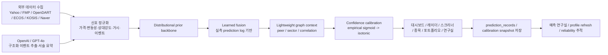
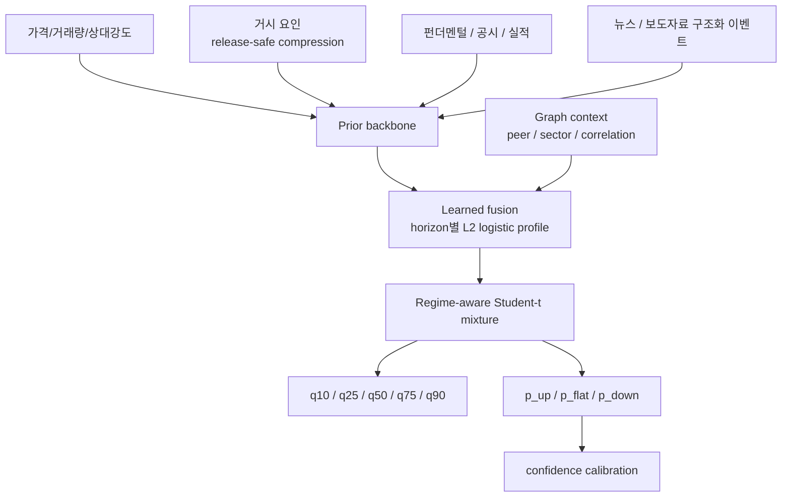

# Stock Predict

## v2.55.2 예측 연구실 표본 누적 복구

- `/lab` 기본 조회가 `refresh=false`여도 만기 도달한 예측 로그를 짧은 시간 안에서 먼저 재평가하도록 바꿨습니다. 그래서 사용자가 연구실에 들어왔을 때 이미 저장된 pending 표본이 있으면 통계가 더 빨리 실측값으로 승격됩니다.
- 연구실 인사이트와 액션 큐는 `저장된 로그는 있지만 아직 실측 평가가 끝난 표본이 없는 상태`를 별도 문구로 안내합니다. 이제 단순히 “표본 부족”으로만 보이지 않고, 실제로 몇 건이 평가 대기 중인지 바로 확인할 수 있습니다.
- Render 메모리 세이프 startup에서도 `prediction accuracy refresh`만은 짧은 제한 시간과 작은 배치 크기로 실행되도록 조정했습니다. 다른 무거운 워밍업은 그대로 건너뛰고, 연구실 표본 평가만 운영 부팅 직후 다시 이어집니다.
- Render free 환경의 로컬 SQLite는 여전히 장기 영속 저장소가 아니므로, 매우 잦은 재배포 구간에서는 긴 히스토리가 줄어들 수 있습니다. 대신 `/tmp` 즉석 경로를 쓰지 않고 앱 경로 DB를 유지하며, startup/route refresh를 함께 걸어 표본이 비어 보이는 시간을 줄였습니다.

## v2.55.1 모바일 UI 안정화

- 모바일 상단 고정 바가 검색 헤더와 첫 카드 위로 겹치던 문제를 수정해, 첫 진입 시 검색창과 페이지 헤더가 가려지지 않도록 레이아웃 오프셋을 본문 열 기준으로 다시 맞췄습니다.
- 모바일 메뉴 드로어에 독립 스크롤과 background scroll lock을 추가해, 긴 메뉴에서도 하단 항목까지 안정적으로 이동할 수 있습니다.
- 칩, 버튼, 경고 패널, 빈 상태 카드의 긴 문구가 칸 밖으로 튀어나오지 않도록 공용 줄바꿈과 overflow 규칙을 보강했습니다.

## v2.55.0 예측 연구실 강화

- `/lab`에서 단순 집계표만 보는 대신 `지금 볼 것`, `반복되는 실패 패턴`, `리뷰 큐`를 함께 보여주도록 확장했습니다.
- 최근 검증 로그를 기준으로 어떤 horizon이 먼저 손봐야 하는지, 어떤 형태의 미스가 반복되는지, 어떤 종목을 바로 복기할지 우선순위를 정리합니다.
- stock scope 리뷰 항목은 `/stock/[ticker]` 상세 화면으로 바로 이어져 예측 연구실과 실제 종목 분석 흐름이 끊기지 않도록 맞췄습니다.

## Responsive UI 기준

- 전 화면 버튼, 입력, 패널, 테이블 래퍼는 `frontend/src/app/globals.css`의 semantic `clamp()` 토큰과 공용 primitive를 우선 사용합니다.
- 모바일과 PC는 같은 정보 구조를 유지하되, `portfolio`와 `screener`처럼 긴 표는 모바일 카드형 요약 + 데스크톱 테이블 혼합 정책을 사용합니다.
- 반응형 회귀는 단일 해상도 대신 viewport smoke로 확인하며, 모바일 상단 검색/계정/드로어가 서로 겹치지 않는지를 기본 기준으로 봅니다.

투자 판단과 포트폴리오 운영을 한 흐름으로 연결한 분석 워크스페이스입니다. 이 프로젝트는 단순 종목 조회 앱이 아니라 `시장 탐색 -> 종목 해석 -> 포트폴리오 운영 -> 예측 검증`을 한 제품 안에서 이어 주는 것을 목표로 합니다. 숫자 예측은 확률모형이 담당하고, `OpenAI / GPT-4o`는 뉴스·공시 구조화와 서술형 요약 보조에만 사용합니다.

현재 릴리즈: `v2.55.2`
현재 운영 모델 버전: `dist-studentt-v3.3-lfgraph`

- 프론트: [https://yoongeon.xyz](https://yoongeon.xyz)
- 백엔드 API: [https://api.yoongeon.xyz](https://api.yoongeon.xyz)
- 운영 스택: `Vercel + Render + Supabase + Cloudflare`

## v2.54.2 대시보드 fallback 안정화

- `/api/country/KR/report`가 실시간 집계를 끝내지 못해도 최신 아카이브 리포트를 먼저 되살려, 상하위 종목·핵심 뉴스·오늘 포커스가 전부 비어 보이는 상태를 줄였습니다.
- `/api/country/KR/heatmap`과 `/api/market/movers/KR`는 대표 종목 quote 또는 마지막 정상 스냅샷을 우선 재사용해, all-gray 히트맵이나 빈 상승/하락 패널로 남지 않도록 보강했습니다.
- 대시보드의 movers 패널은 빈 배열만 받은 partial 응답을 정상 데이터처럼 그리지 않고, 지연 상태 카드로 자연스럽게 내리도록 표시 조건을 조정했습니다.
- Render free 워밍업이나 외부 소스 지연이 겹칠 때도 `가짜 0값`보다 `마지막 정상값 / 대표 표본 / 지연 안내`를 우선 보여주도록 fallback 우선순위를 다시 정리했습니다.

## v2.54.1 화면 안정화 패치

- `/watchlist`에서 legacy 예측 이력 payload가 섞여 들어올 때 목록 전체가 `"list" object has no attribute "get"`로 무너지던 문제를 고쳤습니다.
- 대시보드의 지수/보조지표 fallback이 `0`, `₩0`, `$0`처럼 실제 값으로 보이던 경로를 줄였습니다. 확보된 숫자가 없을 때는 지연 안내를 먼저 보여줍니다.
- 히트맵 partial fallback은 더 이상 전부 초록색 `+0.00%` 보드처럼 보이지 않고, 실시간 등락률 분포가 늦을 때는 중립 톤으로 먼저 렌더합니다.
- `기회 레이더`는 usable 후보가 있는 상황에서 generic fallback 문구가 국면 카드와 후보 카드에 중복으로 새어 나오지 않게 정리했습니다.
- `/portfolio`는 모델 포트폴리오 계산 한 부분이 늦어져도 자산 요약과 보유 종목 workspace를 먼저 유지하고, 해당 패널만 degraded fallback으로 내려갑니다.

## v2.54.0 심화 추적 관심종목

- `/watchlist`에서 관심종목을 저장한 뒤 `심화 추적 시작/중지`를 바로 켤 수 있습니다.
- 추적 중인 종목은 목록 상단으로 올라오고, 최근 예측 라벨·신뢰도·기록 시각 preview를 함께 보여줍니다.
- 새 상세 화면 `/watchlist/[ticker]`는 공개 stock shell을 먼저 보여준 뒤, 로그인 후에는 최근 예측 변화, 적중 기록, 현재 판단 근거를 이어서 불러옵니다.
- `/stock/[ticker]`에서도 관심종목 상태를 확인해 `관심종목 추가`, `심화 추적 시작`, `심화 추적 보기` 흐름으로 이어집니다.

### 이번에 추가된 API

- `POST /api/watchlist/{ticker}/tracking`
- `DELETE /api/watchlist/{ticker}/tracking`
- `GET /api/watchlist/{ticker}/tracking-detail`

### 저장 구조 메모

- Supabase `watchlist` row에 아래 컬럼을 추가해 사용합니다.
  - `tracking_enabled`
  - `tracking_started_at`
  - `tracking_updated_at`
- 기존 관심종목 add/remove lifecycle 안에서 추적 on/off를 함께 관리합니다.

### 새 에러 코드

- `SP-6017`
  - 관심종목에 없는 종목으로 심화 추적 toggle 또는 tracking detail을 요청했을 때 반환합니다.

처음 보는 분은 이 README의 앞쪽 3개 섹션만 읽어도 “무엇을 위한 프로젝트인지 / 어떻게 작동하는지 / 지금 무엇을 할 수 있는지”를 이해할 수 있도록 구성했습니다. 더 깊은 계약과 내부 규칙은 README 안에서 개요만 설명하고, 세부 사양은 [ARCHITECTURE.md](ARCHITECTURE.md), [API_CONTRACT.md](API_CONTRACT.md), [AI_CONTEXT.md](AI_CONTEXT.md), [DESIGN_BIBLE.md](DESIGN_BIBLE.md), [AGENTS.md](AGENTS.md)로 이어집니다.

## 프로젝트 한눈에 보기

### 이 프로젝트가 해결하려는 문제

투자 앱은 대체로 세 갈래로 나뉩니다.

- 시세나 차트만 보여 주는 앱
- 뉴스와 리포트만 보여 주는 앱
- 포트폴리오 관리만 되는 앱

`Stock Predict`는 이 셋이 따로 노는 문제를 줄이기 위해 만들었습니다.
사용자는 한 화면에서는 시장 전체 흐름을 보고, 다른 화면에서는 개별 종목의 분포 예측을 보고, 또 다른 화면에서는 내 자산 비중과 리스크를 정리해야 합니다. 이 프로젝트는 그 과정을 한 워크스페이스 안에서 이어 주는 데 초점을 둡니다.

### 누가 쓰기 좋은가

- 한국 시장을 중심으로 빠르게 시장 스냅샷과 후보 종목을 보고 싶은 사용자
- 단순 목표가보다 `확률`, `분위수`, `confidence calibration`을 더 중요하게 보는 사용자
- 보유 종목 추천과 시장 탐색을 따로 떼지 않고 한 흐름으로 보고 싶은 사용자
- “모델이 지금 얼마나 믿을 만한가”를 `/lab`에서 함께 확인하고 싶은 사용자

### 지금 할 수 있는 일

- 대시보드에서 선택 시장의 브리핑, 핵심 수치, 히트맵, 강한 셋업 요약 보기
- `Opportunity Radar`에서 KR 유니버스 후보 스캔과 실행 액션 우선순위 보기
- 스크리너에서 조건 기반 종목 필터링 실행
- 종목 상세에서 공개 판단 요약, 확률 구조, 가격 분위수, 기술/이벤트 요약 보기
- 포트폴리오에서 보유 종목, 자산 기준, 조건 추천, 최적 추천, 일일 이상적 포트폴리오 보기
- 캘린더에서 월간 핵심 일정과 upcoming events 보기
- 아카이브에서 기관 리서치와 내부 분석 리포트 다시 보기
- 예측 연구실에서 `1D / 5D / 20D` 실측 성과, Brier, reliability gap, learned fusion 상태 보기

### 이 프로젝트를 이해할 때 가장 중요한 사실

- 숫자 예측 backbone은 `LLM`이 아니라 `distributional_return_engine.py`입니다.
- 표시 confidence는 보기 좋게 꾸민 점수가 아니라, 실측 로그 기준으로 다시 보정된 값입니다.
- 공개 화면은 가능한 한 `504`보다 `200 + partial + fallback_reason`을 우선합니다.
- 로그인 전에도 `/portfolio`, `/watchlist`는 빈 화면 대신 public preview로 시작합니다.
- 무료/저비용 운영을 전제로 하지만, 문서의 중심은 제약이 아니라 “무엇을 할 수 있는지”에 둡니다.

## 어떻게 작동하나요

이 프로젝트의 큰 흐름은 아래와 같습니다.

1. 외부 데이터와 가격 시계열을 수집합니다.
2. 가격, 변동성, 상대강도, 거시, 펀더멘털, 이벤트 신호를 정규화합니다.
3. `distributional prior backbone`이 미래 로그수익률 분포를 먼저 만듭니다.
4. 실측 prediction log가 충분한 horizon은 `learned fusion`으로 prior score를 보강합니다.
5. 피어/섹터/상관관계 기반 `graph context`가 있으면 가중 blend를 한 번 더 적용합니다.
6. 방향 확률과 support score를 `confidence calibration` 루프에 통과시켜 표시 confidence를 만듭니다.
7. 이 결과를 레이더, 스크리너, 종목 상세, 포트폴리오 추천, 예측 연구실에 반영합니다.
8. 예측은 `prediction_records`로 저장되고, 나중에 실측 결과와 다시 비교되어 calibrator와 learned fusion profile을 갱신합니다.



### 공개 페이지는 왜 `partial`이 있나요

실운영에서는 외부 데이터 공급 하나가 늦다고 해서 대시보드 전체가 몇십 초 동안 빈 화면으로 멈추면 안 됩니다. 그래서 공개 집계형 화면은 아래 원칙을 지킵니다.

- 가능하면 `504`보다 `200 + partial + fallback_reason`을 먼저 반환합니다.
- first screen은 `blank card`, `skeleton-only`, raw `Failed to fetch` 대신 최소 usable 결과를 우선 보여줍니다.
- freshness와 degraded 상태는 `generated_at`, `partial`, `fallback_reason`으로 함께 보여 줍니다.

이 설계는 “완벽히 다 모일 때까지 기다린다”가 아니라 “지금 보여 줄 수 있는 가장 신뢰할 수 있는 최소 결과를 먼저 준다”에 가깝습니다.

## 지금 제공하는 기능

아래 표는 현재 Depth 1 화면과 상세 라우트를 기준으로 정리한 제품 지도입니다.

| 화면(URL) | 무엇을 보여주나 | 누가 쓰나 | 공개/로그인 | 핵심 제한 또는 설계 메모 |
|---|---|---|---|---|
| `/` | 시장 브리핑, 핵심 수치, 오늘의 포커스, 히트맵, 강한 셋업, 뉴스 | 처음 들어온 사용자, 시장 체크 사용자 | 공개 | server-first SSR, 일부 패널은 `partial` 허용 |
| `/auth` | 이메일 회원가입, 로그인, 재설정 | 신규/기존 사용자 | 공개 | 가입 필수값: 아이디, 이메일, 이름, 전화번호, 생년월일, 비밀번호 |
| `/radar` | Opportunity Radar, 시장 국면, 실행 우선 후보 | 빠른 후보 탐색 사용자 | 공개 | KR 중심, `quick/full` 2단계 구조, `quick/cached_quick`에서는 `1차 스캔 점수`를 먼저 표시 |
| `/screener` | 조건 기반 종목 필터링 | 조건 검색 사용자 | 공개 | 최초 진입은 `seed_preview`, 직접 실행 후 `full_scan` |
| `/compare` | 종목 2~4개 비교 | 비교 분석 사용자 | 공개 | 비교 대상이 늘수록 dense layout |
| `/stock/[ticker]` | 개별 종목 공개 판단 요약, 확률 구조, 상세 가이드 | 종목 깊이 보기 사용자 | 공개 | `quick snapshot -> prefer_full` 업그레이드 |
| `/country/[code]` | 국가 리포트, macro claims, 시장 요약 | 시장 해석 사용자 | 공개 | 숫자 근거와 자유 서술 분리 |
| `/country/[code]/sector/[id]` | 섹터 리포트와 구성 종목 | 섹터 해석 사용자 | 공개 | 국가 선택 맥락에 종속 |
| `/portfolio` | 자산 기준, 보유 종목, 추천, 이상적 포트폴리오 | 로그인 사용자 | 로그인 우선, 로그아웃 preview | 익명 first paint는 demo preview 카드로 시작 |
| `/watchlist` | 관심종목 저장/관리, 심화 추적 토글, tracked-first preview | 로그인 사용자 | 로그인 우선, 로그아웃 preview | user-specific API는 세션 확인 뒤에만 호출 |
| `/watchlist/[ticker]` | 심화 추적 상세, 최근 예측 변화, 적중 기록, 현재 판단 근거 | 로그인 사용자 | 공개 shell + 로그인 후 심화 데이터 | 관심종목 미포함 종목은 `SP-6017`, tracking off는 온보딩 상태 |
| `/calendar` | 월간 일정, upcoming events, 체크포인트 | 경제 일정 추적 사용자 | 공개 | 일부 공급이 막혀도 월간 핵심 일정은 유지 |
| `/archive` | 기관 리서치, 내부 분석 리포트 | 리서치 재열람 사용자 | 공개 | 카드 요약은 `summary_plain`만 렌더 |
| `/lab` | 예측 실측 성과, calibration, learned fusion 상태 | 모델 검증 사용자 | 공개 | 표본 부족 시 bootstrapping 상태를 솔직하게 표시 |
| `/settings` | 계정 관리, 시스템 진단, 운영 상태, 버전 확인 | 로그인 사용자 | 로그인 | 프론트/백엔드 배포 버전과 데이터 소스 상태 확인 |
| `/archive/export/[id]` | 아카이브 내보내기 | 리포트 공유 사용자 | 로그인/권한 의존 | 포맷별 fallback과 파일명 처리 중요 |

## 핵심 예측 엔진

현재 canonical 기준선은 아래 파일들입니다.

- `backend/app/analysis/distributional_return_engine.py`
  - 숫자 예측 backbone
- `backend/app/analysis/learned_fusion.py`
  - horizon별 learned fusion profile과 blend 규칙
- `backend/app/analysis/stock_graph_context.py`
  - peer / sector / correlation 기반 경량 graph context
- `backend/app/scoring/confidence.py`
  - raw support, confidence normalization, empirical profile 적용
- `backend/app/services/confidence_calibration_service.py`
  - empirical sigmoid / isotonic calibration profile refresh
- `backend/app/services/learned_fusion_profile_service.py`
  - learned fusion profile refresh와 runtime summary

이 엔진을 한 문장으로 요약하면 이렇습니다.

> 가격 시계열을 주신호로 삼아 미래 로그수익률의 조건부 분포를 먼저 만들고, 실측 로그가 쌓인 horizon만 learned fusion과 graph context로 보강한 뒤, 실제 적중률에 맞춰 confidence를 다시 보정하는 구조입니다.

### 꼭 기억해야 할 원칙

1. 숫자 예측은 `OpenAI`가 하지 않습니다.
2. 뉴스·공시·리포트는 방향을 뒤집는 주체가 아니라 `보조 신호`입니다.
3. 예측 결과는 `점 하나`보다 `분포`와 `확률`을 우선합니다.
4. 표시 confidence는 보기 좋은 점수가 아니라, 실측 결과와 맞도록 calibration을 거친 값입니다.
5. 표본이 부족하면 모델은 솔직하게 `prior_only`와 `bootstrapping` 상태를 유지합니다.

## 예측 공식 상세

아래 수식은 “논문처럼 보이기 위한 장식”이 아니라, 현재 코드가 어떤 계산 철학을 쓰는지 이해하기 위한 설명입니다. 일부는 실제 식과 거의 같고, 일부는 코드의 여러 블록을 사람이 읽기 좋게 풀어 쓴 개념식입니다. 각 블록마다 관련 기준 파일을 함께 적었습니다.



### 1. 예측 타깃 정의

기본 타깃은 가격 수준이 아니라 `h` 거래일 뒤 로그수익률입니다.

```text
y_i,t^(h) = log(P_i,t+h / P_i,t)
h in {1, 5, 20}
```

보조 타깃은 벤치마크 대비 초과수익률입니다.

```text
y_i,t^ex,(h) = y_i,t^(h) - y_m(i),t^(h)
```

변수 설명:

- `P_i,t`: 종목 `i`의 시점 `t` 종가
- `P_i,t+h`: `h` 거래일 뒤 종가
- `y_i,t^(h)`: 해당 horizon의 로그수익률
- `y_i,t^ex,(h)`: 같은 horizon에서 시장 대비 얼마나 더 좋은지 보는 초과수익률

관련 파일:

- `backend/app/analysis/distributional_return_engine.py`
- `backend/app/analysis/next_day_forecast.py`

### 2. 입력 변수 정의

| 블록 | 대표 변수 | 의미 | 구현 기준 |
|---|---|---|---|
| 가격/수익률 | `r`, `M(L)`, `VWAPGap` | 단기 반응과 중기 추세 | `distributional_return_engine.py` |
| 변동성 | `RV(L)`, `GK(L)` | 실현 변동성과 range volatility | `distributional_return_engine.py` |
| 거래량 | `VZ(L)` | 거래량 이상치와 수급 변형 감지 | `distributional_return_engine.py` |
| 상대강도 | `RS(L)` | 시장 대비 강약 | `distributional_return_engine.py` |
| 거시 | `m_t` | 공개시차 안전 거시 요인 압축 | `distributional_return_engine.py` |
| 펀더멘털 | `ROE`, `margin`, `growth`, `yield` | 지속력이 긴 재무 체력 | `distributional_return_engine.py` |
| 이벤트 구조화 | `sentiment`, `surprise`, `uncertainty`, `relevance` | 뉴스/공시를 숫자 벡터로 요약 | `distributional_return_engine.py`, `llm_client.py` |
| 흐름 신호 | `flow_score` | 수급/흐름 보조 | `distributional_return_engine.py` |
| graph context | `peer_momentum`, `correlation_support`, `graph_context_score` | 피어/섹터 맥락 | `stock_graph_context.py` |

대표 가격 변수는 아래처럼 계산합니다.

```text
r_i,t = log(C_i,t / C_i,t-1)
M_i,t(L) = sum_{k=1..L} r_i,t-k+1
RV_i,t(L) = annualized realized volatility
GK_i,t(L) = Garman-Klass range volatility
VZ_i,t(L) = log-volume z-score
RS_i,t(L) = cumulative relative strength vs benchmark
VWAPGap_i,t = (Close - VWAP) / VWAP
```

### 3. prior backbone

`prior backbone`은 가격 블록을 중심으로 여러 기간 표현을 병렬로 읽고, 거시·펀더멘털·이벤트를 게이트 방식으로만 보강합니다.

#### 3-1. 다중 기간 가격 인코더

```text
h_i,t^(L) = f_L(X_i,t-L+1:t^price)
L in {20, 60, 120, 252}

alpha_i,t^(L) = softmax_L(q^T tanh(W_L h_i,t^(L) + U m_t))
h_i,t^p = sum_L alpha_i,t^(L) h_i,t^(L)
```

직관:

- `20일`: 최근 이벤트와 수급 변화
- `60일`: 중단기 추세
- `120일`: 중기 구조
- `252일`: 연간 추세와 장기 체력

즉, 하나의 lookback만 고집하지 않고 거시 상태에 따라 어떤 기간 표현을 더 믿을지 조정합니다.

#### 3-2. 공개시차 안전 거시 압축

거시는 예측 시점 이후에 발표된 값을 몰래 쓰면 안 되기 때문에 `release-safe`하게 읽습니다.

```text
x̄_j,t = x_j,τ_j(t)
τ_j(t) = max { s : release_time_j,s <= t }
```

그 뒤 지표 유형에 따라 변환하고 표준화합니다.

```text
level형: 100 * (log x̄_j,t - log x̄_j,t-1)
rate/spread형: x̄_j,t - x̄_j,t-1
z_j,t = (u_j,t - μ_j) / (σ_j + ε)
m_t = W_macro z_t
```

직관:

- `ECOS`, `KOSIS` 값은 그대로 넣지 않고 공개시차와 단위 차이를 먼저 정리합니다.
- KR 거시는 여러 지표를 사람이 손으로 가중합하지 않고 `요인 압축`으로 줄여 사용합니다.

#### 3-3. 펀더멘털 / 공시 / 실적 블록

대표 벡터는 아래와 같이 생각할 수 있습니다.

```text
f_i,t = [
  earnings_yield,
  book_yield,
  ev_ebitda_yield,
  ROE,
  ROA,
  gross_margin,
  operating_margin,
  revenue_growth,
  EPS_growth,
  debt_to_equity,
  current_ratio,
  estimate_revision,
  EPS_surprise,
  DART_event_flags
]
```

직관:

- 뉴스보다 오래 남는 구조적 체력을 따로 읽기 위한 블록입니다.
- 재무/공시 신호는 가격 블록을 완전히 대체하지 않고, 게이트를 통해 보정에 참여합니다.

#### 3-4. 뉴스 / 공시 이벤트 구조화

`OpenAI / GPT-4o`는 종목 수익률을 직접 예측하지 않습니다. 대신 뉴스, press release, 공시를 아래처럼 구조화합니다.

```text
z_n = [
  sentiment,
  surprise,
  uncertainty,
  relevance,
  event_type_one_hot,
  horizon_one_hot
]
```

여러 이벤트는 시차 감소 가중치로 집계합니다.

```text
e_i,t = sum_n ω_n z_n / (sum_n ω_n + ε)
ω_n = relevance_n * source_weight(n) * exp(-Δt_n / τ_type(n))
```

직관:

- 같은 뉴스라도 relevance가 낮거나 오래되면 영향이 줄어듭니다.
- `OpenDART 공시 > 회사 press release > 일반 뉴스 메타데이터` 순서로 신뢰도를 더 높게 둡니다.

#### 3-5. 숫자 주도 게이트 결합

prior backbone은 가격 표현이 중심이고, 거시·펀더멘털·이벤트는 게이트를 통과한 보정치로만 합칩니다.

```text
g_f = a_f * σ(W_f^g [h^p ; f ; m ; e] + b_f^g)
g_m = a_m * σ(W_m^g [h^p ; f ; m ; e] + b_m^g)
g_e = a_e * σ(W_e^g [h^p ; f ; m ; e] + b_e^g)

h_i,t = h_i,t^p + g_f ⊙ φ_f(f_i,t) + g_m ⊙ φ_m(m_t) + g_e ⊙ φ_e(e_i,t)
```

직관:

- 주신호는 가격입니다.
- 거시/공시/뉴스는 `가격 표현을 뒤집는 주체`가 아니라 `가격 표현을 보정하는 보조자`입니다.

### 4. learned fusion

prior backbone은 계속 canonical backbone으로 남고, learned fusion은 실측 로그가 충분한 horizon에만 얹힙니다.

기준 파일:

- `backend/app/analysis/learned_fusion.py`
- `backend/app/services/learned_fusion_profile_service.py`

표본 기준:

- `MIN_FUSION_SAMPLES = 36`
- `MIN_DIRECTION_CLASS_COUNT = 8`

feature map은 아래 필드를 사용합니다.

```text
prior_fused_score
fundamental_score
macro_score
event_sentiment
event_surprise
event_uncertainty
flow_score
coverage_naver
coverage_opendart
regime_spread
```

profile은 horizon별 pure `numpy` L2-regularized logistic regression으로 맞춥니다.

```text
p_learned = sigmoid(β0 + β^T x_fusion)
learned_score = clip((p_learned - 0.5) * 2.4, -1.5, 1.5)
```

graph context가 있으면 learned score에 작은 보강치를 더합니다.

```text
learned_score'
  = clip(
      learned_score
      + graph_context_score * 0.22 * max(0.35, graph_coverage),
      -1.5,
      1.5
    )
```

최종 blend weight는 현재 코드 기준으로 아래와 같습니다.

```text
blend_weight
  = clip((sample_count - 24) / 120, 0.0, 0.65)
    * data_quality_support
    * max(0.35, graph_coverage)

fused_score
  = prior_fused_score * (1 - blend_weight)
    + learned_score' * blend_weight
```

방법 분기:

- profile 없음 또는 표본 부족: `prior_only`
- profile 있음, graph 없음: `learned_blended`
- profile 있음, graph 있음: `learned_blended_graph`

직관:

- learned fusion은 기존 엔진을 뒤엎지 않습니다.
- prior backbone이 계속 중심이고, 실측 로그가 쌓인 horizon만 조심스럽게 보강합니다.
- blend weight 상한을 `0.65`로 두는 이유는, 표본이 생겨도 prior를 완전히 버리지 않기 위해서입니다.

### 5. graph context

기준 파일:

- `backend/app/analysis/stock_graph_context.py`

graph context는 full GNN이 아니라 경량 feature builder입니다.

우선순위:

1. `FMP peers`
2. same `sector / industry`
3. rolling return correlation top-k
4. 아무것도 없으면 `used=false`, coverage `0`, score `0`

coverage 계산은 현재 코드 기준으로 아래와 같습니다.

```text
coverage
  = clip(
      min(peer_count, 5) / 5 * 0.55
      + correlation_support * 0.25
      + news_relation_support * 0.20,
      0.0,
      1.0
    )
```

graph context score는 아래처럼 bounded scalar로 만듭니다.

```text
graph_context_score
  = clip(
      peer_momentum_5d * 0.35
      + peer_momentum_20d * 0.45
      + sector_relative_strength * 0.35
      - peer_dispersion * 0.25
      + correlation_support * 0.12
      + news_relation_support * 0.08,
      -1.0,
      1.0
    )
```

직관:

- 피어가 강한지
- 같은 섹터가 시장보다 강한지
- 최근 상관관계가 실제로 있는지
- 관련 뉴스 맥락이 있는지

를 작은 보정치로 합칩니다. graph가 비어도 예측 전체는 실패하지 않고 prior-only로 안전하게 끝납니다.

### 6. regime gate

시장 상태는 개별 종목 특징만으로 충분하지 않기 때문에 breadth, dispersion, 금리 프록시를 함께 읽습니다.

```text
Breadth_t = average(Close_i,t > MA20_i,t)
Dispersion_t = cross-sectional variance of recent returns
AD_t = (#up - #down) / N_t
u_t = [m_t, Breadth_t, Dispersion_t, AD_t, ΔTreasury_t, MRP_t]

π_t = softmax(W_r u_t + b_r)
```

현재 체제는 보통 아래 3개로 읽습니다.

- `risk_on`
- `neutral`
- `risk_off`

직관:

- 같은 종목이어도 시장 바닥이 흔들리면 기대분포를 더 보수적으로 봅니다.
- 레이더와 포트폴리오의 defensive action은 이 regime 정보를 실제 액션으로 연결하는 역할을 합니다.

### 7. Student-t mixture 출력

최종 수익률 분포는 개념적으로 아래처럼 이해하면 됩니다.

```text
p(y_i,t^(h) | F_t)
= sum_{r=1..3} π_t,r
  sum_{k=1..K} ω_i,t,r,k^(h) * StudentT(y ; μ_i,t,r,k^(h), σ_i,t,r,k^(h), ν_i,t,r,k^(h))
```

여기서:

- `π_t,r`: 시장 regime 확률
- `ω_i,t,r,k`: mixture weight
- `μ`: location
- `σ`: scale
- `ν`: 자유도

왜 Student-t mixture를 쓰나:

- 금융 수익률은 tail이 두껍습니다.
- 이벤트 구간은 비대칭과 fat tail이 쉽게 커집니다.
- 가우시안 하나만으로는 상·하단 꼬리와 비대칭을 설명하기 어렵습니다.

이 분포에서 아래 값들을 파생합니다.

#### 가격 분위수

```text
q_τ,i,t^(h) = F^{-1}(τ)
P̂_i,t+h^(τ) = P_i,t * exp(q_τ,i,t^(h))
```

실제 UI에는 보통 `q10 / q25 / q50 / q75 / q90` 가격으로 다시 보여 줍니다.

#### 방향 확률

```text
P_up   = 1 - F(δ)
P_flat = F(δ) - F(-δ)
P_down = F(-δ)
```

여기서 `δ`는 거래비용과 미세노이즈를 감안한 중립 구간입니다.

#### 기대수익률과 confidence 보조 입력

- `mean_return_raw`
- `mean_return_excess`
- `vol_forecast`
- `probability_edge`
- `analog_support`
- `data_quality_support`

이 값들이 레이더 정렬, 포트폴리오 추천, 표시 confidence 계산의 입력으로 이어집니다.

### 8. confidence calibration

기준 파일:

- `backend/app/scoring/confidence.py`
- `backend/app/services/confidence_calibration_service.py`

confidence는 “그럴듯해 보이는 숫자”가 아니라, 실제 적중률과 맞도록 calibration된 표시값입니다.

개념식은 아래와 같습니다.

```text
raw_confidence_h
  = 100 * (
      0.35 d_h
    + 0.18 a_h
    + 0.08 r_h
    + 0.12 e_h
    + 0.10 g_h
    + 0.07 q_h
    + 0.05 (1 - u_h)
    + 0.05 (1 - v_h)
  )

display_confidence_h = 100 * G_h(raw_confidence_h)
```

여기서:

- `d_h`: distribution support
- `a_h`: analog support
- `r_h`: regime support
- `e_h`: probability edge
- `g_h`: agreement support
- `q_h`: data quality support
- `u_h`: uncertainty support
- `v_h`: volatility support

운영 기준:

- bootstrap prior로 시작
- 실측 로그가 쌓이면 `empirical sigmoid`
- 충분히 쌓이면 `isotonic + reliability bins`

현재 calibration refresh 기준:

- `MIN_CALIBRATION_SAMPLES = 24`
- `MIN_CLASS_COUNT = 6`
- `MIN_ISOTONIC_SAMPLES = 120`
- `MIN_ISOTONIC_CLASS_COUNT = 20`

즉, 표본이 적으면 confidence는 더 보수적으로 유지되고, 실제 로그가 늘수록 “70점이면 실제로도 70%대에 가까운가”를 다시 맞추게 됩니다.

### 9. fallback과 partial

이 프로젝트는 “모든 데이터가 다 올 때까지 기다리는 모델”이 아니라, 운영 환경에서 살아남는 모델을 지향합니다. 그래서 예측 엔진과 공개 API는 degraded mode를 명시적으로 가집니다.

대표 fallback 규칙:

- learned fusion profile 없음
  - `prior_only`
- graph context 없음
  - `learned_blended` 또는 `prior_only`
- LLM timeout
  - 숫자 backbone은 계속 동작
  - 이벤트 구조화/요약만 heuristic 또는 partial fallback
- 외부 API timeout
  - 가능하면 `200 + partial + fallback_reason`
- stock detail full detail timeout
  - `stock_quick_detail`
  - 화면은 quick snapshot으로 먼저 열고, 필요 시 `prefer_full=true` follow-up
- radar full 계산 지연
  - `cached full -> cached quick -> fresh quick -> background full warmup`

중요한 금지사항:

- 오래된 Monte Carlo + LLM 숫자 보정 구조는 현재 사용하지 않습니다.
- free 운영 환경이라고 해서 “대충 heuristic만” 쓰지 않습니다.
- partial은 품질 저하를 숨기는 장치가 아니라, degraded 상태를 명시하고 사용자에게 먼저 보여 주는 계약입니다.

## 포트폴리오 추천과 최적화

현재 canonical optimizer는 `backend/app/services/portfolio_optimizer.py`입니다. 추천, 최적 추천, 일일 이상적 포트폴리오는 같은 optimizer 철학을 공유합니다.

### 목적 함수

핵심 목적 함수는 아래와 같습니다.

```text
w*_t = argmax_{w >= 0, 1^T w <= 1} (
  w^T μ̂_t
  - η w^T Σ̂_t w
  - τ ||w - w_{t-1}||_1
)
```

변수 설명:

- `μ̂_t`: `20거래일 기대수익률 + 기대초과수익률` 기반 기대 벡터
- `Σ̂_t`: `EWMA + shrinkage` 공분산
- `η`: 리스크 회피 강도
- `τ`: 회전율 패널티
- `w_{t-1}`: 기존 보유 비중

### 공분산과 제약

공분산은 개념적으로 아래와 같습니다.

```text
Σ̂_t = λ Σ̂_t^EWMA + (1 - λ) Σ̂_t^shrinkage
```

실제 optimizer는 아래 제약을 같이 둡니다.

- short 금지
- `target_equity` 한도
- `single_cap`
- `country_cap`
- `sector_cap`
- turnover penalty

스타일에 따라 리스크 회피/회전율 기본값도 달라집니다.

- defensive: `η=7.8`, `τ=0.009`
- balanced: `η=6.0`, `τ=0.006`
- offensive: `η=4.6`, `τ=0.004`

### selection score와 defensive action

레이더 후보와 포트폴리오 신규 편입 정렬은 아래 철학을 공유합니다.

```text
selection
= 100 * clip(
    0.30 expected_excess_return
  + 0.25 calibrated_confidence
  + 0.15 probability_edge
  + 0.10 tail_ratio
  + 0.08 regime_alignment
  + 0.07 analog_support
  + 0.05 data_quality
  - 0.20 downside
  - 0.12 forecast_volatility
)
```

그리고 중요한 설계 원칙이 하나 있습니다.

> 이 프로젝트는 “늘릴 종목”만 말하는 앱이 아니라, “줄이거나 보류할 종목”도 같은 등급으로 보여 주는 워크스페이스입니다.

그래서 `reduce_risk`, `capital_preservation`, `stay_selective` 같은 defensive action은 결과에서 숨기지 않습니다. 기존 보유 종목이면 감축/보류 판단을 유지하고, 신규 비중이 필요한 추천에서는 `target_weight_pct = 0`으로 신규 확대만 막도록 설계합니다.

## 사용하는 외부 API와 제한

아래 표는 “무엇을 쓰는가”뿐 아니라 “어디서 막히고, 막히면 시스템이 어떻게 살아남는가”를 같이 정리한 표입니다.

| API / 서비스 | 어디에 쓰나 | 제한 또는 장애 패턴 | 시스템 대응 |
|---|---|---|---|
| `OpenAI / GPT-4o` | 뉴스·공시 구조화, 공개/상세 요약 | timeout, 비용, 키 미설정 | 숫자 backbone은 계속 동작, 요약만 fallback |
| `Yahoo Finance` | 가격 이력, 지수, 기본 펀더멘털 | quote 지연, batch coverage 변동 | cache + representative fallback + partial |
| `FMP` | 스크리너, peer context, 캘린더, 보도자료, 일부 펀더멘털 | plan 제한, 지역별 coverage 편차, timeout | 대체 source, partial, smaller universe |
| `OpenDART` | 공시/재무/이벤트 | 키 필요, 요청 제한, 한국 상장사 한정 | 미설정 시 이벤트 보강만 약해짐 |
| `ECOS` | 한국 거시 데이터 | 키 필요, series coverage 차이 | 거시 요인 일부 약화, 엔진은 계속 동작 |
| `KOSIS` | 통계 보강 | 키와 통계표 ID가 둘 다 필요 | 빠진 지표는 availability mask로 중립 처리 |
| `Naver Search API` | 국내 뉴스 메타데이터 | 키 필요, rate limit | Google News RSS와 함께 best effort |
| `Google News RSS` | 헤드라인 수집 | 원문 한계, 기사 품질 편차 | 구조화 이벤트의 보조 입력으로만 사용 |
| `PyKRX` | KR 수급/보조 입력 | 한국 시장 전용, 데이터 비는 날 존재 | 비면 중립 처리 |
| `Supabase` | Auth, watchlist, portfolio, user metadata | 무료 플랜 pause, 세션 만료 | `401 / SP-6014`, 세션 재검증, 로그인 유도 |
| `Render` | FastAPI 백엔드 호스팅 | free sleep, cold start, 512MB 메모리 | memory-safe startup, partial-first, on-demand warmup |
| `Vercel` | Next.js 프론트 호스팅 | build 시 live API 결합 위험 | request-time SSR, fetch별 revalidate 유지 |
| `Cloudflare` | DNS, SSL, 도메인 | 직접 데이터 계산은 하지 않음 | 안정적 도메인/보안 계층 |

### OpenAI 비용이 생각보다 적을 수 있는 이유

이 프로젝트는 OpenAI를 “모든 요청의 숫자 예측기”로 쓰지 않습니다.

- 대시보드, 레이더, 스크리너의 핵심 숫자 계산은 자체 확률 엔진이 합니다.
- OpenAI는 주로 `country/stock/sector` 요약, 이벤트 구조화, narrative layer에만 붙습니다.
- `cache_ttl_report`는 현재 `21600초`, 즉 `6시간`입니다.
- 그래서 같은 보고서를 반복해서 열어도 OpenAI 비용이 바로 다시 붙지 않는 경우가 많습니다.

즉, OpenAI 사용량이 작다고 해서 “호출은 되는데 아무 일도 안 한다”는 뜻은 아닙니다. 이 프로젝트 구조상 OpenAI는 `선택적`이고, `강하게 캐시된` 보조 계층입니다.

### 운영형 제한 메모

- `Render Free`는 일반적으로 `15분` 이상 inbound traffic이 없으면 spin down 될 수 있고, 다음 요청에 cold start가 붙을 수 있습니다. 최신 정책은 [Render Free instances](https://render.com/docs/free), [Render FAQ](https://render.com/docs/faq)를 함께 보는 것이 가장 정확합니다.
- `Supabase` free project도 inactivity로 pause될 수 있고, pause 상태에서는 `540 project paused`가 반환될 수 있습니다. 공식 문서: [Supabase HTTP status codes](https://supabase.com/docs/guides/troubleshooting/http-status-codes)
- 외부 서비스 정책과 quota는 바뀔 수 있으므로, README에는 “지금 운영에서 실제로 문제가 되는 패턴”을 우선 적고, 최신 숫자 한도는 공식 문서를 다시 확인하는 것을 권장합니다.

## 개발 구조도

이 저장소는 `프론트 App Router`, `백엔드 Router -> Service -> Analysis/Data`, `SQLite runtime cache`, `Supabase user data` 구조를 기본으로 합니다.

### 저장소 구조

```text
.
├─ README.md
├─ AGENTS.md
├─ AI_CONTEXT.md
├─ API_CONTRACT.md
├─ ARCHITECTURE.md
├─ DESIGN_BIBLE.md
├─ verify.py
├─ start.py
├─ frontend/
│  └─ src/
│     ├─ app/          # App Router page entry
│     ├─ components/   # page/panel/chart/auth/state UI
│     └─ lib/          # api contract, account rules, helpers
└─ backend/
   └─ app/
      ├─ main.py       # FastAPI entry
      ├─ routers/      # HTTP API layer
      ├─ services/     # business logic
      ├─ analysis/     # prediction engine
      ├─ scoring/      # confidence / selection / calibration
      ├─ data/         # external data clients
      └─ errors.py     # central error registry
```

### 계층별 역할

| 계층 | 역할 | 예시 |
|---|---|---|
| Frontend App Router | 페이지 엔트리와 SSR 흐름 | `frontend/src/app` |
| Frontend components | 실제 화면 조합과 dense workspace UI | `frontend/src/components` |
| Frontend contract | API 호출, 타입, 계정 규칙 | `frontend/src/lib/api.ts`, `frontend/src/lib/account.ts` |
| Router | HTTP path와 response shape | `backend/app/routers` |
| Service | 업무 규칙, fallback, orchestration | `backend/app/services` |
| Analysis | 예측 엔진, learned fusion, graph context | `backend/app/analysis` |
| Data | 외부 데이터 fetch / source normalization | `backend/app/data` |
| Scoring | confidence, selection, calibration | `backend/app/scoring` |

### SQLite와 Supabase의 역할 분리

| 저장소 | 무엇을 저장하나 | 왜 따로 두나 |
|---|---|---|
| SQLite | 캐시, runtime summary, prediction logs, calibration snapshot | 빠른 로컬 재사용과 분석용 기록 |
| Supabase | Auth, watchlist, portfolio holdings, portfolio profile, user metadata | 사용자별 영속 데이터와 인증 |

### prediction log와 calibration snapshot

`prediction_records`는 나중에 “모델이 실제로 맞았는가”를 확인하기 위한 핵심 기록입니다.

- 예측 시점 값 저장
- target date 이후 actual close 연결
- `calibration_json` 안에 calibration snapshot 저장
- `fusion_features`, `graph_context`, `fusion_metadata`도 nested block으로 함께 저장
- `/lab`과 `system diagnostics`는 이 기록을 다시 읽어 learned fusion / calibration 상태를 보여 줌
- `/api/diagnostics`와 `/settings`는 여기에 더해 route 안정성 요약, first usable latency, hydration failure, session recovery failure까지 함께 모아 공개/로그인 화면의 체감 안정성을 추적함

더 자세한 계층도는 [ARCHITECTURE.md](ARCHITECTURE.md)를 참고해 주세요.

## 운영 동작과 캐시/워밍업

이 섹션은 사용자가 실제로 많이 묻는 질문을 운영 사실 기준으로 정리한 FAQ입니다.

### 병합해서 업데이트하면 시장 스캔을 다시 하나요

짧게 말하면 `merge 자체`로는 다시 스캔하지 않습니다. 다만 `백엔드가 새로 배포되거나 재시작되면` 일부 공개 스냅샷은 다시 만들어질 수 있습니다.

- `프론트만` 배포되면 백엔드 시장 스캔은 다시 돌지 않습니다.
- `백엔드`가 Render에서 새로 시작되면 프로세스 메모리 캐시는 비워질 수 있습니다.
- 하지만 현재 production은 memory-safe startup이어서 무거운 prewarm을 startup에서 강제로 돌리지 않습니다.
- 그래서 “배포되자마자 startup에서 전수 시장 스캔”이 아니라, 첫 `/radar`, `/screener`, 대시보드 요청에서 필요한 quick snapshot을 다시 만들 가능성이 더 큽니다.

### 배포 직후 왜 `partial`이 보일 수 있나요

배포 직후에는 아래 세 가지가 동시에 겹치기 쉽습니다.

- Render cold start
- 프로세스 메모리 캐시 비움
- 느린 외부 공급자 첫 요청

이때 전체 화면을 비우는 대신 `200 + partial + fallback_reason`을 먼저 보여 주는 것이 현재 설계 원칙입니다. 즉 `partial`은 오류 숨김이 아니라, degraded mode를 사용자에게 먼저 설명하는 계약입니다.

### 왜 레이더는 `quick`과 `full`이 나뉘나요

KR 레이더는 유니버스가 크고, 정밀 분포 분석까지 한 번에 끝내면 free-tier 환경에서 첫 화면이 너무 늦어질 수 있습니다. 그래서 현재는 아래 흐름을 씁니다.

1. `cached full`
2. `cached quick`
3. `fresh quick`
4. `background full warmup`

즉 “가능한 후보를 먼저 보여주고, 정밀 분석은 그 다음” 전략입니다.

### 왜 개별 종목은 `quick snapshot` 뒤에 `prefer_full` 업그레이드인가요

개별 종목을 클릭했을 때 첫 화면이 완전히 빈 실패 카드로 열리면 체감 품질이 크게 나빠집니다. 그래서 지금은:

- first click: `quick snapshot`
- hydration 후 필요할 때: `prefer_full=true` follow-up

흐름을 사용합니다. Render memory-safe 환경에서는 detached background full refresh를 오래 남기지 않고, 후속 요청 안에서 bounded full analyze를 마치도록 정리했습니다.

### 왜 startup에서 무거운 보강 작업을 꺼 두었나요

실제 운영에서 Render free 인스턴스가 `512MB` 한도에서 `prediction_accuracy_refresh`, `research_archive_sync`, `market_opportunity_prewarm`, `learned_fusion_profile_refresh`를 동시에 올리면 메모리 피크나 SQLite lock으로 불안정해질 수 있었습니다.

그래서 현재는:

- memory-safe startup mode 우선
- heavy startup jobs skip
- concurrency `1`
- on-demand refresh와 cache 재사용

구조로 바꿨습니다.

### 왜 OpenAI 비용이 적게 보일 수 있나요

다시 한 번 중요한 점만 요약하면:

- OpenAI는 숫자 backbone이 아닙니다.
- 대시보드/레이더/스크리너 핵심 계산은 자체 확률 엔진이 합니다.
- OpenAI는 일부 요약/구조화 경로에만 붙습니다.
- 그 결과도 `6시간` 기준 report cache를 타는 경우가 많습니다.

그래서 사용량이 작게 보이는 것이 구조적으로 자연스러운 편입니다.

### 현재 운영에서 중요한 time budget은 무엇인가요

운영 메모 기준으로 자주 중요한 예산은 아래와 같습니다.

- `market opportunities` route-level full wait: `12초`
- `market opportunities` quick wait: `최대 4초`
- `opportunity quick quote screen`: `1.2초`
- public server fetch 기본 예산: `8초`
- `radar` public fetch 예산: `18초`
- `screener seed`: `12초`
- `lab / archive`: `10초`
- `STARTUP_LEARNED_FUSION_REFRESH_TIMEOUT`: `25초`

이 값들은 “항상 이 안에 끝난다”는 SLA가 아니라, free-tier 환경에서 first screen을 지키기 위한 현재 예산입니다.

## AI 에이전트 문서와 유도 방식

이 저장소는 사람이 읽기 쉽게 문서를 쓰는 동시에, `GitHub 링크만 받은 AI`가 길을 잃지 않게 문서를 나눠 두었습니다.

### 각 문서의 역할

| 문서 | 역할 | AI가 이 문서를 읽으면 좋은 이유 |
|---|---|---|
| `README.md` | 제품 설명과 허브 문서 | 무엇을 위한 프로젝트인지 먼저 이해 |
| `AGENTS.md` | 작업 규칙과 canonical 기준 | 무엇을 바꾸면 안 되는지 이해 |
| `AI_CONTEXT.md` | 빠른 진입용 지도 | 읽기 순서와 핵심 파일 파악 |
| `ARCHITECTURE.md` | 시스템 구조 | 계층과 저장 구조 파악 |
| `API_CONTRACT.md` | 응답/에러/fallback 계약 | 프론트-백엔드 계약 검토 |
| `DESIGN_BIBLE.md` | UI 철학과 정렬 규칙 | 화면 평가 기준 통일 |

### AI를 어떻게 유도하나요

이 저장소는 AI에게 아래 방향을 강하게 유도합니다.

- “예전에 구상한 앱”이 아니라 “지금 운영 중인 사이트”를 기준으로 평가하기
- 숫자 예측 backbone이 OpenAI가 아니라 `distributional_return_engine`임을 분명히 보기
- 공개 경로는 `partial`과 `fallback_reason`을 품질 저하가 아니라 운영 계약으로 이해하기
- 한국어 사용자 문구, 한국어 운영형 문장, 과장 카피 금지 원칙을 따르기
- 문서 변경이 필요하면 README, API_CONTRACT, DESIGN_BIBLE, CHANGELOG를 함께 맞추기

즉, AI가 멋있어 보이는 추측을 하게 만드는 게 아니라, 현재 구조를 정확히 읽게 만드는 문서 세트를 의도적으로 둔 것입니다.

## 디자인 철학

디자인 철학의 요약은 아래 한 문장으로 기억하면 됩니다.

> 이 프로젝트는 콘텐츠 사이트가 아니라 `판단과 운영을 돕는 워크스페이스`입니다.

### 기본 성격

- 차분해야 합니다.
- 정보 밀도를 견뎌야 합니다.
- 행동으로 이어져야 합니다.
- 신뢰감을 잃지 않아야 합니다.

### 페이지 thread 구조

모든 화면은 가능하면 아래 순서로 읽히도록 설계합니다.

1. `Header`
2. `Decision`
3. `Evidence`
4. `Action`
5. `Audit`

즉, 예쁜 카드 대칭보다 “왼쪽 위에서 읽기 좋은 순서”가 더 중요합니다.

### 레이아웃 원칙

- dense workspace 페이지는 공통 `main / aside` 축을 사용합니다.
- 카드마다 다른 정렬 규칙을 만들지 않습니다.
- 빈 카드보다 상태 카드를 우선합니다.
- 같은 화면에서 강조점은 한두 개를 넘기지 않습니다.
- 공용 typography, spacing, control height는 `clamp()` 기반 semantic token으로 맞춰 모바일과 데스크톱에서 비율만 자연스럽게 바뀌게 유지합니다.
- 검색바, 계정 상태, 모바일 drawer, dense form CTA는 같은 touch target과 density 체계를 공유합니다.
- 긴 데이터 표는 무조건 한 방식으로 밀지 않고, `비교표는 가로 스크롤`, `보유 종목/스크리너 같은 작업표는 모바일 카드 요약`으로 나눕니다.

### 문구 원칙

- 한국어 우선
- 과장 카피 금지
- 기능 이름은 실제 내비게이션 용어와 맞추기
- “제약”보다 “효용”을 먼저 설명하기

더 자세한 기준은 [DESIGN_BIBLE.md](DESIGN_BIBLE.md)에 정리돼 있습니다.

## 어디가 어려웠고 어떻게 고쳤는가

이 프로젝트에서 실제로 어려웠던 부분은 “좋아 보이는 모델”보다 “운영에서 살아남는 구조”였습니다. 아래는 가장 대표적인 사례들입니다.

### 1. Render free warm-up과 512MB 메모리 문제

문제:

- cold start에서 startup task가 겹치면 메모리 피크와 SQLite lock이 같이 터질 수 있었습니다.

원인:

- `prediction_accuracy_refresh`, `research_archive_sync`, `market_opportunity_prewarm`, `learned_fusion_profile_refresh`가 동시에 올라가면 free-tier 인스턴스가 버티기 어려웠습니다.

해결:

- memory-safe startup mode
- heavy startup jobs skip
- startup concurrency `1`
- on-demand refresh 중심 구조로 전환

### 2. KR 레이더 quick/full 병목

문제:

- `/radar`는 첫 화면이 오래 비어 있거나 placeholder partial로 자주 떨어졌습니다.

원인:

- 한 요청 안에서 full과 quick가 서로 기다리며 늦어지고, quick 후보 생성도 느린 공급자에 과하게 의존했습니다.

해결:

- `cached full -> cached quick -> fresh quick -> background full warmup`
- representative quick snapshot 우선
- placeholder partial은 first screen에 그대로 고정하지 않기

### 3. Vercel build와 live API 결합 문제

문제:

- Next build의 `Collecting page data`가 live Render API에 매달려 배포가 흔들릴 수 있었습니다.

원인:

- 공개 서버 페이지가 build-time static collection 대상처럼 동작하던 시기가 있었습니다.

해결:

- public server pages는 `revalidate = 0`
- request-time SSR
- fetch별 `next.revalidate`는 유지

### 4. stock detail background refresh 불안정성

문제:

- 개별 종목 상세를 한 번 열고 나면 detached full refresh가 남아 backend가 흔들릴 수 있었습니다.

원인:

- quick partial 뒤 무거운 full detail과 archive save를 background task로 계속 남기던 흐름 때문이었습니다.

해결:

- first click은 quick snapshot
- richer detail은 `prefer_full=true` follow-up request 안에서 bounded 처리
- memory-safe 모드에서는 detached refresh 최소화

### 5. SQLite lock과 공용 캐시 병목

문제:

- 공개 요약 read와 cache read/write가 같은 SQLite lock 경로에 걸리면 partial fallback보다 먼저 응답이 붙잡힐 수 있었습니다.

원인:

- 첫 요청에서 DB lock wait가 길면 캐시 구조가 있어도 체감상 아무 소용이 없었습니다.

해결:

- 프로세스 메모리 캐시 추가
- SQLite read/write fast-fail 프로필 분리
- 같은 snapshot은 메모리에서 먼저 재사용

### 6. partial UI 설계

문제:

- 예전에는 raw fetch error나 큰 빈 카드가 first screen에 드러나기 쉬웠습니다.

원인:

- 백엔드 fallback 계약과 프론트 상태 표현이 충분히 연결되지 않았습니다.

해결:

- `generated_at / partial / fallback_reason` audit strip
- 상태 카드 우선
- raw `Failed to fetch` 노출 제거
- placeholder와 usable partial을 구분

## 현재 한계와 개선 방향

이 프로젝트는 이미 많은 기능을 갖고 있지만, 아직도 솔직히 말해야 할 한계가 있습니다.

### 현재 한계

| 영역 | 현재 한계 | 왜 그런가 |
|---|---|---|
| 시장 범위 | 실운영 중심은 KR | 데이터/검증/운영 자원 집중 |
| public first screen | 외부 공급자 지연 시 `partial`이 남을 수 있음 | free-tier + external API variability |
| Prediction Lab | 표본 부족 시 `bootstrapping` 상태가 길 수 있음 | 실측 기록 누적이 필요 |
| graph context | 일부 종목은 coverage가 낮음 | peer/sector/correlation seed 부족 |
| external API | FMP, OpenDART, Naver, KOSIS는 키/플랜/가용성 영향 | optional source 구조 |
| hosting | cold start를 완전히 없애기 어렵다 | Render free 구조 |

### 개선 방향

- persistent cache 또는 별도 저장소를 써서 warm-up 민감도를 더 줄이기
- graph context coverage를 넓히기 위한 peer seed 품질 개선
- `/lab`의 failure case와 horizon별 breakdown을 더 풍부하게 만들기
- 미국/유럽/일본까지 예측/탐색 범위를 넓힐지, 아니면 KR 특화 품질을 더 밀어 올릴지 명확히 선택하기
- external provider failure를 더 설명적으로 보여 주는 audit 문구 고도화
- public summary와 detailed analysis의 톤 차이를 더 세밀하게 다듬기

## 빠른 시작 / 로컬 실행 / 검증 / 배포

이 저장소는 Windows PowerShell 환경을 기준으로 정리돼 있습니다. 실행 정책이나 shell hook 문제를 피하려면 가상환경 Python을 직접 호출하는 방식을 권장합니다.

### 1. 준비

- Python 가상환경 준비
- Node.js / npm 설치
- 환경 변수 예시 확인
  - `backend/.env.example`
  - `frontend/.env.example`

### 2. 의존성 설치

```powershell
npm install
```

필요하면 프론트에서 직접 설치할 수도 있습니다.

```powershell
cd frontend
npm install
```

### 3. 로컬 실행

가장 간단한 진입점은 `start.py`입니다.

```powershell
& .\venv\Scripts\python.exe .\start.py
```

### 4. 가장 먼저 돌릴 검증

```powershell
& .\venv\Scripts\python.exe .\verify.py
```

### 5. 자주 쓰는 검증 명령

백엔드만 빠르게 보고 싶을 때:

```powershell
& .\venv\Scripts\python.exe .\verify.py --skip-frontend
```

실제 라우트 기준 공개 smoke를 더 보고 싶을 때:

```powershell
& .\venv\Scripts\python.exe .\verify.py --live-api-smoke
```

반응형 viewport까지 함께 보고 싶을 때:

```powershell
& .\venv\Scripts\python.exe .\scripts\browser_smoke.py --base-url http://127.0.0.1:3000 --viewport-matrix
```

운영 배포 상태를 직접 점검할 때:

```powershell
& .\venv\Scripts\python.exe .\verify.py --deployed-site-smoke
```

현재 로컬 버전이 운영에 반영될 때까지 기다릴 때:

```powershell
& .\venv\Scripts\python.exe .\scripts\wait_for_deployed_version.py
```

### 6. 세부 검증

Backend:

```powershell
cd backend
& ..\venv\Scripts\python.exe -m compileall app
& ..\venv\Scripts\python.exe -m unittest discover -s tests -v
```

Frontend:

```powershell
cd frontend
npm run build
npx tsc --noEmit
```

### 7. 배포 메모

- 프론트: `Vercel`
- 백엔드: `Render`
- 계정/사용자 데이터: `Supabase`
- 도메인/DNS: `Cloudflare`

운영 배포를 볼 때는 “코드가 머지됐는가”보다 아래를 같이 봐야 합니다.

- `/api/health`의 `version`
- `/settings`의 프론트/백엔드 버전 카드
- `verify.py --deployed-site-smoke` 통과 여부

## 문서 맵

README는 허브 문서입니다. 더 자세한 내용은 아래 문서를 함께 보는 것이 가장 빠릅니다.

| 문서 | 무엇을 볼 때 읽나 |
|---|---|
| [AGENTS.md](AGENTS.md) | AI 에이전트 작업 규칙, canonical 기준선, 버전/문서 동기화 규칙 |
| [AI_CONTEXT.md](AI_CONTEXT.md) | GitHub 링크만 받은 AI가 어디부터 읽어야 하는지 빠르게 파악할 때 |
| [ARCHITECTURE.md](ARCHITECTURE.md) | 계층 구조, 저장 역할, runtime architecture를 더 자세히 볼 때 |
| [API_CONTRACT.md](API_CONTRACT.md) | 응답 필드, fallback, 에러 코드, 공개 audit 메타데이터를 확인할 때 |
| [DESIGN_BIBLE.md](DESIGN_BIBLE.md) | UI/UX 철학, page thread, spacing, main/aside 정렬 원칙을 볼 때 |
| [CONTRIBUTING.md](CONTRIBUTING.md) | 협업과 기여 흐름을 확인할 때 |
| [CHANGELOG.md](CHANGELOG.md) | 어떤 문제가 언제 어떻게 고쳐졌는지 릴리즈 단위로 추적할 때 |

이 README는 “처음 이해하기 위한 입구” 역할을 하도록 다시 썼습니다.
더 정확한 리뷰나 구현 변경을 하려면, README를 읽은 뒤 위 문서들로 내려가는 흐름을 권장합니다.
