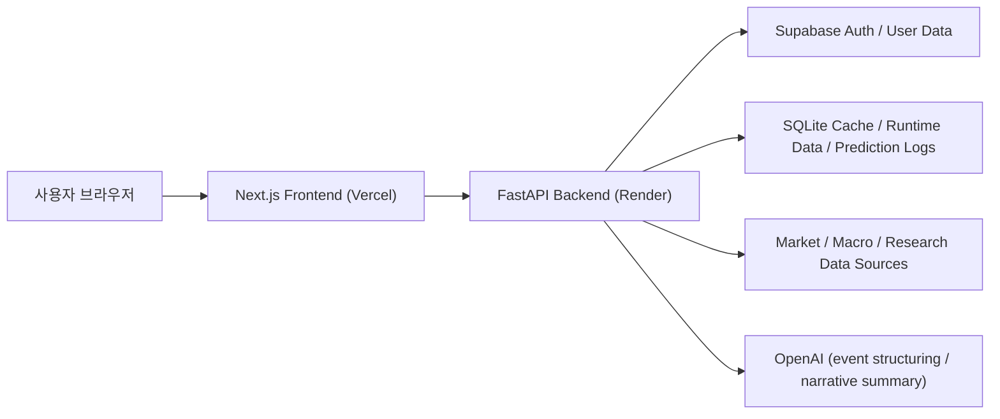
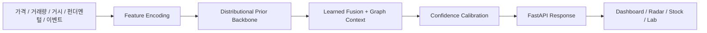
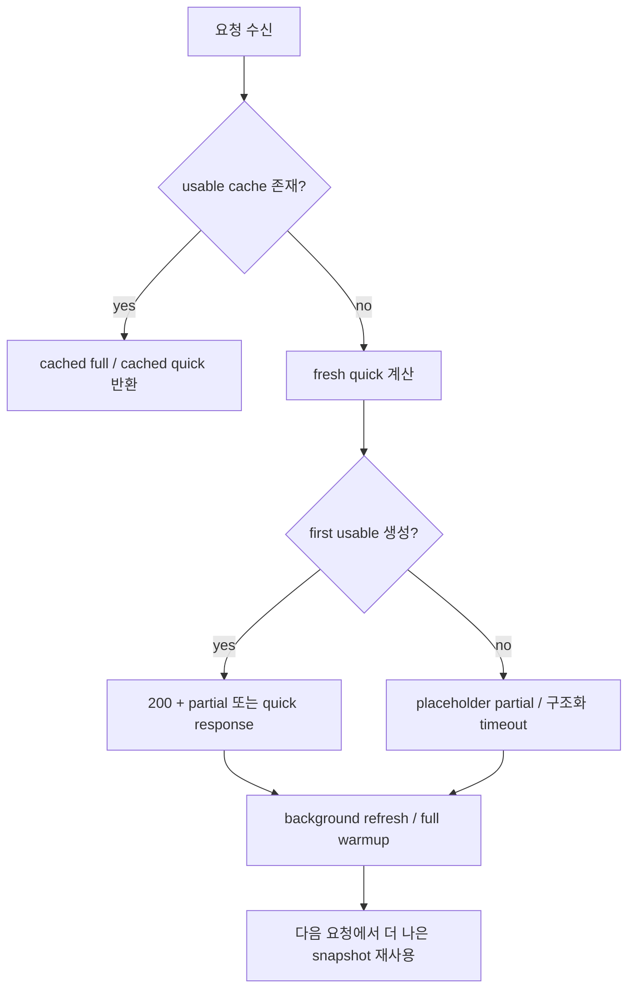

# Stock Predict

투자 판단, 종목 해석, 포트폴리오 운영, 예측 검증을 한 흐름으로 연결한 분석 워크스페이스입니다.
이 프로젝트는 단순 시세 조회나 목표가 제시에 머무르지 않고, `시장 탐색 -> 종목 해석 -> 포트폴리오 운영 -> 예측 검증`을 하나의 제품 안에서 이어 주는 것을 목표로 합니다.

핵심 원칙은 세 가지입니다.

- 숫자 예측은 확률모형이 담당합니다.
- `OpenAI`는 숫자 예측기가 아니라 `구조화 이벤트 추출기 + 서술형 요약기`로 사용합니다.
- 느린 외부 소스 하나 때문에 화면 전체가 죽지 않도록 `partial + fallback`을 먼저 설계합니다.

현재 릴리즈: `v2.58.0`
현재 운영 모델 버전: `dist-studentt-v3.3-lfgraph`

- 프론트: [https://yoongeon.xyz](https://yoongeon.xyz)
- 백엔드 API: [https://api.yoongeon.xyz](https://api.yoongeon.xyz)
- health: [https://api.yoongeon.xyz/api/health](https://api.yoongeon.xyz/api/health)
- 운영 스택: `Vercel + Render + Supabase + Cloudflare`

## 목차

- [무엇을 해결하는 제품인가](#무엇을-해결하는-제품인가)
- [현재 운영 기준선](#현재-운영-기준선)
- [핵심 기능](#핵심-기능)
- [시스템 아키텍처](#시스템-아키텍처)
- [운영 철학과 실패 처리 철학](#운영-철학과-실패-처리-철학)
- [예측 엔진 상세](#예측-엔진-상세)
- [예측 로그와 연구실 표본 누적 구조](#예측-로그와-연구실-표본-누적-구조)
- [기술 스택 상세](#기술-스택-상세)
- [데이터 소스와 fallback 전략](#데이터-소스와-fallback-전략)
- [기능별 설명](#기능별-설명)
- [어려웠던 점과 해결 과정](#어려웠던-점과-해결-과정)
- [Known Limitations](#known-limitations)
- [디자인 방향성](#디자인-방향성)
- [운영 검증과 관련 문서](#운영-검증과-관련-문서)

## 무엇을 해결하는 제품인가

시장 데이터는 많지만, 실제 투자 워크플로우에서는 아래 문제가 반복됩니다.

- 시장 브리핑은 따로 보고, 종목 상세는 또 다른 화면에서 보고, 포트폴리오 판단은 스프레드시트로 따로 관리해야 합니다.
- 종목 하나의 “좋아 보이는 이유”는 볼 수 있어도, 그 판단이 시간이 지나 실제로 얼마나 맞았는지는 보기 어렵습니다.
- 무료 또는 제한된 데이터 소스를 사용하는 환경에서는, 공개 화면이 자주 `불러오는 중`, `빈 화면`, `에러 전용 화면`으로 무너지기 쉽습니다.

Stock Predict는 이 문제를 아래 방식으로 해결합니다.

- 대시보드에서 시장 전체 상태를 먼저 요약합니다.
- 기회 레이더와 스크리너로 후보 종목을 빠르게 좁힙니다.
- 종목 상세에서 확률 분포, 가격 분위수, 이벤트/기술 요약을 함께 봅니다.
- 포트폴리오에서 실제 보유 종목과 추천을 같은 기준으로 비교합니다.
- 예측 연구실에서 과거 예측이 실제로 얼마나 맞았는지 다시 검증합니다.

이 제품은 “AI가 종목을 찍어 주는 서비스”보다, **판단 과정과 운영 흐름을 구조화하는 분석 워크스페이스**에 가깝습니다.

## 현재 운영 기준선

문서와 구현은 `예전에 구상한 제품`이 아니라 **지금 운영 중인 사이트**를 기준으로 맞춥니다.

### 운영 환경

- Frontend: `Next.js App Router` on `Vercel`
- Backend: `FastAPI` on `Render`
- 인증/사용자 데이터: `Supabase`
- 런타임 캐시/연구 로그/보조 저장: `SQLite`
- DNS/도메인: `Cloudflare`

### 시장 범위

현재 서비스는 한국 시장 중심으로 운영됩니다.
다만 README에서는 이 제약을 headline처럼 반복하지 않고, 필요한 문맥에서만 분명하게 적습니다.

### 현재 주요 화면

| 화면 | 역할 | 비고 |
|---|---|---|
| `/` | 대시보드, 브리핑, 시장 스냅샷, 히트맵, 강한 셋업 | 공개 |
| `/radar` | Opportunity Radar | 공개, 대표 유니버스 기반 |
| `/screener` | 조건 기반 필터링 | 공개 |
| `/compare` | 종목 비교 | 공개 |
| `/stock/[ticker]` | 종목 상세 분석 | 공개 |
| `/portfolio` | 보유 종목, 추천, 이벤트 레이더 | 로그인 |
| `/watchlist` | 관심종목 및 심화 추적 | 로그인 |
| `/calendar` | 일정 캘린더 | 공개 |
| `/archive` | 리서치/예측 아카이브 | 공개 |
| `/lab` | 예측 연구실 | 공개 |
| `/settings` | 계정/시스템/진단/운영 상태 | 로그인 |

## 핵심 기능

### 1. 대시보드

- 선택 시장의 브리핑, 핵심 수치, 히트맵, 강한 셋업, 뉴스, 포커스를 한 화면에 요약합니다.
- 일부 데이터 소스가 늦어도 `마지막 정상 스냅샷 + 대표 표본 + partial 안내`를 우선 보여 줍니다.

### 2. Opportunity Radar

- `다음 거래일 포커스`는 보드 상위 몇 종목만 다시 고르는 방식이 아니라, 더 넓은 레이더 후보군을 1일 기준으로 다시 재평가해 1종목을 고릅니다.
- 이 추천은 `1일 예상 수익률`, `상승 확률`, `손익비`, `시장 국면`뿐 아니라 최근 급등 추격 위험도 함께 감점해 단기 추격 매수를 줄이도록 설계합니다.
- 여기에 `추세 정렬`, `MACD 모멘텀`, `RSI 위치`, `거래량 확인`, `볼린저 밴드/돌파 품질`, `ATR 기반 과열`을 묶은 `단타 차트 점수`를 크게 반영합니다.

- KR 기본 유니버스를 `코스피 상위 190개 + 코스닥 상위 10개` 대표 200종목으로 고정합니다.
- 먼저 1차 스코어링으로 후보를 좁히고, 상위 종목만 정밀 분석합니다.
- 상단에는 `다음 거래일 포커스`를 별도로 두어, 상위 후보 중 `예상 수익률 + 상승 확률 + 차트 점수 + 손익비`가 가장 유리한 종목 1개를 진입가/손절가/목표가와 함께 바로 읽을 수 있게 합니다.
- 같은 화면 안에서도 상단 포커스는 `다음 거래일`, 아래 후보 보드는 `20거래일 기대 수익 분포` 기준으로 분리해 보여줍니다.
- 전종목 전수 심층 분석 대신, **운영 가능한 범위 안에서 일관된 후보 보드**를 만드는 전략입니다.

### 3. Screener

- 조건 기반으로 종목을 필터링합니다.
- seed preview와 full scan을 분리해, 첫 화면이 오래 멈추지 않도록 설계했습니다.

### 4. 종목 상세

- 방향 확률, 분위수 기반 가격 범위, 기술 요약, 이벤트/공시 맥락을 함께 보여 줍니다.
- `quick snapshot -> prefer_full` 업그레이드 구조를 유지해 first usable을 먼저 확보합니다.

### 5. 포트폴리오

- 보유 종목, 자산 기준, 조건 추천, 최적 추천, 이벤트 레이더를 하나의 워크스페이스로 연결합니다.
- 모델 포트폴리오 계산이 늦어져도 자산 요약과 보유 종목 패널은 먼저 살립니다.

### 6. 관심종목 / 심화 추적

- 관심종목을 저장하고, 필요 시 `심화 추적`을 켤 수 있습니다.
- `/watchlist/[ticker]`에서 최근 예측 변화, 적중/오차, 현재 판단 근거를 더 깊게 볼 수 있습니다.

### 7. 예측 연구실

- 저장된 예측 로그와 실제 결과를 비교해, 방향 적중률/오차/보정 품질을 점검합니다.
- 단순 성과 표가 아니라 `반복 실패 패턴`, `리뷰 큐`, `현재 표본 상태`까지 함께 보여 줍니다.

## 시스템 아키텍처

### 시스템 구조도



### 예측 파이프라인



### 운영/실패 흐름도



### 저장소 구조 요약

| 경로 | 역할 |
|---|---|
| `frontend/src/app` | Next.js App Router 페이지 엔트리 |
| `frontend/src/components` | UI 패널, 차트, 인증, 상태 카드 |
| `frontend/src/lib/api.ts` | 프론트-백엔드 API 계약 중심 |
| `backend/app/main.py` | FastAPI 엔트리포인트, middleware, startup task |
| `backend/app/routers` | HTTP API 계층 |
| `backend/app/services` | 비즈니스 로직 계층 |
| `backend/app/analysis` | 예측/분석 엔진 |
| `backend/app/scoring` | confidence / selection / calibration 규칙 |
| `backend/app/data` | 외부 데이터 클라이언트 |
| `backend/app/errors.py` | 중앙 에러 코드 레지스트리 |
| `backend/tests` | 회귀 테스트 |

더 자세한 구조는 [ARCHITECTURE.md](./ARCHITECTURE.md)를 참고하세요.

## 운영 철학과 실패 처리 철학

이 프로젝트의 중요한 설계 원칙은 **모든 요청이 완전한 성공을 보장할 수 없다는 사실을 먼저 인정하는 것**입니다.

### 1. hard fail보다 `first usable`을 우선합니다

가능한 경우 공개 화면은 아래 순서를 따릅니다.

1. cached full
2. cached quick
3. fresh quick
4. placeholder partial
5. 그 다음에만 structured timeout / hard error

즉, “완벽한 결과를 늦게 보여주는 것”보다 “쓸 수 있는 첫 결과를 먼저 보여주는 것”을 우선합니다.

### 2. `200 + partial + fallback_reason`을 적극 사용합니다

공개 집계형 API는 가능한 한 아래 메타데이터를 포함합니다.

- `partial`
- `fallback_reason`
- `generated_at`
- `fallback_tier`
- `snapshot_id`

이 방식의 장점은 다음과 같습니다.

- 사용자는 에러 전용 화면 대신 현재 사용 가능한 결과를 먼저 볼 수 있습니다.
- 프론트는 숫자/패널/보드가 “완전 성공인지, 부분 성공인지”를 구분해서 렌더할 수 있습니다.
- diagnostics와 browser smoke에서 복합 장애를 더 명확히 분해할 수 있습니다.

### 3. 패널 단위 격리를 우선합니다

느린 외부 소스 하나 때문에 화면 전체가 무너지지 않도록, 패널별 상태를 분리합니다.

- 좋은 예: 포트폴리오 추천 패널이 늦어도 자산 요약과 보유 종목은 먼저 보여 줌
- 나쁜 예: 뉴스 패널 실패 때문에 전체 대시보드가 blank가 되는 구조

### 4. 보호 API는 인증 계약을 일관되게 유지합니다

보호된 API는 인증이 없을 때 `401 / SP-6014`를 반환합니다.
관심종목에 없는 종목으로 심화 추적을 요청하면 `404 / SP-6017`을 사용합니다.

이 프로젝트에서는 페이지별 ad-hoc 로그인 처리보다, **공통 인증 계약과 세션 복구 흐름**을 우선합니다.

## 예측 엔진 상세

현재 canonical backbone은 [`backend/app/analysis/distributional_return_engine.py`](./backend/app/analysis/distributional_return_engine.py) 입니다.
표시 confidence의 canonical calibration loop는 [`backend/app/scoring/confidence.py`](./backend/app/scoring/confidence.py) 와 [`backend/app/services/confidence_calibration_service.py`](./backend/app/services/confidence_calibration_service.py) 입니다.

### 엔진 개요

엔진은 점예측보다 **조건부 수익률 분포**를 우선합니다.

- 출력은 `q10 / q25 / q50 / q75 / q90`
- 방향은 `p_down / p_flat / p_up`
- 표시 confidence는 heuristic를 바로 노출하지 않고 calibration loop를 거쳐 재보정

입력은 대략 아래 축으로 구성됩니다.

- 가격 시계열과 변동성
- benchmark 대비 상대 흐름
- 거시 압축 요인
- 펀더멘털/애널리스트 요약
- 수급 신호
- 뉴스/공시에서 구조화한 이벤트 특징
- graph context와 learned fusion profile

### 1. regime 확률

엔진은 먼저 시장 체제를 `risk_on / neutral / risk_off`로 요약합니다.

개념 요약식:

```text
logit_risk_on  = 1.10*macro + 0.95*market_momentum + 0.65*fused_score
               + 0.75*breadth + 0.28*advance_decline
               - 0.35*dispersion - 0.80*stress - 0.25*event_uncertainty

logit_neutral  = 0.18 - 0.25*|fused_score| - 0.18*|macro| - 0.10*|breadth|

logit_risk_off = -0.95*macro - 0.85*market_momentum - 0.50*fused_score
               - 0.65*breadth + 0.52*dispersion + 1.00*stress
               + 0.55*event_uncertainty

regime_probs = softmax([logit_risk_on, logit_neutral, logit_risk_off])
```

직관:

- 거시/시장 모멘텀이 좋고 breadth가 넓으면 `risk_on` 확률이 올라갑니다.
- stress, dispersion, uncertainty가 커지면 `risk_off` 쪽 가중이 커집니다.

### 2. horizon별 분포 생성

각 horizon은 단일 정규분포가 아니라, **regime x component mixture 기반 Student-t 분포 샘플링**으로 구성합니다.

개념 요약식:

```text
X_h ~ Σ_r Σ_k π(r, k) * StudentT(df_rk, loc_rk, scale_rk)
```

여기서:

- `r`: `risk_on / neutral / risk_off`
- `k`: bearish / base / bullish component
- `π(r, k)`: regime 확률과 skew 기반 component weight의 곱
- `loc_rk`: historical mean + signal tilt + regime shift + component offset
- `scale_rk`: historical volatility와 regime scale로 조정된 분산

실제 구현에서는 horizon당 `4096`개 샘플을 뽑아 분포를 만듭니다.

이 분포에서 바로 아래를 계산합니다.

```text
q10, q25, q50, q75, q90 = quantile(X_h)

delta  = max(0.0032*sqrt(h), 0.18*std(X_h))
p_up   = P(X_h >  delta)
p_down = P(X_h < -delta)
p_flat = 1 - p_up - p_down
```

직관:

- median 하나만 보여주면 tail risk가 사라지므로 분위수를 함께 노출합니다.
- `flat` 구간은 미세한 흔들림을 방향 신호로 과대해석하지 않기 위한 완충 구간입니다.

### 3. confidence support 조합

confidence는 단일 숫자가 아니라 여러 support의 조합에서 출발합니다.

핵심 support는 아래와 같습니다.

- `distribution_support`
- `analog_support`
- `regime_support`
- `edge_support`
- `agreement_support`
- `data_quality_support`
- `uncertainty_support`
- `volatility_support`

raw support 개념 요약식:

```text
raw_support =
    normalized_weighted_sum(
        distribution,
        analog,
        regime,
        edge,
        agreement,
        quality,
        uncertainty,
        volatility
    )
```

실제 구현 가중은 현재 아래 비중을 사용합니다.

```text
distribution 0.35
analog       0.18
regime       0.08
edge         0.12
agreement    0.10
quality      0.07
uncertainty  0.05
volatility   0.05
```

#### analog support

유사 패턴 품질은 아래 조합으로 요약합니다.

```text
ESS = 1 / Σ (w_i_normalized^2)

analog_support =
    0.45*win_rate_component
  + 0.25*ESS_component
  + 0.15*profit_factor_component
  + 0.15*dispersion_component
```

직관:

- 단순 적중률만 높고 몇 개 샘플에 편중된 analog는 과신하지 않습니다.
- ESS와 dispersion을 같이 보아 “표본 다양성”과 “흩어짐”을 같이 평가합니다.

#### data quality support

```text
data_quality_support =
    0.50*history_component
  + 0.15*macro_available
  + 0.15*fundamental_available
  + 0.10*flow_available
  + 0.10*event_component
```

직관:

- history가 충분한지
- macro / fundamental / flow / event가 실제로 채워졌는지
- event는 수량뿐 아니라 uncertainty까지 반영하는지

### 4. bootstrap prior와 empirical calibration

raw support는 그대로 confidence로 쓰지 않습니다.
horizon마다 먼저 bootstrap prior를 두고, 실제 예측 로그가 쌓이면 empirical profile로 다시 보정합니다.

#### bootstrap sigmoid

```text
p_bootstrap = sigmoid(slope_h * (raw_support - center_h))
```

현재 기본 파라미터:

- `1D`: slope `8.0`, center `0.54`
- `5D`: slope `7.2`, center `0.57`
- `20D`: slope `6.4`, center `0.60`

#### empirical sigmoid

실측 로그가 충분하면:

```text
score = intercept + Σ(alpha_i * feature_i)
p_empirical = sigmoid(score)
```

그 위에 표본이 충분한 경우 isotonic curve를 한 번 더 얹습니다.

```text
p_final = isotonic(p_empirical)
```

즉 표시 confidence는:

1. raw support 계산
2. bootstrap 또는 empirical sigmoid
3. 필요 시 isotonic reliability correction

을 거친 뒤 최종적으로 사용자에게 노출됩니다.

### 5. learned fusion

이 프로젝트는 prior backbone 하나로 끝나지 않고, 표본이 충분한 horizon에서는 learned fusion을 얹습니다.

개념적으로는:

```text
fused_score = (1 - beta) * prior_score + beta * learned_score + graph_adjustment
```

여기서:

- `prior_score`: 가격/거시/펀더멘털/이벤트/수급을 합친 기본 backbone
- `learned_score`: prediction log 기반으로 학습된 fusion profile
- `beta`: horizon별 sample count에 따라 달라지는 blend weight
- `graph_adjustment`: peer/sector 관계와 coverage를 반영한 보정

표본이 부족하면 `prior_only`에 더 가깝고, 표본이 충분할수록 learned fusion 비중이 올라갑니다.

### 6. 포트폴리오 optimizer

canonical optimizer는 [`backend/app/services/portfolio_optimizer.py`](./backend/app/services/portfolio_optimizer.py) 입니다.

핵심 목적함수는 아래 형태입니다.

```text
J(w) = μ'w - λ * (w'Σw) - τ * ||w - w_current||_1
```

여기서:

- `μ`: 기대 초과수익과 기대 총수익을 혼합한 objective mean
- `Σ`: `EWMA + shrinkage covariance`
- `λ`: risk aversion
- `τ`: turnover penalty

공분산은 개념적으로 아래처럼 구성합니다.

```text
Σ_daily = (1 - shrinkage) * EWMA_cov + shrinkage * diag(EWMA_cov)
Σ_horizon = horizon_days * Σ_daily
```

여기에:

- single position cap
- country cap
- sector cap
- 최소 active weight

같은 현실 제약을 projection 단계에서 반복적으로 반영합니다.

## 예측 로그와 연구실 표본 누적 구조

예측 연구실은 별도 샘플 파일을 따로 관리하는 구조가 아니라, **실제 API 예측 흐름에서 발생한 prediction log를 다시 읽는 구조**입니다.

### 저장 흐름

1. 예측 생성
2. `prediction_records`에 저장
3. target date 도달 후 실제값(`actual_close`, `actual_low`, `actual_high`) 업데이트
4. calibration profile refresh
5. `/lab`과 diagnostics에 반영

### 핵심 저장 필드

`prediction_records`에는 대략 아래 정보가 저장됩니다.

- `scope`
- `symbol`
- `country_code`
- `prediction_type`
- `target_date`
- `model_version`
- `prediction_json`
- `calibration_json`
- `actual_close / actual_low / actual_high`

### pending prediction vs evaluated prediction

- `pending prediction`
  - 예측은 저장됐지만 아직 target date가 지나지 않았거나 actual 값이 비어 있음
- `evaluated prediction`
  - actual 값이 들어와 적중/오차/보정 평가가 가능한 상태

이 구분이 중요한 이유는, 연구실에서 표본이 “아예 안 쌓이는 것”과 “쌓였지만 아직 평가되지 않은 것”이 완전히 다른 상태이기 때문입니다.

### calibration_json의 역할

`calibration_json`은 단순 메모 필드가 아니라, 표시 confidence가 왜 그렇게 나왔는지를 나중에 다시 검증하기 위한 snapshot입니다.

여기에는 예를 들어 아래가 들어갑니다.

- raw support
- distribution support
- analog support
- regime support
- edge support
- data quality support
- volatility support
- fusion metadata
- graph context metadata

즉 연구실은 “결과만 보는 화면”이 아니라, **예측 당시의 입력 상태와 confidence 구성까지 다시 읽는 화면**입니다.

## 기술 스택 상세

### 기술 스택 요약 표

| 레이어 | 사용 기술 | 역할 |
|---|---|---|
| Frontend | Next.js App Router, React, TypeScript, Tailwind CSS | SSR, 공개/보호 페이지 UI, 상태 계약 |
| Backend | FastAPI, Pydantic, async Python | API, fallback, 분석 orchestration |
| Auth / User Data | Supabase | 인증, 계정 프로필, 사용자별 watchlist/portfolio |
| Runtime Storage | SQLite | 캐시, prediction log, runtime diagnostics |
| Infra | Vercel, Render, Cloudflare | 프론트/백엔드 배포, DNS, edge 보조 |
| External Data | ECOS, KOSIS, OpenDART, Naver, Yahoo Finance, FMP, 연구 리포트 | 시장/거시/공시/뉴스/시세 입력 |
| AI Layer | OpenAI | 이벤트 구조화, 내러티브 요약 |

### Frontend

#### 왜 Next.js App Router인가

- 공개 화면에서 SSR first usable 확보가 중요합니다.
- `/`, `/radar`, `/stock/[ticker]`처럼 첫 화면 자체가 제품 경험의 핵심입니다.
- 페이지 단위 server-first 구조와 client-side hydration 보강을 함께 쓰기 좋습니다.

#### 왜 TypeScript인가

- 백엔드 응답 shape가 additive로 자주 확장됩니다.
- `partial`, `fallback_reason`, `tracking_enabled`, `failure_class` 같은 필드가 UI에서 안전하게 따라와야 합니다.

#### 왜 Tailwind 기반 UI인가

- dense-data 화면에서 spacing, surface, panel hierarchy를 빠르게 통일하기 쉽습니다.
- 반응형 보정과 primitive 재정의가 빠릅니다.

### Backend

#### 왜 FastAPI인가

- typed response model과 route 계층이 빠르게 맞물립니다.
- 공개 route, 보호 route, diagnostics route를 같은 패턴으로 유지하기 쉽습니다.
- async I/O와 structured error response를 설계하기 좋습니다.

#### 운영상 장점

- route-level partial/fallback을 유연하게 넣기 쉽습니다.
- health/diagnostics와 business route를 같은 프레임에서 관리할 수 있습니다.

### Auth / User Data

#### 왜 Supabase인가

- 인증, session, metadata, user-specific rows를 빠르게 일관되게 처리할 수 있습니다.
- `/auth`, `/settings`, watchlist/portfolio 같은 사용자 데이터 흐름을 직접 auth 서버 없이 관리할 수 있습니다.

#### trade-off

- 세션 복구/reauth/metadata sync를 프론트와 백엔드가 같이 맞춰야 합니다.
- 그래서 이 저장소는 인증 UI 규칙과 보호 API 계약을 강하게 고정합니다.

### Runtime Storage

#### 왜 SQLite인가

- prediction log, cache, diagnostics summary, runtime snapshot을 빠르게 붙이기 좋습니다.
- 작은 운영 환경에서 별도 cache store 없이 시작하기 쉽습니다.

#### trade-off

- Render free 환경에서는 장기 영속성 한계가 있습니다.
- lock contention과 cold restart 후 state 손실 가능성을 항상 고려해야 합니다.
- 그래서 cache timeout, public-read timeout, fail-open을 함께 설계합니다.

### Infra

#### 왜 Vercel + Render + Cloudflare 조합인가

- Vercel: Next.js frontend에 적합
- Render: FastAPI backend를 단순하게 운영 가능
- Cloudflare: DNS/도메인/보조 edge 역할

#### 실제 운영 한계

- Render free는 cold start와 startup time budget 문제가 있습니다.
- background job, long warmup, always-on cache를 기대하기 어렵습니다.
- 그래서 이 프로젝트는 route-triggered refresh, representative sample, structured partial response를 적극 사용합니다.

### AI Usage

이 프로젝트에서 OpenAI의 역할은 분명히 제한합니다.

- 하는 일
  - 뉴스/공시 이벤트를 구조화
  - 서술형 요약 생성
- 하지 않는 일
  - 숫자 가격 예측 직접 생성
  - 비중 최적화 직접 생성

즉 숫자 backbone은 확률모형이고, LLM은 **보조 입력과 설명 계층**입니다.

## 데이터 소스와 fallback 전략

| 소스 | 주 역할 | 자주 생기는 문제 | 현재 fallback |
|---|---|---|---|
| `ECOS` | 거시 지표 | 발표 지연, 최신값 공백 | 이전 값 유지 + macro partial |
| `KOSIS` | 보조 통계 | 응답 지연 | ECOS/이전 snapshot 우선 |
| `OpenDART` | 공시 | 공시 비는 날 존재 | event count 0 허용 |
| `Naver` | KR 대표 quote, 뉴스, 시총 페이지 | HTML 구조 변경 가능성 | cached snapshot / representative quote |
| `Yahoo Finance` | 가격 이력, 일부 quote | 느림, 비일관성, rate limit 가능성 | 제한된 범위에서만 사용, representative scan 우선 |
| `FMP` | 보조 quote / news | free tier 변동성, 제한 | source disable / cached fallback |
| 공식 리서치 소스 | archive/research | source별 품질 편차 | archive sync partial 허용 |

### fallback 전략 핵심

1. 모든 소스를 같은 신뢰도로 취급하지 않습니다.
2. 빠른 공개 화면은 representative sample과 cache를 우선합니다.
3. 느린 소스는 background refresh로 미룹니다.
4. 소스 하나 실패가 전체 API 실패로 번지지 않게 `partial`을 우선합니다.

## 기능별 설명

### `/`

- 시장 브리핑
- 핵심 지표
- 히트맵
- 오늘의 포커스
- 강한 셋업
- 주요 뉴스

### `/radar`

- 대표 200종목 레이더
- 시장 국면
- 1차 스캔 수
- 실제 시세 확보 수
- 상위 후보 정밀 분석

### `/screener`

- 조건 기반 필터
- seed preview
- full scan
- quality filter와 fallback

### `/stock/[ticker]`

- 공개 판단 요약
- 분포 기반 forecast
- 기술 요약
- pivot/forecast delta
- watchlist / 심화 추적 진입

### `/portfolio`

- 자산 기준
- 보유 종목
- 조건 추천
- 최적 추천
- 이벤트 레이더

### `/watchlist`

- 저장 관심종목
- 심화 추적 on/off
- 최근 예측 preview
- tracking detail 이동

### `/lab`

- accuracy summary
- failure patterns
- review queue
- calibration 관련 메타데이터

## 어려웠던 점과 해결 과정

### 1. Render free cold start와 first usable

#### 문제

공개 화면이 cold start 직후 `timeout`, `blank`, `error-only`로 무너지는 경우가 잦았습니다.

#### 왜 어려웠나

- Render free는 startup budget이 빡빡합니다.
- 외부 데이터 fan-out이 큰 요청은 cold 상태에서 더 오래 걸립니다.
- 사용자는 “잠깐 기다리면 나아지는지”와 “실제로 실패한 것인지”를 구분하기 어렵습니다.

#### 버린 선택지

- 모든 startup task를 부팅 시점에 강제로 끝내기
- 공개 화면을 full 계산 완료 후에만 렌더하기

#### 최종 해결

- cached full -> cached quick -> fresh quick -> placeholder partial 순서를 고정
- `200 + partial + fallback_reason`을 우선 사용
- background refresh를 따로 돌려 다음 요청 품질을 올림

#### 남은 한계

- free-tier 특성상 cold request가 느려질 수는 있습니다.
- 다만 지금은 빈 화면보다 usable snapshot이 먼저 나오도록 설계했습니다.

### 2. Opportunity Radar 전종목 전략의 운영상 한계

#### 문제

초기 방향은 KR 전종목 1차 quote screen이었지만, 실제 운영에서는 전수 시세 확보가 자주 늦거나 비었습니다.

#### 왜 어려웠나

- 무료 외부 데이터 소스는 대량 quote fan-out에 취약합니다.
- cache가 비어 있는 순간 전종목 스캔은 first usable을 만들기 어렵습니다.
- 사용자 입장에서는 “전종목 기반”보다 “안정적으로 후보를 보는 것”이 더 중요했습니다.

#### 최종 해결

- KR 기본 유니버스를 `코스피 상위 190개 + 코스닥 상위 10개` 대표 200종목으로 고정
- 대표 유니버스에서 1차 스코어링 후 상위 후보만 정밀 분석

#### 남은 한계

- 소형주 급등 후보 일부는 놓칠 수 있습니다.
- 대신 레이더 보드의 운영 안정성이 훨씬 좋아졌습니다.

### 3. Prediction Lab 표본 누적과 actual evaluation 지연

#### 문제

연구실이 “표본이 안 쌓이는 것처럼” 보이는 구간이 있었습니다.

#### 왜 어려웠나

- prediction log 저장과 actual evaluation은 같은 타이밍에 끝나지 않습니다.
- Render startup이 memory-safe 모드일 때 heavy refresh를 건너뛰면 pending prediction이 오래 남을 수 있습니다.

#### 최종 해결

- prediction accuracy refresh를 startup과 route-triggered refresh에 나눠 배치
- `stored but not yet evaluated` 상태를 연구실 인사이트에서 분리해 보여 줌
- `/tmp` 즉석 경로 대신 앱 경로 DB 유지

#### 남은 한계

- SQLite 기반 runtime log는 장기 영속 저장소가 아닙니다.
- 매우 잦은 재배포가 이어지면 긴 히스토리는 줄어들 수 있습니다.

### 4. 외부 데이터 source fan-out과 partial/fallback 설계

#### 문제

market data, macro, news, research source를 한 요청에 모두 묶으면 하나만 느려도 전체 응답이 늦어졌습니다.

#### 최종 해결

- source 책임 분리
- representative sample 우선
- panel isolation
- `partial`과 `fallback_reason` 메타 추가

### 5. 모바일 UI 겹침과 반응형 문제

#### 문제

- fixed header와 본문 겹침
- drawer 스크롤 불가
- 긴 문구 overflow

#### 최종 해결

- layout offset 재정렬
- 독립 drawer scroll container
- chip/button/warning panel 공통 overflow 규칙

### 6. 패널 장애가 전체 화면으로 번지던 문제

#### 문제

한 패널 실패가 페이지 전체 blank로 번지는 구조가 있었습니다.

#### 최종 해결

- panel state 분리
- fail-open / degraded state
- diagnostics에서 failure class를 따로 집계

## Known Limitations

- Render free cold start는 완전히 제거할 수 없습니다.
- SQLite 기반 runtime data는 장기 영속 저장소로는 한계가 있습니다.
- 무료 외부 데이터 소스는 응답 지연과 공백이 발생할 수 있습니다.
- 대표 유니버스 레이더는 전체 시장 급등 후보를 모두 커버하지 못할 수 있습니다.
- 일부 공개 패널은 외부 소스 상태에 따라 degraded/partial로 내려갈 수 있습니다.

이 README는 한계를 숨기지 않되, **지금 어떤 제약을 어떤 방식으로 관리하고 있는지**를 함께 보여 주는 것을 목표로 합니다.

## 디자인 방향성

이 제품은 `콘텐츠 사이트`가 아니라 `투자 워크스페이스`입니다.
또한 `AI 쇼케이스`가 아니라 `판단과 운영을 돕는 업무 도구`입니다.

핵심 시각 원칙:

- 중립적인 바탕
- 제한된 포인트 색
- dense-data 우선
- 좌측 정렬 중심 읽기 흐름
- 과장된 AI 랜딩 페이지 감성 배제

### UI 설계 원칙

| 원칙 | 의미 |
|---|---|
| 정보 밀도 우선 | 카드 장식보다 읽기 쉬운 정렬과 계층을 우선 |
| 버튼 hierarchy 고정 | primary / secondary / inline action을 반복적으로 재발명하지 않음 |
| 패널 역할 분리 | primary panel, muted panel, warning panel, empty state를 구분 |
| 모바일 일관성 | 모바일에서도 정보 구조는 유지하고, 밀도만 조정 |
| 신뢰감 우선 | 과장된 문구, 네온 톤, 의미 없는 장식 억제 |

더 자세한 UI 기준은 [DESIGN_BIBLE.md](./DESIGN_BIBLE.md)를 참고하세요.

## 운영 검증과 관련 문서

### 대표 검증 명령

```powershell
& .\venv\Scripts\python.exe .\verify.py
& .\venv\Scripts\python.exe .\verify.py --skip-frontend
& .\venv\Scripts\python.exe .\verify.py --live-api-smoke
& .\venv\Scripts\python.exe .\verify.py --deployed-site-smoke
```

### 관련 문서

- [ARCHITECTURE.md](./ARCHITECTURE.md)
- [API_CONTRACT.md](./API_CONTRACT.md)
- [DESIGN_BIBLE.md](./DESIGN_BIBLE.md)
- [CHANGELOG.md](./CHANGELOG.md)
- [AGENTS.md](./AGENTS.md)

### 이 README가 다루는 것과 다루지 않는 것

- 이 README가 다루는 것
  - 제품 개요
  - 시스템 구조
  - 예측 엔진 설계
  - 운영 철학
  - 장애 대응 철학
- 이 README가 깊게 다루지 않는 것
  - 전체 API wire schema
  - 세부 UI primitive 규칙
  - 모든 에러 코드 전문
  - 모든 테스트 케이스 목록

그 세부는 위 관련 문서에서 계속 이어집니다.
