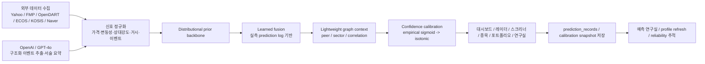
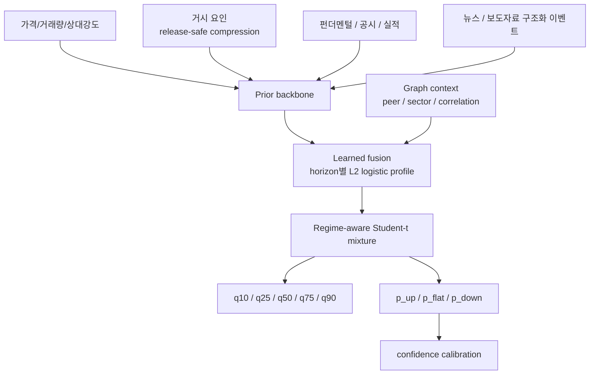

# Stock Predict

투자 판단과 포트폴리오 운영을 한 흐름으로 연결한 분석 워크스페이스입니다. 이 프로젝트는 단순 종목 조회 앱이 아니라 `시장 탐색 -> 종목 해석 -> 포트폴리오 운영 -> 예측 검증`을 한 제품 안에서 이어 주는 것을 목표로 합니다. 숫자 예측은 확률모형이 담당하고, `OpenAI / GPT-4o`는 뉴스·공시 구조화와 서술형 요약 보조에만 사용합니다.

<<<<<<< HEAD
현재 릴리즈: `v2.53.0`
현재 운영 모델 버전: `dist-studentt-v3.3-lfgraph`

=======
핵심 원칙은 세 가지입니다.

- 숫자 예측은 확률모형이 담당합니다.
- `OpenAI`는 숫자 예측기가 아니라 `구조화 이벤트 추출기 + 서술형 요약기`로 사용합니다.
- 느린 외부 소스 하나 때문에 화면 전체가 죽지 않도록 `partial + fallback`을 먼저 설계합니다.

현재 릴리즈: `v2.62.0`
현재 운영 모델 버전: `dist-studentt-v3.3-lfgraph`

### 이번 릴리즈 하이라이트

- `/archive` 기관 리서치 아카이브는 이제 한국 단일 기본값 대신 전체 지역 집계를 먼저 보여주고, 기본 표본도 `40건`까지 넓혀 더 많은 원문을 바로 읽을 수 있습니다. 기존 6개 소스에 더해 `Federal Reserve FEDS Notes`, `FEDS`, `IFDP`, `ECB Publications`를 추가해 해외 정책·연구 리포트 표본도 함께 보강했습니다.
- `/calendar`는 이제 한국 일정만 따로 보는 화면이 아니라, 같은 월간 보드 안에서 미국·유로존·일본 핵심 매크로와 대표 기업 실적까지 함께 읽습니다. `upcoming_events` 기본 노출은 `12건`, 상단 핵심 카드도 `4건`으로 늘려 실제로 먼저 볼 일정 수가 더 풍부하게 보이도록 맞췄습니다.
- `backend/tests/test_research_archive_service.py`와 `backend/tests/test_calendar_service.py`에는 전체 지역 아카이브 조회, 추가 해외 소스 등록, 글로벌 CPI/금리결정/대표 실적 포함, 국가별 recurring dedupe 유지 회귀를 함께 추가했습니다. 앞으로는 아카이브 표본이 다시 줄거나 해외 캘린더 이벤트가 한국 recurring 일정과 섞여 사라지는 회귀를 테스트에서 바로 잡을 수 있습니다.
- `country report` PDF export는 이제 한글 폰트에 없는 이모지를 그대로 밀어 넣지 않고, `[하락]`, `[상승]`, `[현금유출]` 같은 한국어 표식으로 먼저 치환합니다. 그래서 `/api/country/KR/report/pdf`가 운영 로그에 missing glyph 경고를 남기던 경로를 줄이고, 같은 요약 문구도 더 안정적으로 PDF로 내려가게 맞췄습니다.
- `/api/screener` startup guard가 shared seed가 없을 때 `limit=10` safe shell을 먼저 보여줘도, 공용 startup seed는 별도로 `36개` 기준으로 남깁니다. 그래서 첫 작은 요청 하나 때문에 직후 `limit=50` 요청까지 `10개짜리 partial`로 줄어드는 seed 오염을 막고, 빠른 첫 응답과 충분한 후속 후보 수를 같이 유지하도록 맞췄습니다.
- `/api/screener` startup guard는 이제 shared startup seed가 아직 준비되지 않은 첫 찰나에도 live KR bulk quote path로 흘러가지 않고, 즉시 safe shell을 만들어 반환합니다. 그래서 배포 직후 첫 `/screener?country=KR&limit=10` hit이 seed race 때문에 다시 10초 안팎 full 계산으로 새던 빈틈을 한 번 더 줄였습니다.
- `/api/screener` 기본 공개 쿼리는 이제 Render startup 보호 시간 안에서는 live KR bulk quote 경로보다 `last_success -> shared startup seed`를 먼저 확인합니다. 그래서 배포 직후 첫 `/screener` 진입이 이미 준비된 partial snapshot이 있는데도 다시 live bulk fetch를 타며 9~11초까지 늘어지던 구간을 더 보수적으로 줄였습니다.
- `/api/screener` startup safe mode는 이제 기본 공개 쿼리에서 `limit`이 달라도 공용 startup seed를 재사용합니다. 그래서 배포 직후 첫 스크리너 진입이 `limit=10` 프론트 seed와 `limit=20/50` 운영 점검 요청이 서로 다른 cache key 때문에 다시 cold shell을 만들던 구간을 줄이고, 첫 usable partial을 더 빨리 재사용할 수 있게 맞췄습니다.
- 브리핑 public fallback은 이제 `startup_guard`, `memory_guard`, `timeout`을 같은 문구로 뭉개지 않습니다. 그래서 실제로는 startup 보호 구간인데도 화면에 계속 `브리핑 계산 지연`처럼 보이던 오진을 줄이고, 첫 진입 상태를 더 정확하게 읽을 수 있게 맞췄습니다.
- `daily briefing` full 계산 timeout 뒤에도 이제 런타임 background registry가 같은 작업을 계속 붙잡습니다. 그래서 timeout 응답 직후 task가 사라져 `last_success`까지 못 가는 경로를 줄이고, 뒤이은 요청이 직전 브리핑 seed를 더 안정적으로 재사용할 수 있게 정리했습니다.
- `/api/briefing/daily`는 이제 5분 본캐시가 비어도 같은 날짜의 `last_success` 스냅샷을 먼저 재사용하고, 뒤에서 refresh를 이어 갑니다. 그래서 캐시 만료 직후 첫 진입이 다시 6초 timeout shell을 맞기보다, 직전 브리핑 스냅샷을 바로 읽고 다음 요청에서 최신 브리핑으로 자연스럽게 따라붙도록 정리했습니다.
- startup prewarm은 이제 `KR country report`를 2초 안에 끝내지 못해도 `country_report_startup_seed`를 먼저 고정합니다. 그래서 배포 직후나 cold wake 직후 첫 `/` 진입이 startup guard 빈 shell 대신, archived/quick 후보를 최대한 섞은 준비된 시장 스냅샷을 바로 읽을 수 있게 맞췄습니다.
- Render memory-safe startup의 `public_dashboard_prewarm`은 이제 `KR country report` 성공 캐시까지 함께 예열합니다. 그래서 첫 `/` 진입이 대시보드와 같은 `KR report` 기반 패널을 바로 읽을 때, 요청 경로에서 정밀 국가 리포트를 0부터 다시 계산하며 `country_report_timeout` partial로 떨어질 가능성을 더 줄였습니다.
- deployed smoke에서 실제로 내려오던 `briefing_partial_snapshot`, `live_snapshot_timeout`, `kr_safe_shell_warming`, `calendar_startup_warming` fallback reason을 프론트 공용 audit 라벨과 요약 문구에 정식 반영했습니다. 그래서 운영 첫 진입에서도 raw fallback key가 그대로 보이지 않고 `브리핑 요약 스냅샷`, `대표 시세 스냅샷`, `기본 스크리너 스냅샷`, `월간 일정 스냅샷`처럼 현재 상태를 더 자연스럽게 읽을 수 있습니다.
- backend `country`와 `briefing` startup guard는 이제 최소 보호 시간만 지난 뒤 메모리 pressure가 안정적인 경우 더 빨리 풀리고, `public_dashboard_prewarm`이 `warning`으로 끝난 경우에도 인스턴스가 이미 안정적이면 live 경로를 다시 시도할 수 있도록 완화했습니다. 그래서 첫 진입 때 메모리는 이미 안정적인데도 `/`, `/radar`, `/api/briefing/daily`가 너무 오래 `startup_guard` partial 문구에만 머무는 구간을 더 줄였습니다.
- frontend 공용 audit 문구는 이제 startup/quick/cache fallback을 무조건 `일부 데이터 지연` 경고로 번역하지 않고 `초기 스냅샷`, `빠른 스냅샷`, `직전 스냅샷`처럼 현재 상태를 더 정확하게 설명합니다. 홈 대시보드의 빈 뉴스 상태도 `기사 연결 대기` 대신 `핵심 기사 보강 중`으로 정리해 첫 진입 인상을 덜 불안하게 맞췄습니다.

- backend `country` startup guard 조기 해제는 이제 `public_dashboard_prewarm=ok` 이후 메모리 pressure가 임계값 바로 위아래에서 소수점 단위로 흔들릴 때도 작은 jitter 완충 구간을 둡니다. 그래서 `/api/country/KR/heatmap`과 `/api/market/opportunities/KR`가 같은 인스턴스에서 몇 초 간격으로 `startup_guard`와 live fallback 사이를 번갈아 오가던 플래핑을 줄이고, 사용자에게 더 일관된 첫 usable 상태를 보여 주도록 정리했습니다.
- `backend/tests/test_country_router.py`에는 `public_dashboard_prewarm` 이후 pressure가 release 임계값에 아주 근접한 경우에도 startup guard가 안정적으로 풀리는 회귀를 추가했습니다. 앞으로는 메모리 pressure가 `0.500x` 부근에서 흔들릴 때 공개 라우트가 다시 startup guard로 튀는 회귀를 테스트에서 바로 잡을 수 있습니다.
- Render memory-safe 운영의 `/api/country/KR/heatmap`은 이제 safe-mode에서 공유 캐시 `wait_timeout`과 KR 대표 시세 fallback timeout을 함께 더 짧게 사용합니다. 그래서 첫 partial 응답이 내부 timeout budget 2.5초를 그대로 다 쓴 뒤 3초대로 밀리던 구간을 줄이고, heatmap usable 응답을 더 빨리 닫으면서 백그라운드 계산과 캐시 복구는 계속 이어 가도록 정리했습니다.
- `backend/tests/test_country_router.py`에는 safe-mode heatmap이 더 짧은 `wait_timeout`과 대표 시세 fallback timeout을 실제로 쓰는 회귀를 추가했습니다. 앞으로는 Render 500MB 운영 한도에서 `/api/country/KR/heatmap` partial 응답이 다시 2.5초 기본 대기를 다 쓰는 회귀를 테스트에서 바로 잡을 수 있습니다.
- Render memory-safe 운영의 `/api/country/KR/report`는 이제 cached/archived 리포트가 비어 있는 동안 background refresh 가능 여부와 관계없이 공개 timeout budget을 더 짧게 사용합니다. 그래서 safe-mode 내부 조건이 흔들릴 때마다 어떤 요청은 2초 안쪽, 어떤 요청은 다시 5~8초대로 튀던 편차를 줄이고, 사용자 입장에서는 partial 응답이 더 일관되게 빨리 보이도록 정리했습니다.
- `backend/tests/test_country_router.py`에는 일반 공개 budget과 safe-mode 단축 budget, 그리고 background refresh가 꺼진 경우에도 단축 budget이 유지되는 회귀를 함께 추가했습니다. 앞으로는 Render 500MB 운영 한도에서 country report가 다시 긴 대기 시간으로 되돌아가는 회귀를 테스트에서 바로 잡을 수 있습니다.
- backend `country` startup guard는 이제 최대 300초를 그대로 고정하지 않고, 최소 보호 시간 이후 `public_dashboard_prewarm=ok`이며 메모리 압박이 낮은 경우 조기 해제됩니다. 그래서 Render memory-safe startup에서도 배포 후 한동안 메모리는 이미 안정적인데 `/api/country/KR/report`, `/api/country/KR/heatmap`, `/api/market/opportunities/KR`가 너무 오래 startup guard partial에만 머무는 구간을 줄였습니다.
- `backend/tests/test_country_router.py`에는 이 조기 해제 조건과 고압 메모리일 때는 guard가 계속 유지되는 회귀를 추가했습니다. 앞으로는 startup guard가 다시 “무조건 5분 고정”으로 되돌아가거나, 반대로 메모리 여유가 없는데 너무 빨리 풀리는 회귀를 테스트에서 바로 잡을 수 있습니다.
- Render memory-safe startup의 `public_dashboard_prewarm`은 이제 캘린더 월간 shell seed도 함께 데웁니다. 그래서 배포 직후 첫 `/api/calendar/KR` 호출이 외부 일정 공급원의 cold fetch를 응답 경로에서 바로 떠안지 않고, 짧은 TTL의 월간 핵심 일정 seed를 먼저 재사용해 첫 usable 응답을 더 빠르게 보여주도록 맞췄습니다.
- `backend/app/services/calendar_service.py`에는 `prewarm_public_calendar_cache_seed()`를 추가하고, `backend/tests/test_main_startup.py`와 `backend/tests/test_calendar_service.py`에는 이 startup seed가 실제로 실행되며 외부 earnings/economic feed를 건드리지 않고 짧은 TTL의 partial shell만 기록하는 회귀를 추가했습니다. 앞으로는 Render 500MB 운영 한도 안에서 배포 직후 캘린더 첫 진입이 다시 5초대 cold hit으로 튀는 회귀를 테스트에서 바로 잡을 수 있습니다.
- Render memory-safe startup의 `public_dashboard_prewarm`은 이제 `시장 지표 -> 데일리 브리핑 -> 기본 screener safe-shell seed`까지 함께 데웁니다. 그래서 운영 첫 진입에서 `/api/screener?country=KR&limit=20`가 `universe_data` lazy import와 safe-shell seed 생성을 요청 경로에서 한꺼번에 떠안던 구간을 startup 쪽으로 당겨, 첫 deployed hit 지연을 더 줄이는 방향으로 맞췄습니다.
- `backend/app/routers/screener.py`에는 `prewarm_public_screener_cache_seed()`를 추가하고, `backend/tests/test_main_startup.py`와 `backend/tests/test_public_dashboard_timeouts.py`에는 이 prewarm이 실제로 실행되며 fallback universe만 사용하고 KR quote import는 건드리지 않는 회귀를 추가했습니다. 앞으로는 Render 500MB 운영 한도 안에서 `/api/screener` 첫 진입 기본 partial cache가 다시 cold import 때문에 흔들리는 회귀를 테스트에서 바로 잡을 수 있습니다.
- Render memory-safe startup에서도 이제 `public_dashboard_prewarm`이 `시장 지표 -> 데일리 브리핑` 순서로 가벼운 공개 캐시를 먼저 데웁니다. 그래서 배포 버전이 막 반영된 직후 첫 운영 스윕에서만 `/api/market/indicators`와 `/api/briefing/daily`가 cold-hit 때문에 30초대까지 튀던 구간을 줄이고, 첫 사용자 진입이 두 번째 새로고침 수준의 응답으로 더 빨리 내려오도록 맞췄습니다.
- backend `briefing` startup guard도 이제 shell을 바로 반환하면서 background warmup을 함께 예약합니다. 앞으로는 Render safe mode 초기 5분 안에 `/api/briefing/daily`를 먼저 연 사용자가 있어도, 다음 조회에서 다시 같은 cold-hit을 반복할 가능성을 더 줄일 수 있습니다.
- `scripts/deployed_site_smoke.py`는 이제 배포 API 측정을 `urllib` 대신 `requests` 클라이언트로 수행하고, `Accept-Encoding: identity`와 `Connection: close`를 명시합니다. 그래서 직접 `requests`로는 1초 안쪽인데 deployed smoke만 30~40초처럼 보이던 false latency를 줄이고, 실제 서버 지연과 검증 체인 지연을 더 정확히 분리할 수 있게 맞췄습니다.
- `backend/tests/test_deployed_site_smoke.py`에는 배포 스모크 fetch가 같은 `requests` 헤더/timeout 규칙을 유지하는지와, `401` 보호 API가 `SP-6014` 없이 내려올 때 elapsed summary를 포함한 실패를 안정적으로 출력하는 회귀를 추가했습니다. 앞으로는 검증 체인 자체가 다시 잘못된 HTTP 클라이언트나 출력 버그 때문에 흔들리는 회귀를 테스트에서 바로 잡을 수 있습니다.
- backend `public_api_memory_hygiene_middleware`는 이제 pre-request memory trim을 짧게 timebox하고, 느려지면 요청을 계속 흘려보내면서 trim은 백그라운드에서 마무리합니다. 그래서 Render 메모리 보호는 유지하되, 서버 route trace는 5초 안쪽인데 실제 클라이언트 요청만 30~40초씩 늘어지던 지연을 줄이는 방향으로 정리했습니다.
- `backend/tests/test_main_memory_hygiene.py`에는 공개 API request가 trim scheduler를 타는지, 느린 trim이 있어도 middleware가 그 완료까지 기다리지 않는지, 이미 돌고 있는 trim이 있으면 추가 요청을 다시 붙잡지 않는지 확인하는 회귀를 추가했습니다.
- backend `/api/briefing/daily`는 이제 `briefing_service` lazy import도 비동기 helper 안에서 로드합니다. 그래서 첫 브리핑 요청이 무거운 모듈 import 때문에 timeout 바깥에서 30초 이상 묶이는 경로를 줄이고, 공개 timeout budget이 실제 import 비용까지 포함해 적용되도록 정리했습니다.
- `backend/tests/test_public_dashboard_timeouts.py`에는 daily briefing timeout이 늦은 cancellation cleanup뿐 아니라 느린 lazy import도 기다리지 않고 바로 partial로 내려가는 회귀를 추가했습니다. 앞으로는 첫 브리핑 진입이 import 비용 때문에 다시 timeout budget 바깥으로 밀리는 회귀를 테스트에서 바로 잡을 수 있습니다.
- backend `/api/briefing/daily`의 공개 timeout은 이제 `shielded background task` 기준으로 동작합니다. 그래서 Render cold wake 직후 브리핑 전체 계산이 늦더라도 timeout 후 늦은 cancellation cleanup을 기다리며 30~40초까지 붙잡히지 않고, 1차 partial을 더 빨리 반환하면서 백그라운드 계산은 계속 살아 cache 복구를 이어 가도록 정리했습니다.
- `backend/tests/test_public_dashboard_timeouts.py`에는 daily briefing timeout이 늦은 cancellation cleanup을 기다리지 않고 바로 partial로 내려가는 회귀를 추가했습니다. 앞으로는 브리핑 6초 budget이 다시 cleanup 대기 때문에 무너지는 회귀를 테스트에서 바로 잡을 수 있습니다.
- backend `/api/country/{code}/report`는 이제 Render `startup_memory_safe_mode`에서도 `startup_guard` 구간이 지나고 메모리 압박이 아주 높지 않으며 분석 모듈이 이미 warm된 상태라면, timeout partial을 내린 뒤 background refresh를 계속 살려 둡니다. 그래서 첫 재시도 이후에도 `country_report_timeout` partial만 반복되던 구간에서 최근 archived/quick fallback을 유지한 채 다음 조회 품질이 더 빨리 회복되도록 정리했습니다.
- `backend/tests/test_country_router.py`에는 safe-mode warm-up이 켜진 경우 timeout fallback이 archived/quick candidate 정보를 계속 포함하면서 background refresh task도 살아 있는지 확인하는 회귀를 추가했습니다. 앞으로는 저압박 safe mode에서 country report가 다시 “빠르게 partial만 반환하고 갱신은 멈춰 버리는” 회귀를 테스트에서 바로 잡을 수 있습니다.
- backend `/api/market/opportunities/{code}`는 이제 Render `startup_guard`에서 cached full/quick이 모두 비어 있더라도 즉시 placeholder만 남기지 않고, dedupe된 `quick warm-up`을 백그라운드로 한 번 예약합니다. 그래서 배포 직후 첫 요청은 가벼운 partial로 닫되, 다음 재조회부터는 usable quick 후보가 더 빨리 살아날 수 있게 정리했습니다.
- `backend/tests/test_public_dashboard_timeouts.py`에는 startup guard가 quick warm-up을 예약하는 경우와, memory pressure guard에서는 그 warm-up마저 시작하지 않는 회귀를 함께 추가했습니다. 앞으로는 cold start 직후 기회 레이더가 다시 placeholder만 반복하고 다음 조회 품질이 회복되지 않는 회귀를 테스트에서 바로 잡을 수 있습니다.
- backend `/api/market/indicators`가 내부적으로 사용하는 `yfinance index quote cache`도 이제 `0값 payload`를 저장하지 않습니다. 그래서 라우트 쪽 shared cache를 비웠더라도 안쪽 `index:*` 캐시에 남아 있던 stale zero 응답을 다시 재사용하던 경로까지 함께 차단했습니다.
- `backend/app/data/yfinance_client.py`의 index quote cache key는 `v2`로 올렸습니다. 그래서 이미 운영 캐시에 남아 있던 오래된 zero quote를 바로 우회하고, 새 요청부터는 실제 정상값만 다시 캐시에 남도록 정리했습니다.
- backend `/api/market/indicators`의 개별 지표 fetch는 더 여유 있는 item budget 안에서 계속 timebox됩니다. 그래서 외부 시세 하나가 느려도 전체 지표 strip이 30초 이상 붙잡히지 않으면서, 직전 패치보다 실제 정상값을 다시 복구할 가능성은 더 높였습니다.
- `backend/tests/test_public_dashboard_timeouts.py`에는 개별 indicator timeout이 cancellation cleanup을 기다리지 않고 바로 응답하는 회귀를 추가했습니다. 앞으로는 공개 대시보드 상단 지표가 다시 single-source stall 때문에 첫 usable 응답을 놓치는 회귀를 테스트에서 바로 잡을 수 있습니다.
- repo 루트에서 `python -m unittest discover -s backend/tests ...`를 바로 실행해도 `app.*` import가 깨지지 않도록 root package shim과 회귀 테스트를 추가했습니다. 이제 수동 기능 루프나 verify 보조 명령을 어느 cwd에서 실행하든 같은 방식으로 백엔드 테스트를 재현할 수 있습니다.

- backend `/api/stock/{ticker}/detail`의 full/quick cache lookup timebox는 이제 `shield + explicit cancel`로 동작합니다. 그래서 SQLite cache lookup이 취소 이후 정리까지 오래 붙잡히더라도, public first-hit은 cache miss로 더 빨리 넘기고 `stock_memory_guard` 또는 quick partial 응답으로 이어지게 정리했습니다.
- backend `/api/stock/{ticker}/detail`의 `stock_memory_guard` shell은 이제 quick cache seed를 메모리에만 남기고 SQLite persistent cache write는 건너뜁니다. 그래서 Render safe mode의 cold first-hit이 이미 가벼운 partial 응답으로 끝났는데도 background-safe shell write가 로컬 DB I/O에 붙잡혀 수십 초까지 늘어지는 경로를 더 짧게 끊었습니다.
- backend `/api/country/{code}/report`의 public 정밀 대기 budget을 `8초 -> 5초`로 더 낮췄습니다. 최근 정상 캐시와 archived report가 없더라도, 공개 첫 진입은 더 빨리 `country_report_timeout` partial로 닫고 background refresh를 이어 가도록 조정해 운영 smoke 기준 10초 안팎까지 늘어지던 국가 리포트 첫 usable 응답을 더 짧게 줄이는 방향으로 맞췄습니다.
- `scripts/deployed_site_smoke.py`는 이제 성공 시간에 재시도 누적과 마지막 성공 시도를 함께 표시합니다. 그래서 이후 루프에서는 “정말 한 번의 응답이 느린지”와 “첫 시도가 실패한 뒤 재시도로 회복됐는지”를 시간을 섞지 않고 바로 읽을 수 있습니다.
- backend `/api/country/{code}/report`는 이제 공개 timeout fallback이 이미 확인한 archived report/quick 후보 조회를 다시 반복하지 않습니다. 최근 정상 캐시와 아카이브를 먼저 확인한 뒤에도 정밀 계산이 늦으면, 응답 경로에서는 더 가벼운 `country_report_timeout` shell을 바로 반환하고 background refresh만 계속 유지해 partial 응답이 10초대까지 다시 늘어지는 구간을 줄였습니다.
- `backend/tests/test_country_router.py`에는 background refresh를 유지한 public timeout fallback이 lightweight 경로로 바로 내려가는 회귀를 추가했습니다. 앞으로는 국가 리포트 timeout 응답이 다시 archived/quick fallback 재조회까지 끌고 가며 느려지는 회귀를 테스트에서 바로 잡을 수 있습니다.
- backend `/api/stock/{ticker}/detail`는 이제 Render safe mode에서 full/quick cache가 모두 비어 있는 첫 공개 진입일 때 quick 빌더를 응답 경로에서 기다리지 않습니다. 기본 경로는 즉시 `stock_memory_guard` shell을 보여 주고, quick snapshot warm은 백그라운드에서 따로 진행해 배포 직후 cold-hit 한 번 때문에 15초 timeout까지 밀리는 구간을 줄였습니다.
- `backend/tests/test_stock_router.py`에는 safe mode cache miss가 `stock_memory_guard`를 바로 반환하면서 quick warm 스케줄만 남기는 회귀를 추가했습니다. 앞으로는 public stock detail 첫 진입이 다시 quick builder I/O에 붙잡혀 늦어지는 회귀를 테스트에서 바로 잡을 수 있습니다.
- `backend/tests/test_stock_router.py`에는 `stock_memory_guard` shell cache seed가 persistent DB cache write 없이 메모리 seed만 남기는 회귀도 추가했습니다. 앞으로는 safe mode 보호 응답이 다시 SQLite cache I/O 때문에 오래 붙잡히는 회귀를 테스트에서 바로 잡을 수 있습니다.
- `backend/tests/test_stock_router.py`에는 stock cache lookup timeout이 취소 cleanup을 기다리지 않고 quick partial로 바로 내려가는 회귀도 추가했습니다. 앞으로는 full cache miss 경로가 다시 SQLite cancel cleanup 때문에 길어지는 회귀를 테스트에서 바로 잡을 수 있습니다.
- backend `/api/research/predictions`와 `/lab`의 기본 진입(`refresh=false`)은 이제 적중률 재계산과 due prediction backfill을 응답 경로에서 기다리지 않고 백그라운드 유지보수 작업으로 넘깁니다. 그래서 첫 진입이 `prediction_lab_cache_wait_timeout`으로 2초 이상 멈추는 대신, 현재 준비된 연구실 데이터를 즉시 보여 주고 후속 보강은 뒤에서 이어가도록 정리했습니다.
- `backend/tests/test_research_and_portfolio.py`에는 prediction lab 기본 진입이 background maintenance를 기다리지 않고 바로 응답하는 회귀를 추가했습니다. 앞으로는 `/lab` 첫 화면이 다시 accuracy refresh/backfill 때문에 느려지는 회귀를 테스트에서 바로 잡을 수 있습니다.
- `기회 레이더` 상위 10개 후보를 기준일마다 별도 cohort로 저장하고, `/lab`에서 `1D / 5D / 20D` 방향 적중률, 20거래일 밴드 적중률, 최근 miss/hit 복기, tag별 분해를 함께 보도록 확장했습니다.
- 레이더 점수는 이제 실측 cohort를 바탕으로 bounded empirical post-score 조정을 함께 반영합니다. 최근 45일 표본을 decay로 읽어 `모멘텀 / 수급 / 실적 / 밸류 / 업황 / 퀄리티` feature별 보정 방향을 계산하되, 점수 가산은 최대 `±6점`으로 제한해 500MB 운영 한도에서도 보수적으로 작동하게 맞췄습니다.
- `/calendar`, `/archive`, `/watchlist`, `/portfolio`, `/stock/[ticker]`, `/lab`에 남아 있던 버튼/세그먼트 누락을 공용 `button hierarchy + responsive segmented control`로 다시 흡수했습니다. 좁은 화면에서도 액션 버튼이 토글 chip처럼 보이거나 한 줄에서 깨지는 구간을 줄였습니다.
- backend `/api/stock/{ticker}/detail`는 이제 Render `startup_memory_safe_mode`에서 quick partial 응답 뒤 `prediction_capture_service`를 전혀 건드리지 않습니다. 그래서 first hit이 이미 `stock_quick_detail`로 충분히 응답했는데도 distributional capture scheduling이 cold `stock_analyzer + db` import를 다시 깨우며 10초대 지연과 추가 메모리 압박을 만들던 경로를 더 보수적으로 끊었습니다.
- `backend/tests/test_stock_router.py`에는 safe mode quick partial이 distributional capture scheduling 자체를 건너뛰는 회귀를 추가했습니다. 앞으로는 stock detail quick 응답이 다시 숨은 side effect import 때문에 느려지는 회귀를 테스트에서 바로 잡을 수 있습니다.
- backend `/api/country/KR/heatmap`는 이제 Render `startup_memory_safe_mode`에서 `yfinance_client`가 아직 cold import 상태면 live heatmap build 자체를 시작하지 않고, 먼저 cache/last-success를 확인한 뒤 그것도 없으면 `heatmap_cold_import_guard` shell로 바로 닫습니다. 그래서 heatmap first hit 하나만으로 `yfinance` 스택을 새로 깨우며 워커 메모리를 다시 `470MB+` critical band로 밀어 올리던 경로를 더 보수적으로 막았습니다.
- heatmap timeout fallback도 이제 safe mode에서 `kr_market_quote_client`가 cold import 상태면 live 대표호가 fetch를 다시 시도하지 않고 placeholder heatmap으로 바로 닫습니다. 그래서 live build timeout 뒤 fallback에서 다시 KR quote client를 깨우며 memory pressure를 한 번 더 올리던 경로를 줄였습니다.
- `backend/tests/test_public_dashboard_timeouts.py`에는 safe mode cold import guard가 live heatmap build/shared cache fetch를 모두 건너뛰는 회귀와, heatmap fallback이 cold KR quote import를 다시 깨우지 않는 회귀를 추가했습니다. 앞으로는 히트맵 first hit이 다시 cold data client import 때문에 지연과 메모리 급등을 같이 만드는 회귀를 테스트에서 바로 잡을 수 있습니다.
- backend `/api/stock/{ticker}/detail`의 quick public 경로는 이제 Render `startup_memory_safe_mode`에서 background full refresh를 아예 시작하지 않습니다. 프론트 기본 흐름은 `preferFull=false`인데도 quick 응답 직후 숨은 full refresh가 다시 돌면서 RSS를 `450MB+` warning band까지 밀어 올리고, 이어지는 diagnostics/screener 지연을 다시 키우던 경로를 끊었습니다.
- `backend/tests/test_stock_router.py`에는 safe mode 저압 구간에서도 stock detail background refresh가 다시 살아나지 않는 회귀를 추가했습니다. 앞으로는 quick 종목 상세 뒤에서 full 분석이 몰래 붙어 메모리를 다시 잡아먹는 회귀를 테스트에서 바로 잡을 수 있습니다.
- backend `/api/stock/{ticker}/detail`은 이제 Render `startup_memory_safe_mode`에서 `stock_analyzer`가 아직 cold import 상태면 uncached quick/full 분석을 바로 시작하지 않고 `stock_memory_guard` shell로 먼저 내려갑니다. 로컬 기준 `stock_analyzer` 첫 import만으로도 RSS가 약 `+136MB` 커지는 구간을 확인했고, 운영에서는 이 cold import가 첫 종목 상세 요청 뒤 memory pressure를 critical까지 끌어올리며 diagnostics 지연을 다시 키우던 경로를 잘랐습니다.
- `backend/tests/test_stock_router.py`에는 safe mode 저압 구간에서도 cold stock analysis import를 피하고 memory guard shell/background refresh skip으로 끝나는 회귀를 추가했습니다. 앞으로는 Render 500MB 한도에서 종목 상세가 다시 uncached first hit만으로 무거운 분석 스택을 깨우는 회귀를 테스트에서 바로 잡을 수 있습니다.
- backend `/api/screener`는 이제 Render safe mode에서 `last_success` seed나 `safe shell` partial을 내려준 뒤 추가 cache warmup background job을 다시 만들지 않습니다. 그래서 partial 응답은 이미 끝났는데 뒤에서 KR bulk snapshot warmup이 계속 돌며 memory pressure와 다음 diagnostics 지연을 다시 키우던 경로를 잘랐습니다.
- `backend/tests/test_public_dashboard_timeouts.py`에는 safe mode shell fallback과 last-success seed가 모두 cache warmup background job 없이 끝나는 회귀를 추가했습니다. 앞으로는 Render 500MB 보호 구간에서 screener partial 응답 뒤에 후속 warmup이 다시 살아나 운영 smoke 직후 메모리와 지연을 밀어 올리는 회귀를 테스트에서 바로 잡을 수 있습니다.
- backend `memory_hygiene`는 이제 Render safe mode에서 `pressure_ratio 0.8` 이상의 elevated warning 구간이면 trim cooldown을 건너뛰고 바로 한 번 더 정리를 시도합니다. 그래서 public smoke 직후 cgroup 사용량이 500MB 한도 바로 아래 warning band에 머무를 때도 다음 요청이 쿨다운에 막혀 손을 놓고 있지 않도록 조정했습니다.
- backend `/api/diagnostics`는 이제 preflight trim 이후 pressure가 `0.8` 이상이면 critical 전이라도 archive/research heavy probe를 건너뛰고 구조화된 skip reason을 바로 반환합니다. 그래서 운영 smoke 직후 warning pressure만으로도 diagnostics가 다시 10초대까지 늘어지며 메모리 회복을 방해하던 구간을 더 짧게 끊습니다.
- `backend/tests/test_memory_hygiene.py`, `backend/tests/test_system_service.py`에는 elevated warning 구간에서 cooldown bypass와 heavy probe skip이 함께 유지되는 회귀를 추가했습니다. 앞으로는 Render 500MB 보호선 바로 아래에서 trim과 diagnostics 축약이 다시 critical 직전까지 늦어지는 회귀를 테스트에서 바로 잡을 수 있습니다.
- backend `/api/screener`는 이제 대표 스냅샷, cache lookup/write, main/fallback build timeout을 모두 `shield + explicit cancel` 기반 timebox로 감쌉니다. 그래서 timeout 자체는 났는데 cancellation cleanup이나 SQLite 정리 대기 때문에 첫 응답이 15초를 그대로 채워 버리던 cold-hit 회귀를 더 짧게 끊습니다.
- `backend/tests/test_public_dashboard_timeouts.py`에는 `screener` cache lookup과 representative snapshot이 cancellation cleanup sleep을 가져도 즉시 partial/shell로 복귀하는 회귀를 추가했습니다. 앞으로는 timeout 뒤 정리 단계 때문에 `/api/screener`가 다시 first-usable 응답을 놓치는 회귀를 테스트에서 바로 잡을 수 있습니다.
- backend `/api/diagnostics`는 이제 응답 시작 전에 현재 메모리 pressure를 먼저 읽고, warning 이상이면 즉시 trim을 한 번 시도한 뒤 probe 예산을 더 짧게 가져갑니다. 그래서 public smoke 직후 RSS가 400MB대 후반으로 치솟은 상태에서 archive/research probe까지 다시 오래 붙잡으며 진단 API 자체가 18초 가까이 늦어지던 구간을 먼저 줄이도록 정리했습니다.
- backend `/api/diagnostics`의 best-effort probe는 이제 timeout이 나면 cancellation cleanup까지 끝날 때까지 기다리지 않고 바로 복귀합니다. 그래서 느린 probe가 이미 timeout으로 판정된 뒤에도 `CancelledError` 정리 sleep 때문에 diagnostics 응답이 추가로 늘어지던 회귀를 더 짧게 끊습니다.
- `backend/tests/test_system_service.py`에는 critical memory pressure에서 heavy probe를 건너뛰는 회귀와, timeout된 probe가 cancellation cleanup에 다시 막히지 않는 회귀를 추가했습니다. 앞으로는 Render 500MB 보호 구간에서 diagnostics가 다시 archive/research probe를 무리하게 수행하거나 timeout 뒤 cleanup 대기까지 끌고 가는 회귀를 테스트에서 바로 잡을 수 있습니다.
- backend `/api/screener`는 이제 본문 10초 timeout 뒤 들어가는 snapshot fallback에도 별도 상한을 둡니다. 그래서 본 경로가 이미 timeout된 뒤 fallback까지 다시 `yfinance` 배치 다운로드를 오래 기다리며 운영 smoke에서 15초를 넘기던 회귀를 더 짧은 shell partial로 끊습니다.
- `backend/tests/test_public_dashboard_timeouts.py`에는 `screener`의 snapshot fallback도 stall될 때 `kr_timeout_shell`로 빠르게 복귀하는 회귀를 추가했습니다. 앞으로는 timeout 뒤 fallback까지 다시 느린 외부 fetch를 붙잡으며 `/api/screener` first-usable 응답이 늦어지는 회귀를 테스트에서 바로 잡을 수 있습니다.
- backend `memory_hygiene`는 이제 Render safe mode에서 trim 시작 기준을 `pressure_ratio 0.6`부터 적용합니다. 그래서 메모리가 이미 warning band에 들어왔는데도 0.7을 넘길 때까지 기다리며 public smoke 한 바퀴 뒤 cgroup 사용량이 500MB 한도 바로 아래에 오래 붙어 있던 구간을 더 일찍 눌러보도록 조정했습니다.
- `backend/tests/test_memory_hygiene.py`에는 warning pressure band에서도 trim이 실제로 시도되는 회귀를 추가했습니다. 앞으로는 trim 시작 기준이 다시 너무 늦어져 memory-safe 모드가 사실상 critical 직전에서만 작동하는 회귀를 테스트에서 바로 잡을 수 있습니다.
- backend `stock detail`은 이제 Render `startup_memory_safe_mode`에서 pressure가 중간 이상으로 올라가면 public quick 경로의 background refresh와 inline full upgrade를 더 일찍 건너뜁니다. 그래서 quick 호출 뒤 숨어서 돌던 full 분석이 RSS를 400MB대 후반까지 끌어올리고, 이어지는 `prefer_full` 호출이 10초대 후반까지 튀거나 `stock_memory_guard`로 늦게 떨어지던 회귀를 더 보수적으로 막습니다.
- `backend/tests/test_stock_router.py`에는 elevated pressure에서 background refresh와 inline full analyze를 건너뛰는 회귀를 추가했습니다. 앞으로는 Render 500MB 보호 구간에서 public stock detail이 다시 full 분석을 무리하게 시작하며 지연과 메모리 급등을 동시에 만드는 회귀를 테스트에서 바로 잡을 수 있습니다.
- backend `stock detail`은 이제 quick snapshot 대기 예산을 더 짧게 고정하고, memory guard shell/quick cache persist를 짧게 timebox합니다. 그래서 Render cold cache나 SQLite lock 구간에서도 `/api/stock/{ticker}/detail` first-usable 응답이 느린 cache write까지 같이 기다리며 6초 이상 끌리는 회귀를 더 줄였습니다.
- `backend/tests/test_stock_router.py`, `backend/tests/test_stock_analyzer.py`에는 memory guard shell과 quick cache persist가 느린 cache write에 막히지 않고 빠르게 복귀하는 회귀를 추가했습니다. 앞으로는 종목 상세 fallback이 다시 cache I/O에 동기 대기하며 first-usable 응답을 늦추는 회귀를 테스트에서 바로 잡을 수 있습니다.
- backend `/api/country/KR/heatmap`은 이제 startup/memory guard 구간에서 `cache` import나 live/universe fallback 전체를 다시 타지 않고, `COUNTRY_REGISTRY`만으로 만든 중립 섹터 shell을 즉시 반환합니다. 그래서 메모리 경고 구간에서도 히트맵 guard 응답이 다시 수초 이상 끌리는 회귀를 줄였고, 홈 대시보드도 완전히 빈 state card 대신 최소한의 섹터 레이아웃을 먼저 유지합니다.
- `backend/tests/test_public_dashboard_timeouts.py`는 heatmap startup guard가 live builder, fallback builder, cache fetch를 모두 건너뛰고 neutral shell만 반환하는 회귀를 고정합니다. 앞으로는 보호 구간에서 히트맵이 다시 cache/bootstrap이나 live fallback을 먼저 타며 느려지는 회귀를 테스트에서 바로 잡을 수 있습니다.
- backend `/api/screener`는 이제 KR quick partial 경로에서 cache lookup, seed write, `last_success` persist를 짧게 timebox합니다. 그래서 representative quote나 safe shell 자체는 이미 준비됐는데도 SQLite cache I/O가 같이 늘어지면서 첫 usable 응답이 10초 이상 밀리던 회귀를 줄였습니다.
- `backend/tests/test_public_dashboard_timeouts.py`에는 `screener`가 느린 cache lookup을 miss로 처리하고, cache persist가 막혀도 partial 응답을 먼저 반환하는 회귀를 추가했습니다. 앞으로는 Render cold cache/lock 구간에서 screener partial path가 다시 cache I/O까지 동기 대기하는 회귀를 테스트에서 바로 잡을 수 있습니다.
- backend `/api/briefing/daily`는 이제 timeout, startup guard, memory guard에 걸리면 `sessions/calendar/archive`를 다시 읽는 서비스 fallback까지 기다리지 않고 라우트 안에서 초경량 shell payload를 즉시 반환합니다. 그래서 브리핑이 partial 상태로 내려갈 때도 하위 의존 하나가 늦어지는 바람에 다시 15초 budget을 넘기는 경로를 더 확실히 잘랐습니다.
- `backend/tests/test_public_dashboard_timeouts.py`에는 `daily briefing`이 startup/memory guard 상태에서 full 브리핑 fetch를 건너뛰고 partial fallback으로 바로 내려가는 회귀를 추가했습니다. 새 프로세스 초반이나 보호 구간에서 브리핑 라우트가 다시 느린 full path를 먼저 붙잡는 회귀를 테스트에서 바로 잡을 수 있습니다.
- `.github/workflows/render-keepalive.yml`은 이제 `main` push에서도 즉시 한 번 실행됩니다. public GitHub Actions 페이지 기준으로 keepalive workflow run이 `0`건이던 상태를 bootstrapping하기 위해, 배포 직후 warm-up과 workflow 활성 확인을 같은 경로로 묶었습니다.
- `backend/tests/test_keepalive_workflow.py`는 keepalive workflow가 `main` push + 10분 cron + manual trigger를 함께 유지하는지 회귀로 고정합니다. 앞으로는 schedule만 남고 push bootstrap이 빠져 workflow가 다시 잠든 상태로 남는 회귀를 테스트에서 바로 잡을 수 있습니다.
- backend `/api/market/indicators`는 이제 Render memory-safe 모드에서 서비스가 막 깨어난 직후나 메모리 압박 구간이면 live 지표 fetch를 바로 건너뛰고 `last_success` 또는 초경량 fallback을 먼저 반환합니다. 운영 smoke에서 `market/indicators` 첫 호출이 15초 timeout에 걸리던 구간을 줄이기 위해, 공개 지표 라우트도 다른 startup guard 공개 경로와 같은 fast fallback 규칙으로 맞췄습니다.
- `backend/tests/test_public_dashboard_timeouts.py`에는 `market indicators`가 startup/memory guard 상태에서 shared cache fetch와 live yfinance fetch를 건너뛰는 회귀를 추가했습니다. 앞으로는 새 프로세스 초반이나 메모리 보호 구간에서 공개 지표 라우트가 다시 느린 외부 fetch를 먼저 붙잡는 회귀를 테스트에서 바로 잡을 수 있습니다.
- backend `countries`, `country report`, `heatmap`, `market/opportunities`는 이제 Render memory-safe 모드에서 서비스가 막 깨어난 직후 몇 분 동안 같은 `startup guard` fast fallback 규칙을 공유합니다. 새 프로세스는 메모리 비율이 낮아도 cold first-hit가 길어질 수 있었는데, 이번에는 국가 목록도 캐시 lookup보다 fallback shell을 먼저 내려 첫 usable 응답을 더 빨리 닫는 쪽으로 정리했습니다.
- `backend/tests/test_country_router.py`, `backend/tests/test_public_dashboard_timeouts.py`에는 최근 startup window 동안 countries cache lookup과 heavy heatmap/live quick path를 건너뛰고 startup guard fallback으로 바로 내려가는 회귀를 추가했습니다. 앞으로는 새 프로세스 초반에 다시 무거운 full path로 들어가는 회귀를 테스트에서 바로 잡을 수 있습니다.
- frontend `public-audit`에는 `heatmap_startup_guard`, `heatmap_memory_guard`, `opportunity_startup_guard`, `opportunity_memory_guard` 라벨/요약을 추가해, 히트맵과 기회 레이더 fallback 이유도 raw code 대신 자연스러운 한국어로 보이도록 맞췄습니다.
- `.github/workflows/render-keepalive.yml`을 추가해 GitHub Actions가 10분마다 `api/health`와 `api/country/KR/report`를 호출하도록 했습니다. Vercel Hobby cron으로는 분 단위 keepalive가 불가능해서, Render cold wake로 20~35초까지 튀던 첫 요청 지연을 완화하는 운영 keepalive를 저장소 안에서 관리하도록 옮겼습니다.
- `backend/tests/test_keepalive_workflow.py`를 추가해 keepalive workflow가 스케줄과 대상 URL을 유지하는지 회귀로 고정했습니다. 앞으로는 workflow가 빠지거나 warm 대상이 바뀌는 회귀를 테스트에서 바로 잡을 수 있습니다.
- backend `stock detail`은 이제 quick/full 계산이 모두 실패하거나 timeout이어도 500/504로 바로 끊지 않고, 최소 shell 상세를 `200 + partial + fallback_reason=stock_minimal_shell`로 먼저 반환합니다. 그래서 Render cold wake나 외부 시세 지연 구간에서도 상세 페이지가 완전히 깨지지 않고, 티커·기본 메타데이터 중심 first-usable 상태를 먼저 유지합니다.
- `backend/tests/test_stock_router.py`에는 stock detail이 no-cache error/timeout에서도 최소 shell fallback으로 내려가는 회귀를 추가했습니다. 앞으로는 quick/full builder가 모두 실패할 때 공개 종목 상세가 다시 500으로 깨지는 회귀를 테스트에서 바로 잡을 수 있습니다.
- backend `country report`는 memory guard가 켜진 순간 `last_success` cache lookup도 먼저 시도하지 않고, 바로 초경량 fallback으로 내려갑니다. `app.data.cache`/`app.database` cold import와 SQLite bootstrap이 보호 모드의 첫 응답 자체를 늦출 수 있는 경로를 잘라, 메모리 압박 구간에서는 “최근 캐시보다 first-usable 속도”를 우선하도록 순서를 고정했습니다.
- `backend/tests/test_country_router.py`에는 memory guard 진입 시 `cached report lookup`까지 건너뛰는 회귀를 추가했습니다. 앞으로는 보호 응답 앞에서 다시 cache import/bootstrap을 먼저 타는 회귀를 테스트에서 바로 잡을 수 있습니다.
- backend `country report` memory-guard fallback은 이제 `countries` cache 조회와 `fear_greed`/`country score` helper를 아예 건너뛰고, 초경량 중립 payload를 바로 반환합니다. 최근 배포에서 메모리는 `500MB` 한도 안으로 안정됐지만 `country_report_memory_guard` 자체가 10초 안팎으로 늦게 닫히던 구간을 더 짧게 줄이는 방향으로 정리했습니다.
- `backend/tests/test_country_router.py`에는 memory-guard fallback이 archived/quick candidate lookup뿐 아니라 `countries` cache lookup과 scoring helper까지 호출하지 않는 회귀를 추가했습니다. 앞으로는 보호 응답이 다시 무거운 import나 cache 경로를 밟는 회귀를 테스트에서 바로 잡을 수 있습니다.
- backend `country report`와 `stock detail`은 이제 응답 직전 동기 `gc/malloc_trim`을 수행하지 않고, 별도 `asyncio` background trim으로 넘깁니다. `Response.background` 경로에서 배포 런타임이 `No response returned` 500으로 깨지지 않도록 수정하면서도, Render `500MB` 보호 구간에서 fallback/cached 응답이 마지막 메모리 정리 때문에 더 늦게 닫히지 않도록 유지했습니다.
- `backend/tests/test_country_router.py`, `backend/tests/test_stock_router.py`에 응답 helper가 trim을 inline으로 호출하지 않고 비동기 trim 스케줄만 거는 회귀를 추가했습니다. 그래서 앞으로는 fast path가 다시 동기 trim에 막히거나, trim 전달 방식 때문에 공개 응답이 깨지는 회귀를 테스트에서 바로 잡을 수 있습니다.
- Render memory-safe startup에서는 `prediction_accuracy_refresh`도 이제 함께 건너뜁니다. cold wake 직후 `yfinance` 가격 이력 재평가가 공개 라우트와 같은 타이밍에 붙지 않도록 줄여, `500MB` 한도 근처에서 startup background job이 추가 메모리와 CPU를 먼저 잡아먹던 구간을 더 보수적으로 막았습니다.
- `/api/countries`는 memory-safe 모드에서 fallback 또는 `last_success`를 반환할 때 더 이상 즉시 background refresh를 시작하지 않습니다. 응답 직후 `asyncio.create_task`가 다시 index quote 수집을 붙잡으면서 cold route와 메모리 보호 응답을 흔들던 문제를 줄여, `countries` 첫 응답이 안전한 shell/fallback 그대로 끝나도록 맞췄습니다.
- 관련 safe mode 기대값을 startup/public dashboard 회귀 테스트에 함께 고정했습니다. 그래서 앞으로는 `prediction_accuracy_refresh`가 Render 보호 모드에서 다시 살아나거나, `countries` fallback이 응답 직후 무거운 background refresh를 다시 켜는 회귀를 테스트에서 바로 잡을 수 있습니다.
- backend `market_service`는 이제 `yfinance_client`, `stock_scorer`, `stock_analyzer`, `distributional_return_engine` 같은 무거운 공개 레이더 의존성을 실제 계산 시점까지 지연 로드합니다. 그래서 `opportunity radar` 첫 요청이 `pandas/yfinance/ta`를 무조건 함께 적재하지 않게 되어, quick route 진입 시 import footprint와 cold-path 메모리 급등을 줄이는 방향으로 정리했습니다.
- Render memory-safe 구간에서 quick `opportunity radar`는 `1일 포커스` 정밀 계산을 잠시 생략하고 1차 후보 목록을 먼저 반환합니다. `next_day_focus`가 없어도 프론트가 안전하게 렌더링되도록 유지한 채, `500MB` 한도 근처에서 메모리 압박 때문에 quick 응답 자체가 늦어지던 구간을 더 줄이는 쪽으로 맞췄습니다.
- backend `llm_client`는 이제 `openai` SDK를 import 시점이 아니라 실제 LLM 호출 시점에 지연 로드합니다. Render `500MB` 메모리 한도 근처에서 공개 route startup이 불필요한 SDK 메모리를 먼저 점유하지 않도록 줄여, cold start RSS를 낮추는 방향으로 정리했습니다.
- `verify.py --deployed-site-smoke`는 배포 브라우저 매트릭스를 돌리기 전에 동일 라우트를 한 번 더 워밍업하고, 전체 viewport matrix 예산도 늘렸습니다. 실제 사이트는 정상인데 cold path 때문에 검증만 `exit 1`로 깨지던 간헐 실패를 줄여 회귀 루프를 더 안정적으로 반복할 수 있습니다.
- 공개 `country report`의 memory-guard 경로를 더 가볍게 줄였습니다. 메모리 보호 응답이 필요한 순간에는 archived report 재조회와 후보 탐색을 먼저 붙잡지 않고, 대표 지수 스냅샷 중심 1차 응답을 바로 반환해 Render `500MB` 한도 근처에서 9~10초까지 늘어나던 보호 응답 지연을 더 낮추는 방향으로 정리했습니다.
- `verify.py`와 `start.py --check`는 이제 Windows에서 repo-local `venv`와 PATH만 보지 않고, 표준 `nodejs` 설치 경로와 로컬 `.cmd` shim까지 해석합니다. `node`가 PATH에 없어도 `next build`, `tsc --noEmit`, 런처 점검이 같은 규칙으로 계속 동작해 회귀 루프 자체가 끊기지 않도록 맞췄습니다.
- `/api/health`는 Render memory-safe 모드에서도 요청 전 `gc/malloc_trim`을 건너뜁니다. readiness 확인과 wake 확인 경로가 메모리 정리 작업 때문에 추가로 느려지지 않도록 분리했습니다.
- 공개 `stock detail`의 cached full/quick lookup은 이제 `stock_analyzer`를 import하지 않고 라우터에서 바로 cache key를 읽습니다. 그래서 `pandas`, `ta`, 분포 엔진 적재 전에 cached/shell 응답을 먼저 낼 수 있어, cold first-hit에서 20초대까지 밀리던 구간을 더 짧게 줄이는 쪽으로 맞췄습니다.
- 공개 `stock detail` memory-guard shell은 더 이상 `yfinance` 기본 정보 조회를 시도하지 않습니다. 500MB 압박 구간에서는 외부 가격 조회를 건너뛰고 티커·기본 메타데이터 중심 최소 응답을 먼저 주어 화면 계약을 유지합니다.

- backend startup import footprint를 다시 줄였습니다. `main`과 주요 공개/상세 라우터는 이제 `market_service`, `archive_service`, `prediction_capture_service`, `yfinance_client`, `sector_analyzer`, `stock_scorer` 같은 무거운 모듈을 import 시점이 아니라 실제 요청 시점에 로드합니다. Render cold start에서 `/api/health`가 불필요한 `pandas/yfinance/ta` 적재를 먼저 하지 않도록 바꿔, 500MB 메모리 한도와 첫 요청 지연을 함께 낮추는 방향으로 맞췄습니다.
- `app.utils` 패키지는 더 이상 import만으로 `market_calendar`와 `pandas_market_calendars`를 끌어오지 않습니다. `next_trading_day` 노출은 lazy wrapper로 바꿔, route trace나 async util만 쓰는 경로가 달력 계산 모듈까지 함께 적재하지 않도록 정리했습니다.
- `backend/tests/test_import_footprint.py`를 추가해 `app.main`과 `app.routers.country` import가 `market_service`, `yfinance_client`, `stock_analyzer`, `pandas_market_calendars`를 즉시 로드하지 않는다는 회귀를 고정했습니다.

- Render `500MB` memory-safe 모드에서 공개 `country report`, `opportunity radar`, `stock detail`은 고압박 구간이면 요청 안의 무거운 full/quick 계산을 더 과감히 건너뜁니다. 이제 `country report`는 캐시/대표 스냅샷 기반 1차 보고서를 먼저 주고, `opportunity radar`는 안전한 placeholder를, `stock detail`은 프론트 계약을 유지하는 최소 shell 상세를 먼저 반환해 10~20초대 first-hit 지연과 peak RSS를 줄이는 쪽으로 맞췄습니다.
- `country`와 `stock` 라우터의 무거운 분석 import는 lazy import로 옮겼습니다. Render cold start와 `/api/health` 초기 응답이 불필요한 분석 모듈 로딩 때문에 같이 무거워지지 않도록, 실제 계산이 필요한 시점까지 메모리 적재를 늦췄습니다.
- 공개 `country report`와 `stock detail`은 응답 직전에 예측 캡처/아카이브 저장을 동기식으로 기다리던 경로를 정리했습니다. 이제 사용자 응답은 먼저 반환하고, 비핵심 후처리는 별도 경로로 넘겨 `No response returned` 형태의 500과 응답 지연을 줄입니다.
- 공개 `country report`와 `stock detail`의 cached lookup도 짧은 timeout 안에서만 조회합니다. SQLite/cache 조회가 잠기면 오래 붙잡히지 않고 즉시 miss로 간주해 fallback/quick path로 내려가도록 맞췄습니다.
- `/api/diagnostics`는 `memory_diagnostics`를 함께 내려 현재 RSS/cgroup 사용량, 메모리 압박 상태, hot memory cache 엔트리 수와 추정 바이트, oversized cache write skip 횟수를 같이 보여줍니다. accuracy/research archive probe도 병렬로 돌려 진단 엔드포인트 자체가 느려지는 구간을 줄였습니다.
- 공개 지연 경로는 `quick` fallback 기준을 더 짧게 조정했습니다. `market/opportunities` quick timeout과 `stock detail` quick/full grace를 줄였고, 홈·레이더·스크리너·종목 상세 SSR은 클라이언트 hydration 재요청이 있는 화면부터 timebox를 더 낮춰 첫 HTML이 backend cold path를 오래 기다리지 않도록 정리했습니다.
- `scripts/latency_probe.py`를 운영/로컬 지연 재현용으로 정리해 프론트 HTML, 핵심 공개 API, `/api/diagnostics`의 route latency와 `memory_diagnostics`를 같은 형식으로 다시 측정할 수 있게 했습니다.

- `verify.py --deployed-site-smoke`가 하위 headless browser 프로세스에서 오래 멈추지 않도록 브라우저 스모크에 명시적 command timeout과 전체 deadline을 추가했습니다. 이제 배포 검증은 hang 대신 구조화된 실패로 빠르게 돌아와 다음 회귀를 이어서 잡을 수 있습니다.
- `country report` timeout 테스트는 `last_success`/archived cache 오염에 흔들리지 않도록 분리했고, SQLite schema bootstrap은 import 시점과 startup에서 두 번 돌지 않도록 1회 보장으로 정리했습니다. 그래서 배포 검증 루프는 더 안정적으로 반복되고, cold start 때 health 공개 전 불필요한 초기화 비용도 줄였습니다.
- 공용 레이아웃을 한 번 더 다듬어 좌측 레일 폭, 상단 검색/계정 스트립, `PageHeader` 높이를 다시 줄였습니다. 그래서 대시보드, 레이더, 캘린더처럼 상단 체감이 큰 화면에서도 제목과 첫 판단 카드가 더 빨리 같은 viewport 안에 들어옵니다.
- 실행 버튼과 선택 chip의 역할을 다시 분리했습니다. `watchlist`, `settings`, `stock`, `archive`, `calendar`에 남아 있던 기본 버튼 느낌 또는 chip-형 CTA를 `primary / secondary / text` 버튼 계층으로 다시 흡수해, 실제 액션과 필터 토글이 더 쉽게 구분됩니다.
- 인증 게이트, 조건 추천, 레이더 보드, 다음 거래일 포커스 카드처럼 여러 화면에 반복되던 CTA도 같은 button hierarchy로 다시 정리했습니다. 로그인/회원가입, 조건 추천 실행, 연구실 이동, 종목 상세 이동이 더 이상 토글 chip처럼 보이지 않고 실행 버튼으로 읽히도록 맞췄습니다.
- `/calendar`는 상단 빈 공간을 agenda preview와 이번 달 리듬 요약으로 다시 채우고, 단일 국가일 때 어색하게 떠 있던 헤더 버튼을 제거했습니다.
- `/watchlist`와 `/country/[code]/sector/[id]`는 모바일에서 표나 chip 액션을 바로 강요하지 않고, summary-first 카드와 명확한 실행 버튼을 먼저 보여주도록 보강했습니다.
- `/settings`는 로그인 전/후 액션 언어를 다시 맞추고, 보안/이메일/탈퇴 패널이 데스크톱에서는 더 이른 시점부터 2열로 읽히도록 정리해 세로 길이와 버튼 혼선을 줄였습니다.
- 공개 `screener`의 KR representative quote 캐시는 이제 짧은 `wait_timeout` 뒤에 최근 정상 `last_success`를 우선 다시 쓰고, 그것도 없으면 빈 placeholder로 바로 복귀한 뒤 background refresh를 이어 갑니다. 그래서 운영 cold request에서도 `partial` warming 응답이 대표 시세 fetch를 끝까지 기다리며 10초 넘게 늘어지는 구간을 더 줄였습니다.
- 공개 `country report`는 이제 최근 정상 캐시가 있으면 그 응답을 바로 내리고, 캐시가 없어도 최근 아카이브가 있으면 stale public fallback을 즉시 내려줍니다. 최신 정밀 계산은 백그라운드 refresh로 계속 갱신해서, 운영에서는 느린 국가 리포트 계산 때문에 첫 응답이 20초 이상 붙잡히는 구간을 더 줄였습니다.
- 공개 `country report`는 정밀 계산 timeout과 export timeout을 분리했습니다. 운영 공개 경로는 더 이른 시점에 archived report/시장 스냅샷 fallback으로 내려가고, PDF/CSV export는 기존 여유 시간을 유지해 배포 스모크의 15초 기준과 내보내기 안정성을 같이 맞춥니다.
- `country report` fallback은 최근 정상 아카이브에 이미 `top_stocks`가 있으면 quick 후보 조회를 다시 돌지 않도록 순서를 정리했습니다. 그래서 운영에서 느린 공개 요청이 fallback 단계에서 추가로 1초 이상 더 붙잡히는 경로를 줄였습니다.
- `market/opportunities` 응답은 `NaN`/`inf`가 섞인 포커스 예측값이나 20거래일 분포 값이 있어도 JSON 직렬화에서 터지지 않도록 다시 정리했습니다. 운영에서는 `next_day_focus`, `opportunities` 카드가 비정상 수치 때문에 500으로 떨어지지 않고 안전한 기본값으로 내려갑니다.
- 분포 인코더, 시장 국면, 과거 패턴 예측, 공포·탐욕 점수, `yfinance` 수익률 추출의 로그 수익률 계산을 다시 정리해 `0` 또는 음수 가격이 끼어도 `RuntimeWarning`이 연쇄적으로 쌓이지 않도록 보강했습니다. 이번 검증 루프에서는 `verify.py --skip-frontend --live-api-smoke` 로그 기준 `RuntimeWarning 0건`까지 다시 확인했습니다.
- 모바일 상단 chrome과 `PageHeader`, `AuthStatus`, `SearchBar` 간격을 다시 줄여 `네비게이션 -> 검색 -> 계정 -> 본문` 흐름이 first viewport에서 과점유되지 않도록 정리했습니다.
- `/auth`, `/settings`, `/portfolio`, `/watchlist`, `/stock/[ticker]`의 모바일 정렬을 다시 맞춰 입력 버튼 경쟁, 긴 이메일/상태 문구 줄바꿈, 고정 폭 보조 패널 문제를 줄였습니다.
- `/stock/[ticker]`는 차트 컨트롤이 두 줄까지 자연스럽게 감싸지도록 조정하고, 최근 재무 스냅샷은 모바일 카드 요약을 먼저 보여준 뒤 `md` 이상에서 표 상세를 유지하도록 바꿨습니다.
- `DESIGN_BIBLE.md`에 모바일 action wrap과 dense table의 모바일 대체 규칙을 추가해 공용 기준과 실제 화면이 같은 원칙을 따르도록 맞췄습니다.
- `PublicAuditStrip`, `MetricValueCard`, `/settings` 경로 표기, `/stock/[ticker]`의 가이드/점수 헤더를 추가로 다듬어 긴 audit chip, metric 값, API 경로가 모바일에서 잘리지 않고 읽기 흐름을 유지하도록 보강했습니다.
- `/calendar`, `/watchlist/[ticker]`, `OpportunityRadarBoard`도 한 번 더 다듬어 모바일 action row를 공용 규칙으로 묶고, 긴 운영 메모는 pill 대신 본문 메모로 내려 읽기 흐름을 덜 끊게 바꿨습니다.
- 종목 상세 내부 카드인 `NextDayForecastCard`, `TradePlanCard`, `HistoricalPatternCard`, `SetupBacktestCard`도 상단 요약과 5칸 metric strip을 모바일 우선 흐름으로 다시 맞춰 내부 카드까지 같은 리듬을 유지하도록 정리했습니다.
- `dev_runtime.py`, `start.py`, `verify.py`의 런처 해석 규칙을 다시 맞춰 `repo-local venv -> 현재 Python -> Windows py -3` 순서로 fallback하고, 프론트 실행기는 `frontend/node_modules/.bin -> PATH npm/npx` 순서로 찾도록 정리했습니다.
- `verify.py`는 이제 `--skip-frontend`, `--full-sweep`, responsive viewport matrix, backend requirements import probe를 같은 단계형 스윕에 묶어 로컬/배포 회귀를 더 짧은 실패 메시지로 다시 돌릴 수 있습니다.
- `/api/briefing/daily`는 내부 레이더 계산이 늦게 끝나거나 취소를 바로 받지 못해도 브리핑 전체가 오래 붙잡히지 않도록 soft-timeout 경로를 다시 정리했습니다. 그래서 운영에서는 요약 partial 응답이 더 빨리 내려가고, 느린 하위 작업은 뒤에서 정리되더라도 첫 응답은 덜 막힙니다.
- `verify.py`는 같은 워크스페이스에서 중복 실행되면 `.verify.lock`으로 먼저 막고, 정말 병렬 실행이 필요할 때만 `--allow-parallel`로 명시적으로 우회하도록 바꿨습니다. 그래서 regression sweep를 두 개 겹쳐 돌릴 때 생기던 캐시/프로브 테스트 간섭을 기본값에서 줄였습니다.
- backend data 경로에서 이미 사용 중이던 `requests`를 `backend/requirements.txt`에 반영해 새 Python 환경에서 unittest/import probe가 불완전한 requirements 때문에 먼저 깨지지 않도록 맞췄습니다.
- 전역 UI 디자인 시스템을 `glass/card-heavy` 톤에서 `brutal editorial + less is more` 기준으로 다시 정리했습니다. `IBM Plex Sans KR`와 `IBM Plex Mono`를 기준 글꼴로 두고, 라이트 모드를 canonical theme로 맞췄습니다.
- `Navigation`, `SearchBar`, `AuthStatus`, `WorkspaceStateCard`, `PageHeader`를 다시 설계해 상단 chrome, 상태 카드, slab/metric/data frame 규칙을 같은 시각 언어로 통일했습니다.
- `/compare`, `/country/[code]`, `/country/[code]/sector/[id]`, `/settings`, `/auth`, `/lab`와 홈/레이더/종목/포트폴리오 핵심 패널을 새 primitive 기준으로 정리해 pill 남발, 다중 보더, 긴 문장의 캡슐 배치를 줄였습니다.
- `/api/research/predictions`가 `pipeline_health`, `coverage_breakdown`, `pipeline_alerts`를 함께 반환해 연구실이 비어 보일 때도 어디서 표본이 끊겼는지 먼저 설명합니다.
- `stock` quick detail, `country` partial report, `market/opportunities` quick/cached 응답에서 prediction capture를 다시 연결해 1D뿐 아니라 5D/20D 표본도 누적되도록 복구했습니다.
- `/lab` 첫 화면을 `표본 수집 퍼널 -> horizon 커버리지 -> 지금 막히는 지점` 순서로 재구성해, 성과 카드보다 저장/평가 상태를 먼저 읽게 바꿨습니다.
- iPhone Safari 기준으로 상단 mobile shell을 `브랜드/컨트롤 + 검색/계정`의 compact 흐름으로 다시 정리했습니다.
- `/`, `/radar`, `/calendar`, `/stock/[ticker]`, `/portfolio`, `/watchlist`, `/lab`의 상태 카드를 `blocking / partial / empty / loading` 규칙으로 맞췄습니다.
- `/calendar` 모바일 보드는 날짜 셀 장식을 줄이고 `월간 보드 + 선택 날짜 agenda` 구조로 다시 정리했습니다.

>>>>>>> 373595e (feat: expand archive and calendar coverage)
- 프론트: [https://yoongeon.xyz](https://yoongeon.xyz)
- 백엔드 API: [https://api.yoongeon.xyz](https://api.yoongeon.xyz)
- 운영 스택: `Vercel + Render + Supabase + Cloudflare`

처음 보는 분은 이 README의 앞쪽 3개 섹션만 읽어도 “무엇을 위한 프로젝트인지 / 어떻게 작동하는지 / 지금 무엇을 할 수 있는지”를 이해할 수 있도록 구성했습니다. 더 깊은 계약과 내부 규칙은 README 안에서 개요만 설명하고, 세부 사양은 [ARCHITECTURE.md](ARCHITECTURE.md), [API_CONTRACT.md](API_CONTRACT.md), [AI_CONTEXT.md](AI_CONTEXT.md), [DESIGN_BIBLE.md](DESIGN_BIBLE.md), [AGENTS.md](AGENTS.md)로 이어집니다.

## 프로젝트 한눈에 보기

### 이 프로젝트가 해결하려는 문제

투자 앱은 대체로 세 갈래로 나뉩니다.

- 시세나 차트만 보여 주는 앱
- 뉴스와 리포트만 보여 주는 앱
- 포트폴리오 관리만 되는 앱

`Stock Predict`는 이 셋이 따로 노는 문제를 줄이기 위해 만들었습니다.
사용자는 한 화면에서는 시장 전체 흐름을 보고, 다른 화면에서는 개별 종목의 분포 예측을 보고, 또 다른 화면에서는 내 자산 비중과 리스크를 정리해야 합니다. 이 프로젝트는 그 과정을 한 워크스페이스 안에서 이어 주는 데 초점을 둡니다.

### 누가 쓰기 좋은가

- 한국 시장을 중심으로 빠르게 시장 스냅샷과 후보 종목을 보고 싶은 사용자
- 단순 목표가보다 `확률`, `분위수`, `confidence calibration`을 더 중요하게 보는 사용자
- 보유 종목 추천과 시장 탐색을 따로 떼지 않고 한 흐름으로 보고 싶은 사용자
- “모델이 지금 얼마나 믿을 만한가”를 `/lab`에서 함께 확인하고 싶은 사용자

### 지금 할 수 있는 일

- 대시보드에서 선택 시장의 브리핑, 핵심 수치, 히트맵, 강한 셋업 요약 보기
- `Opportunity Radar`에서 KR 유니버스 후보 스캔과 실행 액션 우선순위 보기
- 스크리너에서 조건 기반 종목 필터링 실행
- 종목 상세에서 공개 판단 요약, 확률 구조, 가격 분위수, 기술/이벤트 요약 보기
- 포트폴리오에서 보유 종목, 자산 기준, 조건 추천, 최적 추천, 일일 이상적 포트폴리오 보기
- 캘린더에서 월간 핵심 일정과 upcoming events 보기
- 아카이브에서 기관 리서치와 내부 분석 리포트 다시 보기
- 예측 연구실에서 `1D / 5D / 20D` 실측 성과, Brier, reliability gap, learned fusion 상태 보기

### 이 프로젝트를 이해할 때 가장 중요한 사실

- 숫자 예측 backbone은 `LLM`이 아니라 `distributional_return_engine.py`입니다.
- 표시 confidence는 보기 좋게 꾸민 점수가 아니라, 실측 로그 기준으로 다시 보정된 값입니다.
- 공개 화면은 가능한 한 `504`보다 `200 + partial + fallback_reason`을 우선합니다.
- 로그인 전에도 `/portfolio`, `/watchlist`는 빈 화면 대신 public preview로 시작합니다.
- 무료/저비용 운영을 전제로 하지만, 문서의 중심은 제약이 아니라 “무엇을 할 수 있는지”에 둡니다.

## 어떻게 작동하나요

이 프로젝트의 큰 흐름은 아래와 같습니다.

1. 외부 데이터와 가격 시계열을 수집합니다.
2. 가격, 변동성, 상대강도, 거시, 펀더멘털, 이벤트 신호를 정규화합니다.
3. `distributional prior backbone`이 미래 로그수익률 분포를 먼저 만듭니다.
4. 실측 prediction log가 충분한 horizon은 `learned fusion`으로 prior score를 보강합니다.
5. 피어/섹터/상관관계 기반 `graph context`가 있으면 가중 blend를 한 번 더 적용합니다.
6. 방향 확률과 support score를 `confidence calibration` 루프에 통과시켜 표시 confidence를 만듭니다.
7. 이 결과를 레이더, 스크리너, 종목 상세, 포트폴리오 추천, 예측 연구실에 반영합니다.
8. 예측은 `prediction_records`로 저장되고, 나중에 실측 결과와 다시 비교되어 calibrator와 learned fusion profile을 갱신합니다.



### 공개 페이지는 왜 `partial`이 있나요

실운영에서는 외부 데이터 공급 하나가 늦다고 해서 대시보드 전체가 몇십 초 동안 빈 화면으로 멈추면 안 됩니다. 그래서 공개 집계형 화면은 아래 원칙을 지킵니다.

- 가능하면 `504`보다 `200 + partial + fallback_reason`을 먼저 반환합니다.
- first screen은 `blank card`, `skeleton-only`, raw `Failed to fetch` 대신 최소 usable 결과를 우선 보여줍니다.
- freshness와 degraded 상태는 `generated_at`, `partial`, `fallback_reason`으로 함께 보여 줍니다.

이 설계는 “완벽히 다 모일 때까지 기다린다”가 아니라 “지금 보여 줄 수 있는 가장 신뢰할 수 있는 최소 결과를 먼저 준다”에 가깝습니다.

## 지금 제공하는 기능

아래 표는 현재 Depth 1 화면과 상세 라우트를 기준으로 정리한 제품 지도입니다.

| 화면(URL) | 무엇을 보여주나 | 누가 쓰나 | 공개/로그인 | 핵심 제한 또는 설계 메모 |
|---|---|---|---|---|
| `/` | 시장 브리핑, 핵심 수치, 오늘의 포커스, 히트맵, 강한 셋업, 뉴스 | 처음 들어온 사용자, 시장 체크 사용자 | 공개 | server-first SSR, 일부 패널은 `partial` 허용 |
| `/auth` | 이메일 회원가입, 로그인, 재설정 | 신규/기존 사용자 | 공개 | 가입 필수값: 아이디, 이메일, 이름, 전화번호, 생년월일, 비밀번호 |
| `/radar` | Opportunity Radar, 시장 국면, 실행 우선 후보 | 빠른 후보 탐색 사용자 | 공개 | KR 중심, `quick/full` 2단계 구조 |
| `/screener` | 조건 기반 종목 필터링 | 조건 검색 사용자 | 공개 | 최초 진입은 `seed_preview`, 직접 실행 후 `full_scan` |
| `/compare` | 종목 2~4개 비교 | 비교 분석 사용자 | 공개 | 비교 대상이 늘수록 dense layout |
| `/stock/[ticker]` | 개별 종목 공개 판단 요약, 확률 구조, 상세 가이드 | 종목 깊이 보기 사용자 | 공개 | `quick snapshot -> prefer_full` 업그레이드 |
| `/country/[code]` | 국가 리포트, macro claims, 시장 요약 | 시장 해석 사용자 | 공개 | 숫자 근거와 자유 서술 분리 |
| `/country/[code]/sector/[id]` | 섹터 리포트와 구성 종목 | 섹터 해석 사용자 | 공개 | 국가 선택 맥락에 종속 |
| `/portfolio` | 자산 기준, 보유 종목, 추천, 이상적 포트폴리오 | 로그인 사용자 | 로그인 우선, 로그아웃 preview | 익명 first paint는 demo preview 카드로 시작 |
| `/watchlist` | 관심종목 저장/관리 | 로그인 사용자 | 로그인 우선, 로그아웃 preview | user-specific API는 세션 확인 뒤에만 호출 |
| `/calendar` | 월간 일정, upcoming events, 체크포인트 | 경제 일정 추적 사용자 | 공개 | 일부 공급이 막혀도 월간 핵심 일정은 유지 |
| `/archive` | 기관 리서치, 내부 분석 리포트 | 리서치 재열람 사용자 | 공개 | 카드 요약은 `summary_plain`만 렌더 |
| `/lab` | 예측 실측 성과, calibration, learned fusion 상태 | 모델 검증 사용자 | 공개 | 표본 부족 시 bootstrapping 상태를 솔직하게 표시 |
| `/settings` | 계정 관리, 시스템 진단, 운영 상태, 버전 확인 | 로그인 사용자 | 로그인 | 프론트/백엔드 배포 버전, 데이터 소스 상태, 핵심 route 안정성 확인 |
| `/archive/export/[id]` | 아카이브 내보내기 | 리포트 공유 사용자 | 로그인/권한 의존 | 포맷별 fallback과 파일명 처리 중요 |

## 핵심 예측 엔진

현재 canonical 기준선은 아래 파일들입니다.

- `backend/app/analysis/distributional_return_engine.py`
  - 숫자 예측 backbone
- `backend/app/analysis/learned_fusion.py`
  - horizon별 learned fusion profile과 blend 규칙
- `backend/app/analysis/stock_graph_context.py`
  - peer / sector / correlation 기반 경량 graph context
- `backend/app/scoring/confidence.py`
  - raw support, confidence normalization, empirical profile 적용
- `backend/app/services/confidence_calibration_service.py`
  - empirical sigmoid / isotonic calibration profile refresh
- `backend/app/services/learned_fusion_profile_service.py`
  - learned fusion profile refresh와 runtime summary

이 엔진을 한 문장으로 요약하면 이렇습니다.

> 가격 시계열을 주신호로 삼아 미래 로그수익률의 조건부 분포를 먼저 만들고, 실측 로그가 쌓인 horizon만 learned fusion과 graph context로 보강한 뒤, 실제 적중률에 맞춰 confidence를 다시 보정하는 구조입니다.

### 꼭 기억해야 할 원칙

1. 숫자 예측은 `OpenAI`가 하지 않습니다.
2. 뉴스·공시·리포트는 방향을 뒤집는 주체가 아니라 `보조 신호`입니다.
3. 예측 결과는 `점 하나`보다 `분포`와 `확률`을 우선합니다.
4. 표시 confidence는 보기 좋은 점수가 아니라, 실측 결과와 맞도록 calibration을 거친 값입니다.
5. 표본이 부족하면 모델은 솔직하게 `prior_only`와 `bootstrapping` 상태를 유지합니다.

## 예측 공식 상세

아래 수식은 “논문처럼 보이기 위한 장식”이 아니라, 현재 코드가 어떤 계산 철학을 쓰는지 이해하기 위한 설명입니다. 일부는 실제 식과 거의 같고, 일부는 코드의 여러 블록을 사람이 읽기 좋게 풀어 쓴 개념식입니다. 각 블록마다 관련 기준 파일을 함께 적었습니다.



### 1. 예측 타깃 정의

기본 타깃은 가격 수준이 아니라 `h` 거래일 뒤 로그수익률입니다.

```text
y_i,t^(h) = log(P_i,t+h / P_i,t)
h in {1, 5, 20}
```

보조 타깃은 벤치마크 대비 초과수익률입니다.

```text
y_i,t^ex,(h) = y_i,t^(h) - y_m(i),t^(h)
```

변수 설명:

- `P_i,t`: 종목 `i`의 시점 `t` 종가
- `P_i,t+h`: `h` 거래일 뒤 종가
- `y_i,t^(h)`: 해당 horizon의 로그수익률
- `y_i,t^ex,(h)`: 같은 horizon에서 시장 대비 얼마나 더 좋은지 보는 초과수익률

관련 파일:

- `backend/app/analysis/distributional_return_engine.py`
- `backend/app/analysis/next_day_forecast.py`

### 2. 입력 변수 정의

| 블록 | 대표 변수 | 의미 | 구현 기준 |
|---|---|---|---|
| 가격/수익률 | `r`, `M(L)`, `VWAPGap` | 단기 반응과 중기 추세 | `distributional_return_engine.py` |
| 변동성 | `RV(L)`, `GK(L)` | 실현 변동성과 range volatility | `distributional_return_engine.py` |
| 거래량 | `VZ(L)` | 거래량 이상치와 수급 변형 감지 | `distributional_return_engine.py` |
| 상대강도 | `RS(L)` | 시장 대비 강약 | `distributional_return_engine.py` |
| 거시 | `m_t` | 공개시차 안전 거시 요인 압축 | `distributional_return_engine.py` |
| 펀더멘털 | `ROE`, `margin`, `growth`, `yield` | 지속력이 긴 재무 체력 | `distributional_return_engine.py` |
| 이벤트 구조화 | `sentiment`, `surprise`, `uncertainty`, `relevance` | 뉴스/공시를 숫자 벡터로 요약 | `distributional_return_engine.py`, `llm_client.py` |
| 흐름 신호 | `flow_score` | 수급/흐름 보조 | `distributional_return_engine.py` |
| graph context | `peer_momentum`, `correlation_support`, `graph_context_score` | 피어/섹터 맥락 | `stock_graph_context.py` |

대표 가격 변수는 아래처럼 계산합니다.

```text
r_i,t = log(C_i,t / C_i,t-1)
M_i,t(L) = sum_{k=1..L} r_i,t-k+1
RV_i,t(L) = annualized realized volatility
GK_i,t(L) = Garman-Klass range volatility
VZ_i,t(L) = log-volume z-score
RS_i,t(L) = cumulative relative strength vs benchmark
VWAPGap_i,t = (Close - VWAP) / VWAP
```

### 3. prior backbone

`prior backbone`은 가격 블록을 중심으로 여러 기간 표현을 병렬로 읽고, 거시·펀더멘털·이벤트를 게이트 방식으로만 보강합니다.

#### 3-1. 다중 기간 가격 인코더

```text
h_i,t^(L) = f_L(X_i,t-L+1:t^price)
L in {20, 60, 120, 252}

alpha_i,t^(L) = softmax_L(q^T tanh(W_L h_i,t^(L) + U m_t))
h_i,t^p = sum_L alpha_i,t^(L) h_i,t^(L)
```

직관:

- `20일`: 최근 이벤트와 수급 변화
- `60일`: 중단기 추세
- `120일`: 중기 구조
- `252일`: 연간 추세와 장기 체력

즉, 하나의 lookback만 고집하지 않고 거시 상태에 따라 어떤 기간 표현을 더 믿을지 조정합니다.

#### 3-2. 공개시차 안전 거시 압축

거시는 예측 시점 이후에 발표된 값을 몰래 쓰면 안 되기 때문에 `release-safe`하게 읽습니다.

```text
x̄_j,t = x_j,τ_j(t)
τ_j(t) = max { s : release_time_j,s <= t }
```

그 뒤 지표 유형에 따라 변환하고 표준화합니다.

```text
level형: 100 * (log x̄_j,t - log x̄_j,t-1)
rate/spread형: x̄_j,t - x̄_j,t-1
z_j,t = (u_j,t - μ_j) / (σ_j + ε)
m_t = W_macro z_t
```

직관:

- `ECOS`, `KOSIS` 값은 그대로 넣지 않고 공개시차와 단위 차이를 먼저 정리합니다.
- KR 거시는 여러 지표를 사람이 손으로 가중합하지 않고 `요인 압축`으로 줄여 사용합니다.

#### 3-3. 펀더멘털 / 공시 / 실적 블록

대표 벡터는 아래와 같이 생각할 수 있습니다.

```text
f_i,t = [
  earnings_yield,
  book_yield,
  ev_ebitda_yield,
  ROE,
  ROA,
  gross_margin,
  operating_margin,
  revenue_growth,
  EPS_growth,
  debt_to_equity,
  current_ratio,
  estimate_revision,
  EPS_surprise,
  DART_event_flags
]
```

직관:

- 뉴스보다 오래 남는 구조적 체력을 따로 읽기 위한 블록입니다.
- 재무/공시 신호는 가격 블록을 완전히 대체하지 않고, 게이트를 통해 보정에 참여합니다.

#### 3-4. 뉴스 / 공시 이벤트 구조화

`OpenAI / GPT-4o`는 종목 수익률을 직접 예측하지 않습니다. 대신 뉴스, press release, 공시를 아래처럼 구조화합니다.

```text
z_n = [
  sentiment,
  surprise,
  uncertainty,
  relevance,
  event_type_one_hot,
  horizon_one_hot
]
```

여러 이벤트는 시차 감소 가중치로 집계합니다.

```text
e_i,t = sum_n ω_n z_n / (sum_n ω_n + ε)
ω_n = relevance_n * source_weight(n) * exp(-Δt_n / τ_type(n))
```

직관:

- 같은 뉴스라도 relevance가 낮거나 오래되면 영향이 줄어듭니다.
- `OpenDART 공시 > 회사 press release > 일반 뉴스 메타데이터` 순서로 신뢰도를 더 높게 둡니다.

#### 3-5. 숫자 주도 게이트 결합

prior backbone은 가격 표현이 중심이고, 거시·펀더멘털·이벤트는 게이트를 통과한 보정치로만 합칩니다.

```text
g_f = a_f * σ(W_f^g [h^p ; f ; m ; e] + b_f^g)
g_m = a_m * σ(W_m^g [h^p ; f ; m ; e] + b_m^g)
g_e = a_e * σ(W_e^g [h^p ; f ; m ; e] + b_e^g)

h_i,t = h_i,t^p + g_f ⊙ φ_f(f_i,t) + g_m ⊙ φ_m(m_t) + g_e ⊙ φ_e(e_i,t)
```

직관:

- 주신호는 가격입니다.
- 거시/공시/뉴스는 `가격 표현을 뒤집는 주체`가 아니라 `가격 표현을 보정하는 보조자`입니다.

### 4. learned fusion

prior backbone은 계속 canonical backbone으로 남고, learned fusion은 실측 로그가 충분한 horizon에만 얹힙니다.

기준 파일:

- `backend/app/analysis/learned_fusion.py`
- `backend/app/services/learned_fusion_profile_service.py`

표본 기준:

- `MIN_FUSION_SAMPLES = 36`
- `MIN_DIRECTION_CLASS_COUNT = 8`

feature map은 아래 필드를 사용합니다.

```text
prior_fused_score
fundamental_score
macro_score
event_sentiment
event_surprise
event_uncertainty
flow_score
coverage_naver
coverage_opendart
regime_spread
```

profile은 horizon별 pure `numpy` L2-regularized logistic regression으로 맞춥니다.

```text
p_learned = sigmoid(β0 + β^T x_fusion)
learned_score = clip((p_learned - 0.5) * 2.4, -1.5, 1.5)
```

graph context가 있으면 learned score에 작은 보강치를 더합니다.

```text
learned_score'
  = clip(
      learned_score
      + graph_context_score * 0.22 * max(0.35, graph_coverage),
      -1.5,
      1.5
    )
```

최종 blend weight는 현재 코드 기준으로 아래와 같습니다.

```text
blend_weight
  = clip((sample_count - 24) / 120, 0.0, 0.65)
    * data_quality_support
    * max(0.35, graph_coverage)

fused_score
  = prior_fused_score * (1 - blend_weight)
    + learned_score' * blend_weight
```

방법 분기:

- profile 없음 또는 표본 부족: `prior_only`
- profile 있음, graph 없음: `learned_blended`
- profile 있음, graph 있음: `learned_blended_graph`

직관:

- learned fusion은 기존 엔진을 뒤엎지 않습니다.
- prior backbone이 계속 중심이고, 실측 로그가 쌓인 horizon만 조심스럽게 보강합니다.
- blend weight 상한을 `0.65`로 두는 이유는, 표본이 생겨도 prior를 완전히 버리지 않기 위해서입니다.

### 5. graph context

기준 파일:

- `backend/app/analysis/stock_graph_context.py`

graph context는 full GNN이 아니라 경량 feature builder입니다.

우선순위:

1. `FMP peers`
2. same `sector / industry`
3. rolling return correlation top-k
4. 아무것도 없으면 `used=false`, coverage `0`, score `0`

coverage 계산은 현재 코드 기준으로 아래와 같습니다.

```text
coverage
  = clip(
      min(peer_count, 5) / 5 * 0.55
      + correlation_support * 0.25
      + news_relation_support * 0.20,
      0.0,
      1.0
    )
```

graph context score는 아래처럼 bounded scalar로 만듭니다.

```text
graph_context_score
  = clip(
      peer_momentum_5d * 0.35
      + peer_momentum_20d * 0.45
      + sector_relative_strength * 0.35
      - peer_dispersion * 0.25
      + correlation_support * 0.12
      + news_relation_support * 0.08,
      -1.0,
      1.0
    )
```

직관:

- 피어가 강한지
- 같은 섹터가 시장보다 강한지
- 최근 상관관계가 실제로 있는지
- 관련 뉴스 맥락이 있는지

를 작은 보정치로 합칩니다. graph가 비어도 예측 전체는 실패하지 않고 prior-only로 안전하게 끝납니다.

### 6. regime gate

시장 상태는 개별 종목 특징만으로 충분하지 않기 때문에 breadth, dispersion, 금리 프록시를 함께 읽습니다.

```text
Breadth_t = average(Close_i,t > MA20_i,t)
Dispersion_t = cross-sectional variance of recent returns
AD_t = (#up - #down) / N_t
u_t = [m_t, Breadth_t, Dispersion_t, AD_t, ΔTreasury_t, MRP_t]

π_t = softmax(W_r u_t + b_r)
```

현재 체제는 보통 아래 3개로 읽습니다.

- `risk_on`
- `neutral`
- `risk_off`

직관:

- 같은 종목이어도 시장 바닥이 흔들리면 기대분포를 더 보수적으로 봅니다.
- 레이더와 포트폴리오의 defensive action은 이 regime 정보를 실제 액션으로 연결하는 역할을 합니다.

### 7. Student-t mixture 출력

최종 수익률 분포는 개념적으로 아래처럼 이해하면 됩니다.

```text
p(y_i,t^(h) | F_t)
= sum_{r=1..3} π_t,r
  sum_{k=1..K} ω_i,t,r,k^(h) * StudentT(y ; μ_i,t,r,k^(h), σ_i,t,r,k^(h), ν_i,t,r,k^(h))
```

여기서:

- `π_t,r`: 시장 regime 확률
- `ω_i,t,r,k`: mixture weight
- `μ`: location
- `σ`: scale
- `ν`: 자유도

왜 Student-t mixture를 쓰나:

- 금융 수익률은 tail이 두껍습니다.
- 이벤트 구간은 비대칭과 fat tail이 쉽게 커집니다.
- 가우시안 하나만으로는 상·하단 꼬리와 비대칭을 설명하기 어렵습니다.

이 분포에서 아래 값들을 파생합니다.

#### 가격 분위수

```text
q_τ,i,t^(h) = F^{-1}(τ)
P̂_i,t+h^(τ) = P_i,t * exp(q_τ,i,t^(h))
```

실제 UI에는 보통 `q10 / q25 / q50 / q75 / q90` 가격으로 다시 보여 줍니다.

#### 방향 확률

```text
P_up   = 1 - F(δ)
P_flat = F(δ) - F(-δ)
P_down = F(-δ)
```

여기서 `δ`는 거래비용과 미세노이즈를 감안한 중립 구간입니다.

#### 기대수익률과 confidence 보조 입력

- `mean_return_raw`
- `mean_return_excess`
- `vol_forecast`
- `probability_edge`
- `analog_support`
- `data_quality_support`

이 값들이 레이더 정렬, 포트폴리오 추천, 표시 confidence 계산의 입력으로 이어집니다.

### 8. confidence calibration

기준 파일:

- `backend/app/scoring/confidence.py`
- `backend/app/services/confidence_calibration_service.py`

confidence는 “그럴듯해 보이는 숫자”가 아니라, 실제 적중률과 맞도록 calibration된 표시값입니다.

개념식은 아래와 같습니다.

```text
raw_confidence_h
  = 100 * (
      0.35 d_h
    + 0.18 a_h
    + 0.08 r_h
    + 0.12 e_h
    + 0.10 g_h
    + 0.07 q_h
    + 0.05 (1 - u_h)
    + 0.05 (1 - v_h)
  )

display_confidence_h = 100 * G_h(raw_confidence_h)
```

여기서:

- `d_h`: distribution support
- `a_h`: analog support
- `r_h`: regime support
- `e_h`: probability edge
- `g_h`: agreement support
- `q_h`: data quality support
- `u_h`: uncertainty support
- `v_h`: volatility support

운영 기준:

- bootstrap prior로 시작
- 실측 로그가 쌓이면 `empirical sigmoid`
- 충분히 쌓이면 `isotonic + reliability bins`

현재 calibration refresh 기준:

- `MIN_CALIBRATION_SAMPLES = 24`
- `MIN_CLASS_COUNT = 6`
- `MIN_ISOTONIC_SAMPLES = 120`
- `MIN_ISOTONIC_CLASS_COUNT = 20`

즉, 표본이 적으면 confidence는 더 보수적으로 유지되고, 실제 로그가 늘수록 “70점이면 실제로도 70%대에 가까운가”를 다시 맞추게 됩니다.

### 9. fallback과 partial

이 프로젝트는 “모든 데이터가 다 올 때까지 기다리는 모델”이 아니라, 운영 환경에서 살아남는 모델을 지향합니다. 그래서 예측 엔진과 공개 API는 degraded mode를 명시적으로 가집니다.

대표 fallback 규칙:

- learned fusion profile 없음
  - `prior_only`
- graph context 없음
  - `learned_blended` 또는 `prior_only`
- LLM timeout
  - 숫자 backbone은 계속 동작
  - 이벤트 구조화/요약만 heuristic 또는 partial fallback
- 외부 API timeout
  - 가능하면 `200 + partial + fallback_reason`
- stock detail full detail timeout
  - `stock_quick_detail`
  - 화면은 quick snapshot으로 먼저 열고, 필요 시 `prefer_full=true` follow-up
- radar full 계산 지연
  - `cached full -> cached quick -> fresh quick -> background full warmup`

중요한 금지사항:

- 오래된 Monte Carlo + LLM 숫자 보정 구조는 현재 사용하지 않습니다.
- free 운영 환경이라고 해서 “대충 heuristic만” 쓰지 않습니다.
- partial은 품질 저하를 숨기는 장치가 아니라, degraded 상태를 명시하고 사용자에게 먼저 보여 주는 계약입니다.

## 포트폴리오 추천과 최적화

현재 canonical optimizer는 `backend/app/services/portfolio_optimizer.py`입니다. 추천, 최적 추천, 일일 이상적 포트폴리오는 같은 optimizer 철학을 공유합니다.

### 목적 함수

핵심 목적 함수는 아래와 같습니다.

```text
w*_t = argmax_{w >= 0, 1^T w <= 1} (
  w^T μ̂_t
  - η w^T Σ̂_t w
  - τ ||w - w_{t-1}||_1
)
```

변수 설명:

- `μ̂_t`: `20거래일 기대수익률 + 기대초과수익률` 기반 기대 벡터
- `Σ̂_t`: `EWMA + shrinkage` 공분산
- `η`: 리스크 회피 강도
- `τ`: 회전율 패널티
- `w_{t-1}`: 기존 보유 비중

### 공분산과 제약

공분산은 개념적으로 아래와 같습니다.

```text
Σ̂_t = λ Σ̂_t^EWMA + (1 - λ) Σ̂_t^shrinkage
```

실제 optimizer는 아래 제약을 같이 둡니다.

- short 금지
- `target_equity` 한도
- `single_cap`
- `country_cap`
- `sector_cap`
- turnover penalty

스타일에 따라 리스크 회피/회전율 기본값도 달라집니다.

- defensive: `η=7.8`, `τ=0.009`
- balanced: `η=6.0`, `τ=0.006`
- offensive: `η=4.6`, `τ=0.004`

### selection score와 defensive action

레이더 후보와 포트폴리오 신규 편입 정렬은 아래 철학을 공유합니다.

```text
selection
= 100 * clip(
    0.30 expected_excess_return
  + 0.25 calibrated_confidence
  + 0.15 probability_edge
  + 0.10 tail_ratio
  + 0.08 regime_alignment
  + 0.07 analog_support
  + 0.05 data_quality
  - 0.20 downside
  - 0.12 forecast_volatility
)
```

그리고 중요한 설계 원칙이 하나 있습니다.

> 이 프로젝트는 “늘릴 종목”만 말하는 앱이 아니라, “줄이거나 보류할 종목”도 같은 등급으로 보여 주는 워크스페이스입니다.

그래서 `reduce_risk`, `capital_preservation`, `stay_selective` 같은 defensive action은 결과에서 숨기지 않습니다. 기존 보유 종목이면 감축/보류 판단을 유지하고, 신규 비중이 필요한 추천에서는 `target_weight_pct = 0`으로 신규 확대만 막도록 설계합니다.

## 사용하는 외부 API와 제한

아래 표는 “무엇을 쓰는가”뿐 아니라 “어디서 막히고, 막히면 시스템이 어떻게 살아남는가”를 같이 정리한 표입니다.

| API / 서비스 | 어디에 쓰나 | 제한 또는 장애 패턴 | 시스템 대응 |
|---|---|---|---|
| `OpenAI / GPT-4o` | 뉴스·공시 구조화, 공개/상세 요약 | timeout, 비용, 키 미설정 | 숫자 backbone은 계속 동작, 요약만 fallback |
| `Yahoo Finance` | 가격 이력, 지수, 기본 펀더멘털 | quote 지연, batch coverage 변동 | cache + representative fallback + partial |
| `FMP` | 스크리너, peer context, 캘린더, 보도자료, 일부 펀더멘털 | plan 제한, 지역별 coverage 편차, timeout | 대체 source, partial, smaller universe |
| `OpenDART` | 공시/재무/이벤트 | 키 필요, 요청 제한, 한국 상장사 한정 | 미설정 시 이벤트 보강만 약해짐 |
| `ECOS` | 한국 거시 데이터 | 키 필요, series coverage 차이 | 거시 요인 일부 약화, 엔진은 계속 동작 |
| `KOSIS` | 통계 보강 | 키와 통계표 ID가 둘 다 필요 | 빠진 지표는 availability mask로 중립 처리 |
| `Naver Search API` | 국내 뉴스 메타데이터 | 키 필요, rate limit | Google News RSS와 함께 best effort |
| `Google News RSS` | 헤드라인 수집 | 원문 한계, 기사 품질 편차 | 구조화 이벤트의 보조 입력으로만 사용 |
| `PyKRX` | KR 수급/보조 입력 | 한국 시장 전용, 데이터 비는 날 존재 | 비면 중립 처리 |
| `Supabase` | Auth, watchlist, portfolio, user metadata | 무료 플랜 pause, 세션 만료 | `401 / SP-6014`, 세션 재검증, 로그인 유도 |
| `Render` | FastAPI 백엔드 호스팅 | free sleep, cold start, 512MB 메모리 | memory-safe startup, partial-first, on-demand warmup |
| `Vercel` | Next.js 프론트 호스팅 | build 시 live API 결합 위험 | request-time SSR, fetch별 revalidate 유지 |
| `Cloudflare` | DNS, SSL, 도메인 | 직접 데이터 계산은 하지 않음 | 안정적 도메인/보안 계층 |

### OpenAI 비용이 생각보다 적을 수 있는 이유

이 프로젝트는 OpenAI를 “모든 요청의 숫자 예측기”로 쓰지 않습니다.

- 대시보드, 레이더, 스크리너의 핵심 숫자 계산은 자체 확률 엔진이 합니다.
- OpenAI는 주로 `country/stock/sector` 요약, 이벤트 구조화, narrative layer에만 붙습니다.
- `cache_ttl_report`는 현재 `21600초`, 즉 `6시간`입니다.
- 그래서 같은 보고서를 반복해서 열어도 OpenAI 비용이 바로 다시 붙지 않는 경우가 많습니다.

즉, OpenAI 사용량이 작다고 해서 “호출은 되는데 아무 일도 안 한다”는 뜻은 아닙니다. 이 프로젝트 구조상 OpenAI는 `선택적`이고, `강하게 캐시된` 보조 계층입니다.

### 운영형 제한 메모

- `Render Free`는 일반적으로 `15분` 이상 inbound traffic이 없으면 spin down 될 수 있고, 다음 요청에 cold start가 붙을 수 있습니다. 최신 정책은 [Render Free instances](https://render.com/docs/free), [Render FAQ](https://render.com/docs/faq)를 함께 보는 것이 가장 정확합니다.
- `Supabase` free project도 inactivity로 pause될 수 있고, pause 상태에서는 `540 project paused`가 반환될 수 있습니다. 공식 문서: [Supabase HTTP status codes](https://supabase.com/docs/guides/troubleshooting/http-status-codes)
- 외부 서비스 정책과 quota는 바뀔 수 있으므로, README에는 “지금 운영에서 실제로 문제가 되는 패턴”을 우선 적고, 최신 숫자 한도는 공식 문서를 다시 확인하는 것을 권장합니다.

## 개발 구조도

이 저장소는 `프론트 App Router`, `백엔드 Router -> Service -> Analysis/Data`, `SQLite runtime cache`, `Supabase user data` 구조를 기본으로 합니다.

### 저장소 구조

```text
.
├─ README.md
├─ AGENTS.md
├─ AI_CONTEXT.md
├─ API_CONTRACT.md
├─ ARCHITECTURE.md
├─ DESIGN_BIBLE.md
├─ verify.py
├─ start.py
├─ frontend/
│  └─ src/
│     ├─ app/          # App Router page entry
│     ├─ components/   # page/panel/chart/auth/state UI
│     └─ lib/          # api contract, account rules, helpers
└─ backend/
   └─ app/
      ├─ main.py       # FastAPI entry
      ├─ routers/      # HTTP API layer
      ├─ services/     # business logic
      ├─ analysis/     # prediction engine
      ├─ scoring/      # confidence / selection / calibration
      ├─ data/         # external data clients
      └─ errors.py     # central error registry
```

### 계층별 역할

| 계층 | 역할 | 예시 |
|---|---|---|
| Frontend App Router | 페이지 엔트리와 SSR 흐름 | `frontend/src/app` |
| Frontend components | 실제 화면 조합과 dense workspace UI | `frontend/src/components` |
| Frontend contract | API 호출, 타입, 계정 규칙 | `frontend/src/lib/api.ts`, `frontend/src/lib/account.ts` |
| Router | HTTP path와 response shape | `backend/app/routers` |
| Service | 업무 규칙, fallback, orchestration | `backend/app/services` |
| Analysis | 예측 엔진, learned fusion, graph context | `backend/app/analysis` |
| Data | 외부 데이터 fetch / source normalization | `backend/app/data` |
| Scoring | confidence, selection, calibration | `backend/app/scoring` |

### SQLite와 Supabase의 역할 분리

| 저장소 | 무엇을 저장하나 | 왜 따로 두나 |
|---|---|---|
| SQLite | 캐시, runtime summary, prediction logs, calibration snapshot | 빠른 로컬 재사용과 분석용 기록 |
| Supabase | Auth, watchlist, portfolio holdings, portfolio profile, user metadata | 사용자별 영속 데이터와 인증 |

### prediction log와 calibration snapshot

`prediction_records`는 나중에 “모델이 실제로 맞았는가”를 확인하기 위한 핵심 기록입니다.

- 예측 시점 값 저장
- target date 이후 actual close 연결
- `calibration_json` 안에 calibration snapshot 저장
- `fusion_features`, `graph_context`, `fusion_metadata`도 nested block으로 함께 저장
- `/lab`과 `system diagnostics`는 이 기록을 다시 읽어 learned fusion / calibration 상태를 보여 줌

더 자세한 계층도는 [ARCHITECTURE.md](ARCHITECTURE.md)를 참고해 주세요.

## 운영 동작과 캐시/워밍업

이 섹션은 사용자가 실제로 많이 묻는 질문을 운영 사실 기준으로 정리한 FAQ입니다.

### 병합해서 업데이트하면 시장 스캔을 다시 하나요

짧게 말하면 `merge 자체`로는 다시 스캔하지 않습니다. 다만 `백엔드가 새로 배포되거나 재시작되면` 일부 공개 스냅샷은 다시 만들어질 수 있습니다.

- `프론트만` 배포되면 백엔드 시장 스캔은 다시 돌지 않습니다.
- `백엔드`가 Render에서 새로 시작되면 프로세스 메모리 캐시는 비워질 수 있습니다.
- 하지만 현재 production은 memory-safe startup이어서 무거운 prewarm을 startup에서 강제로 돌리지 않습니다.
- 그래서 “배포되자마자 startup에서 전수 시장 스캔”이 아니라, 첫 `/radar`, `/screener`, 대시보드 요청에서 필요한 quick snapshot을 다시 만들 가능성이 더 큽니다.

### 배포 직후 왜 `partial`이 보일 수 있나요

배포 직후에는 아래 세 가지가 동시에 겹치기 쉽습니다.

- Render cold start
- 프로세스 메모리 캐시 비움
- 느린 외부 공급자 첫 요청

이때 전체 화면을 비우는 대신 `200 + partial + fallback_reason`을 먼저 보여 주는 것이 현재 설계 원칙입니다. 즉 `partial`은 오류 숨김이 아니라, degraded mode를 사용자에게 먼저 설명하는 계약입니다.

### 왜 레이더는 `quick`과 `full`이 나뉘나요

KR 레이더는 유니버스가 크고, 정밀 분포 분석까지 한 번에 끝내면 free-tier 환경에서 첫 화면이 너무 늦어질 수 있습니다. 그래서 현재는 아래 흐름을 씁니다.

1. `cached full`
2. `cached quick`
3. `fresh quick`
4. `background full warmup`

즉 “가능한 후보를 먼저 보여주고, 정밀 분석은 그 다음” 전략입니다.

### 왜 개별 종목은 `quick snapshot` 뒤에 `prefer_full` 업그레이드인가요

개별 종목을 클릭했을 때 첫 화면이 완전히 빈 실패 카드로 열리면 체감 품질이 크게 나빠집니다. 그래서 지금은:

- first click: `quick snapshot`
- hydration 후 필요할 때: `prefer_full=true` follow-up

흐름을 사용합니다. Render memory-safe 환경에서는 detached background full refresh를 오래 남기지 않고, 후속 요청 안에서 bounded full analyze를 마치도록 정리했습니다.

### 왜 홈 브리핑은 독립 패널처럼 다루나요

홈의 브리핑은 중요한 패널이지만, 브리핑 하나가 늦다고 해서 대시보드 전체가 빈 오류 화면처럼 보이면 안 됩니다. 그래서 현재 홈은:

- shell과 핵심 시장 카드 먼저 SSR
- `briefing`은 독립 패널처럼 hydrate
- 재생성 실패 시 stale summary와 마지막 생성 시각 유지
- `country report`, `heatmap`, `movers`, `radar` hydration 실패도 기존 usable SSR 데이터를 지우지 않음

원칙으로 동작합니다. 즉 브리핑은 가치가 높은 요약이지만, top-level render blocker는 아닙니다.

### 왜 startup에서 무거운 보강 작업을 꺼 두었나요

실제 운영에서 Render free 인스턴스가 `512MB` 한도에서 `prediction_accuracy_refresh`, `research_archive_sync`, `market_opportunity_prewarm`, `learned_fusion_profile_refresh`를 동시에 올리면 메모리 피크나 SQLite lock으로 불안정해질 수 있었습니다.

그래서 현재는:

- memory-safe startup mode 우선
- heavy startup jobs skip
- concurrency `1`
- on-demand refresh와 cache 재사용

구조로 바꿨습니다.

### 왜 OpenAI 비용이 적게 보일 수 있나요

다시 한 번 중요한 점만 요약하면:

- OpenAI는 숫자 backbone이 아닙니다.
- 대시보드/레이더/스크리너 핵심 계산은 자체 확률 엔진이 합니다.
- OpenAI는 일부 요약/구조화 경로에만 붙습니다.
- 그 결과도 `6시간` 기준 report cache를 타는 경우가 많습니다.

그래서 사용량이 작게 보이는 것이 구조적으로 자연스러운 편입니다.

### 현재 운영에서 중요한 time budget은 무엇인가요

운영 메모 기준으로 자주 중요한 예산은 아래와 같습니다.

- `market opportunities` route-level full wait: `12초`
- `market opportunities` quick wait: `최대 4초`
- `opportunity quick quote screen`: `1.2초`
- public server fetch 기본 예산: `8초`
- `radar` public fetch 예산: `18초`
- `screener seed`: `12초`
- `lab / archive`: `10초`
- `STARTUP_LEARNED_FUSION_REFRESH_TIMEOUT`: `25초`

이 값들은 “항상 이 안에 끝난다”는 SLA가 아니라, free-tier 환경에서 first screen을 지키기 위한 현재 예산입니다.

## AI 에이전트 문서와 유도 방식

이 저장소는 사람이 읽기 쉽게 문서를 쓰는 동시에, `GitHub 링크만 받은 AI`가 길을 잃지 않게 문서를 나눠 두었습니다.

### 각 문서의 역할

| 문서 | 역할 | AI가 이 문서를 읽으면 좋은 이유 |
|---|---|---|
| `README.md` | 제품 설명과 허브 문서 | 무엇을 위한 프로젝트인지 먼저 이해 |
| `AGENTS.md` | 작업 규칙과 canonical 기준 | 무엇을 바꾸면 안 되는지 이해 |
| `AI_CONTEXT.md` | 빠른 진입용 지도 | 읽기 순서와 핵심 파일 파악 |
| `ARCHITECTURE.md` | 시스템 구조 | 계층과 저장 구조 파악 |
| `API_CONTRACT.md` | 응답/에러/fallback 계약 | 프론트-백엔드 계약 검토 |
| `DESIGN_BIBLE.md` | UI 철학과 정렬 규칙 | 화면 평가 기준 통일 |

### AI를 어떻게 유도하나요

이 저장소는 AI에게 아래 방향을 강하게 유도합니다.

- “예전에 구상한 앱”이 아니라 “지금 운영 중인 사이트”를 기준으로 평가하기
- 숫자 예측 backbone이 OpenAI가 아니라 `distributional_return_engine`임을 분명히 보기
- 공개 경로는 `partial`과 `fallback_reason`을 품질 저하가 아니라 운영 계약으로 이해하기
- 한국어 사용자 문구, 한국어 운영형 문장, 과장 카피 금지 원칙을 따르기
- 문서 변경이 필요하면 README, API_CONTRACT, DESIGN_BIBLE, CHANGELOG를 함께 맞추기

즉, AI가 멋있어 보이는 추측을 하게 만드는 게 아니라, 현재 구조를 정확히 읽게 만드는 문서 세트를 의도적으로 둔 것입니다.

## 디자인 철학

디자인 철학의 요약은 아래 한 문장으로 기억하면 됩니다.

> 이 프로젝트는 콘텐츠 사이트가 아니라 `판단과 운영을 돕는 워크스페이스`입니다.

### 기본 성격

- 차분해야 합니다.
- 정보 밀도를 견뎌야 합니다.
- 행동으로 이어져야 합니다.
- 신뢰감을 잃지 않아야 합니다.

### 페이지 thread 구조

모든 화면은 가능하면 아래 순서로 읽히도록 설계합니다.

1. `Header`
2. `Decision`
3. `Evidence`
4. `Action`
5. `Audit`

즉, 예쁜 카드 대칭보다 “왼쪽 위에서 읽기 좋은 순서”가 더 중요합니다.

### 레이아웃 원칙

- dense workspace 페이지는 공통 `main / aside` 축을 사용합니다.
- 카드마다 다른 정렬 규칙을 만들지 않습니다.
- 빈 카드보다 상태 카드를 우선합니다.
- 같은 화면에서 강조점은 한두 개를 넘기지 않습니다.

### 문구 원칙

- 한국어 우선
- 과장 카피 금지
- 기능 이름은 실제 내비게이션 용어와 맞추기
- “제약”보다 “효용”을 먼저 설명하기

더 자세한 기준은 [DESIGN_BIBLE.md](DESIGN_BIBLE.md)에 정리돼 있습니다.

## 어디가 어려웠고 어떻게 고쳤는가

이 프로젝트에서 실제로 어려웠던 부분은 “좋아 보이는 모델”보다 “운영에서 살아남는 구조”였습니다. 아래는 가장 대표적인 사례들입니다.

### 1. Render free warm-up과 512MB 메모리 문제

문제:

- cold start에서 startup task가 겹치면 메모리 피크와 SQLite lock이 같이 터질 수 있었습니다.

원인:

- `prediction_accuracy_refresh`, `research_archive_sync`, `market_opportunity_prewarm`, `learned_fusion_profile_refresh`가 동시에 올라가면 free-tier 인스턴스가 버티기 어려웠습니다.

해결:

- memory-safe startup mode
- heavy startup jobs skip
- startup concurrency `1`
- on-demand refresh 중심 구조로 전환

### 2. KR 레이더 quick/full 병목

문제:

- `/radar`는 첫 화면이 오래 비어 있거나 placeholder partial로 자주 떨어졌습니다.

원인:

- 한 요청 안에서 full과 quick가 서로 기다리며 늦어지고, quick 후보 생성도 느린 공급자에 과하게 의존했습니다.

해결:

- `cached full -> cached quick -> fresh quick -> background full warmup`
- representative quick snapshot 우선
- placeholder partial은 first screen에 그대로 고정하지 않기

### 3. Vercel build와 live API 결합 문제

문제:

- Next build의 `Collecting page data`가 live Render API에 매달려 배포가 흔들릴 수 있었습니다.

원인:

- 공개 서버 페이지가 build-time static collection 대상처럼 동작하던 시기가 있었습니다.

해결:

- public server pages는 `revalidate = 0`
- request-time SSR
- fetch별 `next.revalidate`는 유지

### 4. stock detail background refresh 불안정성

문제:

- 개별 종목 상세를 한 번 열고 나면 detached full refresh가 남아 backend가 흔들릴 수 있었습니다.

원인:

- quick partial 뒤 무거운 full detail과 archive save를 background task로 계속 남기던 흐름 때문이었습니다.

해결:

- first click은 quick snapshot
- richer detail은 `prefer_full=true` follow-up request 안에서 bounded 처리
- memory-safe 모드에서는 detached refresh 최소화

### 5. SQLite lock과 공용 캐시 병목

문제:

- 공개 요약 read와 cache read/write가 같은 SQLite lock 경로에 걸리면 partial fallback보다 먼저 응답이 붙잡힐 수 있었습니다.

원인:

- 첫 요청에서 DB lock wait가 길면 캐시 구조가 있어도 체감상 아무 소용이 없었습니다.

해결:

- 프로세스 메모리 캐시 추가
- SQLite read/write fast-fail 프로필 분리
- 같은 snapshot은 메모리에서 먼저 재사용

### 6. partial UI 설계

문제:

- 예전에는 raw fetch error나 큰 빈 카드가 first screen에 드러나기 쉬웠습니다.

원인:

- 백엔드 fallback 계약과 프론트 상태 표현이 충분히 연결되지 않았습니다.

해결:

- `generated_at / partial / fallback_reason` audit strip
- 상태 카드 우선
- raw `Failed to fetch` 노출 제거
- placeholder와 usable partial을 구분

## 현재 한계와 개선 방향

이 프로젝트는 이미 많은 기능을 갖고 있지만, 아직도 솔직히 말해야 할 한계가 있습니다.

### 현재 한계

| 영역 | 현재 한계 | 왜 그런가 |
|---|---|---|
| 시장 범위 | 실운영 중심은 KR | 데이터/검증/운영 자원 집중 |
| public first screen | 외부 공급자 지연 시 `partial`이 남을 수 있음 | free-tier + external API variability |
| Prediction Lab | 표본 부족 시 `bootstrapping` 상태가 길 수 있음 | 실측 기록 누적이 필요 |
| graph context | 일부 종목은 coverage가 낮음 | peer/sector/correlation seed 부족 |
| external API | FMP, OpenDART, Naver, KOSIS는 키/플랜/가용성 영향 | optional source 구조 |
| hosting | cold start를 완전히 없애기 어렵다 | Render free 구조 |

### 개선 방향

- persistent cache 또는 별도 저장소를 써서 warm-up 민감도를 더 줄이기
- graph context coverage를 넓히기 위한 peer seed 품질 개선
- `/lab`의 failure case와 horizon별 breakdown을 더 풍부하게 만들기
- 미국/유럽/일본까지 예측/탐색 범위를 넓힐지, 아니면 KR 특화 품질을 더 밀어 올릴지 명확히 선택하기
- external provider failure를 더 설명적으로 보여 주는 audit 문구 고도화
- public summary와 detailed analysis의 톤 차이를 더 세밀하게 다듬기

## 빠른 시작 / 로컬 실행 / 검증 / 배포

이 저장소는 Windows PowerShell 환경을 기준으로 정리돼 있습니다. 실행 정책이나 shell hook 문제를 피하려면 가상환경 Python을 직접 호출하는 방식을 권장합니다.

### 1. 준비

- Python 가상환경 준비
- Node.js / npm 설치
- 환경 변수 예시 확인
  - `backend/.env.example`
  - `frontend/.env.example`

### 2. 의존성 설치

```powershell
npm install
```

필요하면 프론트에서 직접 설치할 수도 있습니다.

```powershell
cd frontend
npm install
```

### 3. 로컬 실행

가장 간단한 진입점은 `start.py`입니다.

```powershell
& .\venv\Scripts\python.exe .\start.py
```

### 4. 가장 먼저 돌릴 검증

```powershell
& .\venv\Scripts\python.exe .\verify.py
```

### 5. 자주 쓰는 검증 명령

백엔드만 빠르게 보고 싶을 때:

```powershell
& .\venv\Scripts\python.exe .\verify.py --skip-frontend
```

실제 라우트 기준 공개 smoke를 더 보고 싶을 때:

```powershell
& .\venv\Scripts\python.exe .\verify.py --live-api-smoke
```

운영 배포 상태를 직접 점검할 때:

```powershell
& .\venv\Scripts\python.exe .\verify.py --deployed-site-smoke
```

브라우저 hydration 이후 blank, error-only, raw timeout까지 같이 확인할 때:

```powershell
& .\venv\Scripts\python.exe .\verify.py --browser-smoke
```

현재 로컬 버전이 운영에 반영될 때까지 기다릴 때:

```powershell
& .\venv\Scripts\python.exe .\scripts\wait_for_deployed_version.py
```

### 6. 세부 검증

Backend:

```powershell
cd backend
& ..\venv\Scripts\python.exe -m compileall app
& ..\venv\Scripts\python.exe -m unittest discover -s tests -v
```

Frontend:

```powershell
cd frontend
npm run build
npx tsc --noEmit
```

### 7. 배포 메모

- 프론트: `Vercel`
- 백엔드: `Render`
- 계정/사용자 데이터: `Supabase`
- 도메인/DNS: `Cloudflare`

운영 배포를 볼 때는 “코드가 머지됐는가”보다 아래를 같이 봐야 합니다.

- `/api/health`의 `version`
- `/settings`의 프론트/백엔드 버전 카드와 핵심 route 안정성 카드
- `verify.py --browser-smoke` 통과 여부
- `verify.py --deployed-site-smoke` 통과 여부

## 문서 맵

README는 허브 문서입니다. 더 자세한 내용은 아래 문서를 함께 보는 것이 가장 빠릅니다.

| 문서 | 무엇을 볼 때 읽나 |
|---|---|
| [AGENTS.md](AGENTS.md) | AI 에이전트 작업 규칙, canonical 기준선, 버전/문서 동기화 규칙 |
| [AI_CONTEXT.md](AI_CONTEXT.md) | GitHub 링크만 받은 AI가 어디부터 읽어야 하는지 빠르게 파악할 때 |
| [ARCHITECTURE.md](ARCHITECTURE.md) | 계층 구조, 저장 역할, runtime architecture를 더 자세히 볼 때 |
| [API_CONTRACT.md](API_CONTRACT.md) | 응답 필드, fallback, 에러 코드, 공개 audit 메타데이터를 확인할 때 |
| [DESIGN_BIBLE.md](DESIGN_BIBLE.md) | UI/UX 철학, page thread, spacing, main/aside 정렬 원칙을 볼 때 |
| [ROUTE_STABILITY_CHECKLIST.md](ROUTE_STABILITY_CHECKLIST.md) | route별 SSR / hydration / timeout / fallback 점검표와 안정성 종료 기준을 볼 때 |
| [CONTRIBUTING.md](CONTRIBUTING.md) | 협업과 기여 흐름을 확인할 때 |
| [CHANGELOG.md](CHANGELOG.md) | 어떤 문제가 언제 어떻게 고쳐졌는지 릴리즈 단위로 추적할 때 |

이 README는 “처음 이해하기 위한 입구” 역할을 하도록 다시 썼습니다.
더 정확한 리뷰나 구현 변경을 하려면, README를 읽은 뒤 위 문서들로 내려가는 흐름을 권장합니다.
